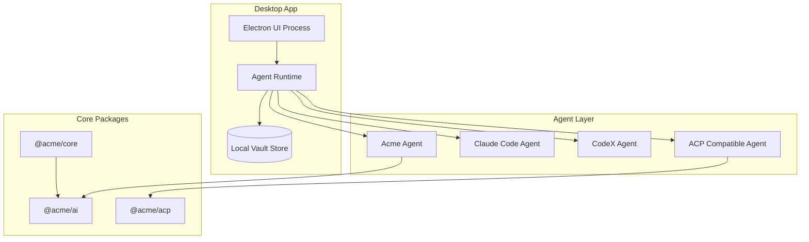
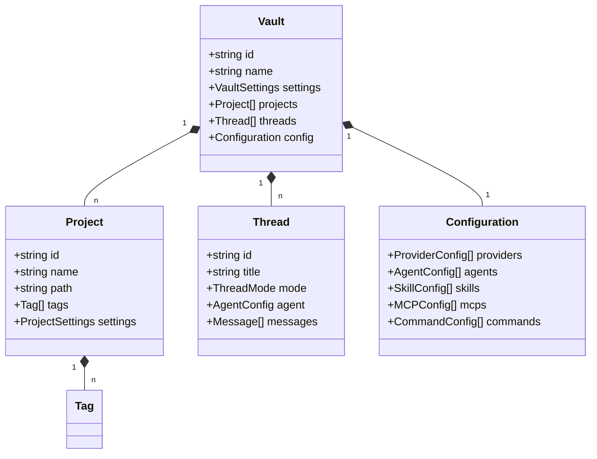
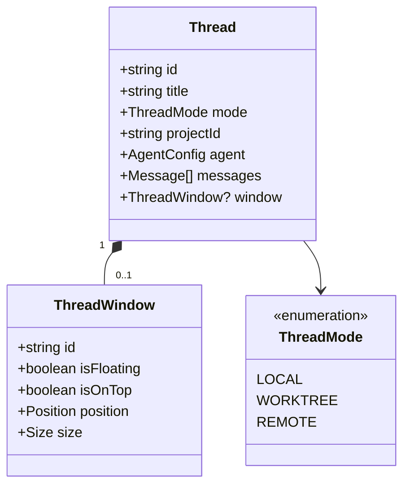
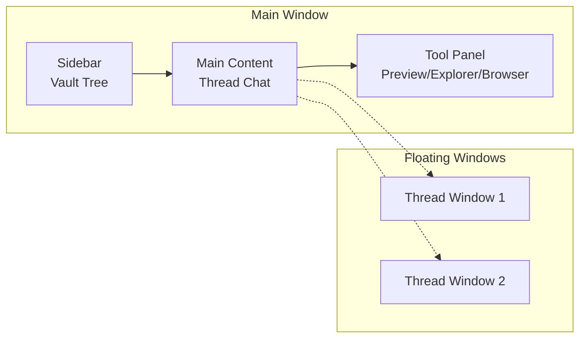
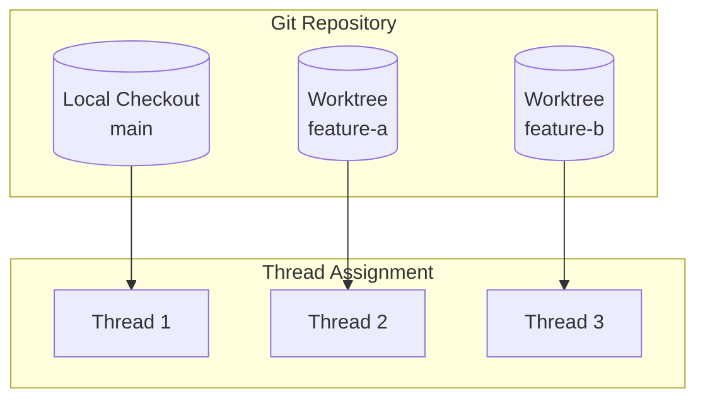
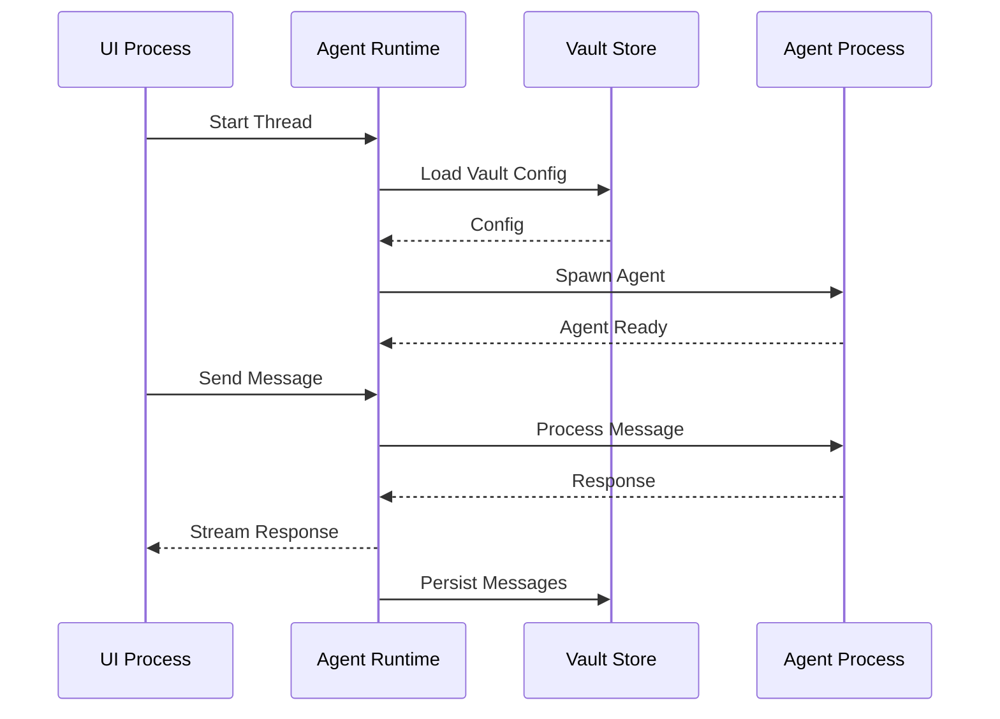
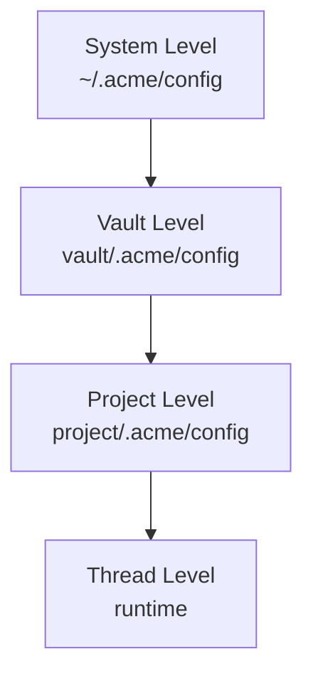

# RFC 0001: Acme Desktop Application Architecture

## Summary

Acme 是一款基于 Electron 开发的桌面应用程序，定位为类似 Codex App 和 OpenCode 的 Code Agent 平台。本 RFC 定义 Acme 桌面应用的整体架构。

## Motivation

Codex App 和 OpenCode 提供了优秀的 Code Agent 体验，但存在以下限制：
- Codex 与 OpenAI 强绑定
- OpenCode 不支持桌面级 UI 和多窗口管理
- 缺乏对多 Vault、多项目的原生支持

Acme 旨在提供一个：
- 不与特定模型/服务商强绑定的 Code Agent 平台
- 支持多 Vault、本地优先的桌面应用
- 支持多种 Code Agent（Acme Agent、Claude Code、CodeX、ACP 兼容 Agent）

## Architecture Overview



## Core Concepts

### Vault

Vault 是 Acme 的核心数据容器，对应用户的一个工作空间。



### Thread

Thread 是与 Agent 的对话会话。



### Multi-Window Model



## UI Layout

### Main Window Layout

```
┌─────────────────────────────────────────────────────────────────┐
│  Title Bar                                                      │
├────────────┬───────────────────────────────────────┬────────────┤
│            │                                       │            │
│  Sidebar   │         Thread Content               │   Tool     │
│            │                                       │   Panel    │
│  - Vaults  │  ┌─────────────────────────────┐    │            │
│  - Projects│  │      Chat Messages          │    │  Preview   │
│  - Tags    │  │                             │    │  ─────────   │
│  - Threads │  │                             │    │  Source    │
│            │  └─────────────────────────────┘    │  Tree      │
│            │  ┌─────────────────────────────┐    │  ─────────   │
│            │  │      Input Composer        │    │  File      │
│            │  └─────────────────────────────┘    │  Explorer  │
│            │                                       │  ─────────   │
│            │                                       │  Browser   │
├────────────┴───────────────────────────────────────┴────────────┤
│  Status Bar                                                     │
└─────────────────────────────────────────────────────────────────┘
```

### Sidebar Structure

```mermaid
tree
    .
    ├── 🏠 Acme
    │   ├── ⚙️ Settings
    │   └── 📦 Vaults
    │       ├── 💼 Work
    │       │   ├── 📁 Project A
    │       │   │   ├── 🧵 Thread 1
    │       │   │   └── 🧵 Thread 2
    │       │   └── 📁 Project B
    │       └── 🏷️ Tags
    │           ├── 🚀 feature-x
    │           └── 🐛 bug-fix
    └── 📊 Statistics
```

## Worktree Support

参考 Codex Worktree 设计：



## IPC Communication



## Project Structure

```
apps/desktop/
├── src/
│   ├── main/                    # Main process
│   │   ├── index.ts             # Entry point
│   │   ├── window.ts            # Window management
│   │   ├── ipc.ts               # IPC handlers
│   │   └── tray.ts              # System tray
│   ├── renderer/                # Renderer process
│   │   ├── App.tsx              # Root component
│   │   ├── components/          # UI components
│   │   │   ├── Sidebar/
│   │   │   ├── Thread/
│   │   │   ├── ToolPanel/
│   │   │   └── ...
│   │   ├── hooks/               # React hooks
│   │   ├── stores/              # State management
│   │   └── styles/             # Styles
│   ├── preload/                 # Preload scripts
│   └── shared/                  # Shared types/utils
├── electron.vite.config.ts
└── package.json
```

## Configuration Hierarchy



## Alternatives Considered

1. **纯 Web 技术栈**: 使用 Tauri 替代 Electron
   - 缺点: Tauri 的 Rust 生态不如 Electron 成熟

2. **单窗口模式**: 类似 VS Code
   - 缺点: 不符合"类 Notion"的多 Vault 设计目标

## Implementation Plan

1. Phase 1: 核心框架
   - Electron 基础架构
   - 多窗口管理
   - Vault 数据结构
   - 基本 UI 布局

2. Phase 2: Agent 集成
   - Agent Runtime
   - Acme Agent 实现
   - ACP 协议支持

3. Phase 3: 高级功能
   - Worktree 支持
   - MCP 集成
   - 自动化任务

## Open Questions

- [ ] 是否需要支持云端同步？
- [ ] Vault 之间的数据隔离策略？
- [ ] 多语言国际化支持？
