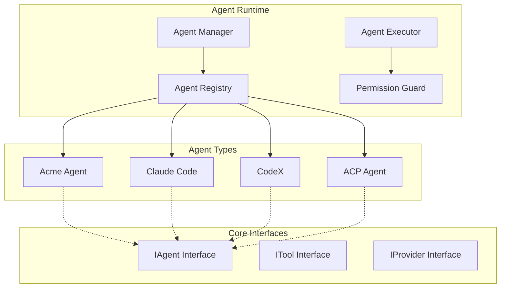
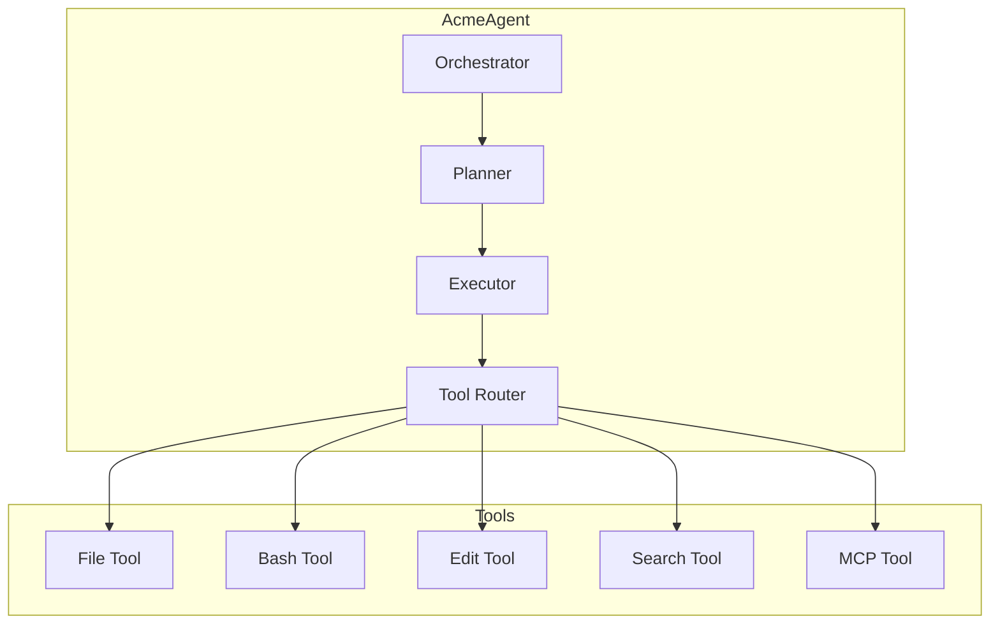
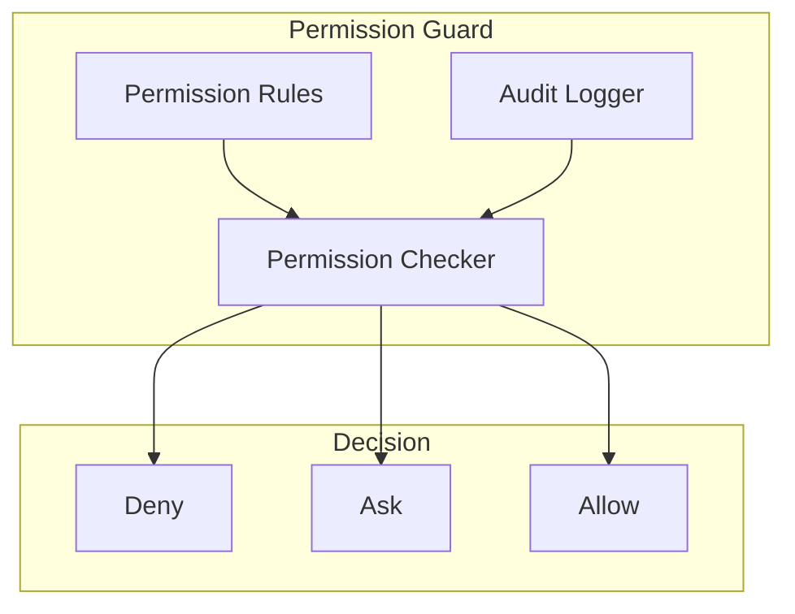
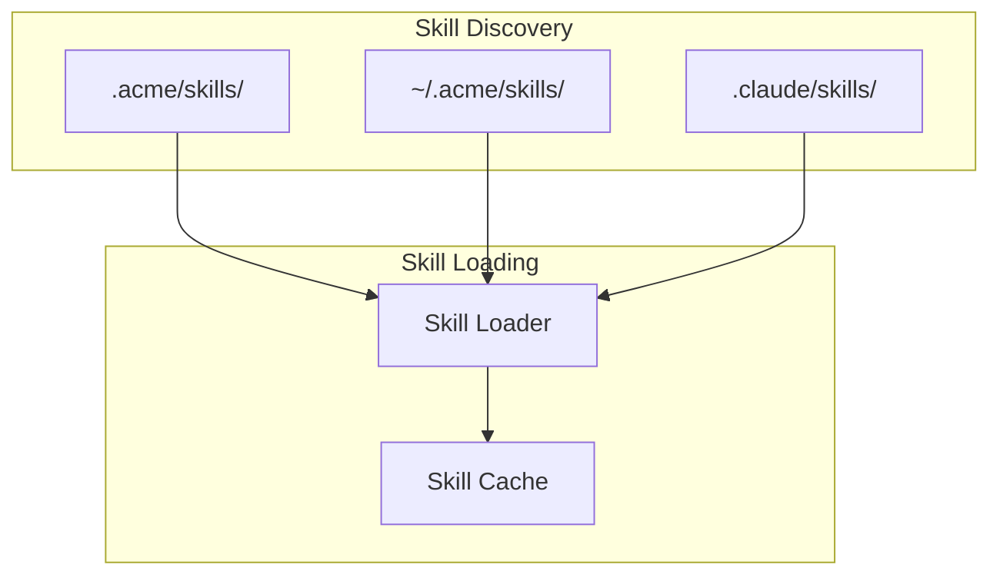
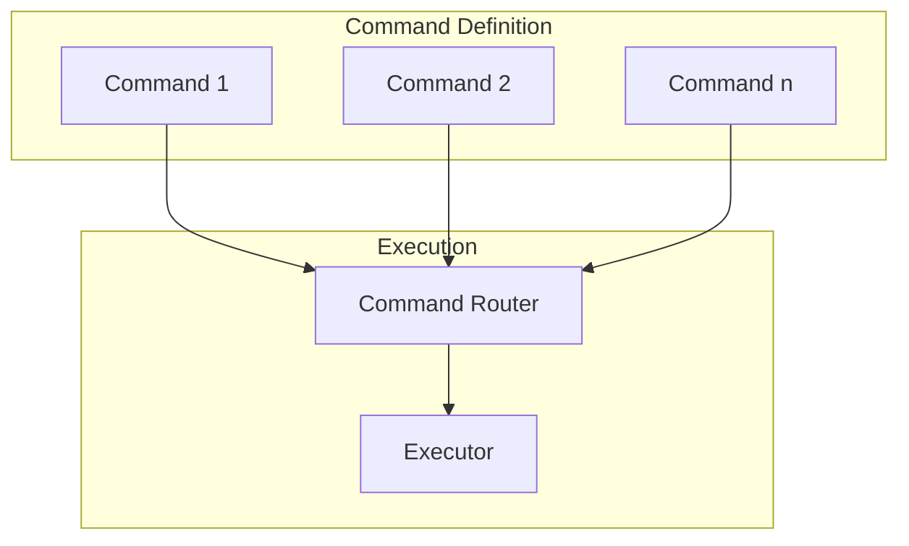

# RFC 0002: Agent Core System Design

## Summary

本 RFC 定义 Acme Agent 核心系统的设计与架构，包括 Agent 类型、接口、权限控制和工具系统。

## Motivation

Acme 需要支持多种类型的 Agent：
- **Acme Agent**: 自研的 Code Agent
- **Claude Code**: 官方 Claude Code Agent
- **CodeX**: OpenAI CodeX Agent
- **ACP 兼容 Agent**: 通过 ACP 协议支持的第三方 Agent

需要一个统一的抽象层来管理这些不同类型的 Agent。

## Architecture



## Core Interfaces

### IAgent Interface

```typescript
// packages/core/src/agent/interfaces.ts

export enum AgentMode {
  LOCAL = 'local',
  WORKTREE = 'worktree',
  REMOTE = 'remote',
}

export enum AgentStatus {
  IDLE = 'idle',
  RUNNING = 'running',
  PAUSED = 'paused',
  STOPPED = 'stopped',
}

export interface AgentConfig {
  id: string;
  name: string;
  type: AgentType;
  mode: AgentMode;
  model?: string;
  provider?: string;
  permissions: PermissionSet;
  tools: ToolConfig[];
  skills: string[];
  prompt?: string;
  temperature?: number;
  maxSteps?: number;
}

export interface PermissionSet {
  file: PermissionLevel;
  bash: PermissionLevel;
  edit: PermissionLevel;
  webfetch: PermissionLevel;
  mcp: PermissionLevel;
  skill: PermissionLevel;
}

export enum PermissionLevel {
  DENY = 'deny',      // 完全禁用
  ASK = 'ask',        // 使用前询问
  ALLOW = 'allow',    // 允许
}

export interface IAgent {
  readonly id: string;
  readonly type: AgentType;
  status: AgentStatus;

  // Lifecycle
  initialize(config: AgentConfig): Promise<void>;
  start(context: AgentContext): Promise<void>;
  stop(): Promise<void>;
  pause(): void;
  resume(): void;

  // Interaction
  sendMessage(message: Message): Promise<Response>;
  streamMessage(message: Message): AsyncIterable<Response>;

  // Tools
  registerTool(tool: ITool): void;
  unregisterTool(name: string): void;
  getTools(): ITool[];

  // State
  getState(): AgentState;
  setState(state: Partial<AgentState>): void;
}

export interface AgentContext {
  workspace: string;
  project?: Project;
  vault?: Vault;
  thread?: Thread;
  env?: Record<string, string>;
}

export interface AgentState {
  messages: Message[];
  files: string[];
  tools: string[];
  context: Record<string, unknown>;
}
```

### ITool Interface

```typescript
// packages/core/src/agent/tool.ts

export enum ToolCategory {
  FILE = 'file',
  BASH = 'bash',
  EDIT = 'edit',
  SEARCH = 'search',
  MCP = 'mcp',
  CUSTOM = 'custom',
}

export interface ToolDefinition {
  name: string;
  description: string;
  category: ToolCategory;
  inputSchema: JSONSchema;
  outputSchema?: JSONSchema;
}

export interface ToolResult {
  success: boolean;
  output?: unknown;
  error?: string;
  metadata?: Record<string, unknown>;
}

export interface ITool {
  readonly definition: ToolDefinition;

  // Permission check before execution
  checkPermission(input: unknown, context: AgentContext): PermissionLevel;

  // Execute the tool
  execute(input: unknown, context: AgentContext): Promise<ToolResult>;

  // Stream output if supported
  stream?(input: unknown, context: AgentContext): AsyncIterable<ToolResult>;
}
```

### IProvider Interface

```typescript
// packages/ai/src/interfaces.ts

export interface LLMResponse {
  content: string;
  reasoning?: string;
  usage?: {
    inputTokens: number;
    outputTokens: number;
    totalTokens: number;
  };
  finishReason: 'stop' | 'length' | 'tool_use' | 'error';
}

export interface LLMStreamResponse {
  content: string;
  reasoning?: string;
  delta: string;
  done: boolean;
}

export interface IProvider {
  readonly name: string;
  readonly capabilities: ProviderCapabilities;

  // Chat completions
  chat(options: ChatOptions): Promise<LLMResponse>;
  streamChat(options: ChatOptions): AsyncIterable<LLMStreamResponse>;

  // Embeddings
  embed(options: EmbedOptions): Promise<EmbeddingResponse>;

  // Models
  listModels(): Promise<Model[]>;
}

export interface ProviderCapabilities {
  streaming: boolean;
  reasoning: boolean;
  vision: boolean;
  functionCalling: boolean;
  jsonMode: boolean;
}
```

## Agent Types

### 1. Acme Agent



### 2. Claude Code Agent (via ACP)

```mermaid
graph LR
    subgraph Acme
        ACPClient[ACP Client]
    end

    subgraph Claude Code
        CCAgent[Claude Code Process]
    end

    ACPClient <---> ACP Protocol
```

### 3. CodeX Agent (via ACP)

```mermaid
graph LR
    subgraph Acme
        ACPClient[ACP Client]
    end

    subgraph CodeX
        CXAgent[CodeX Process]
    end

    ACPClient <---> ACP Protocol
```

## Built-in Tools

### File Tools

```typescript
// packages/core/src/agent/tools/file.ts

export class FileTool implements ITool {
  definition: ToolDefinition = {
    name: 'file',
    description: 'Read, write, and manage files',
    category: ToolCategory.FILE,
    inputSchema: {
      type: 'object',
      properties: {
        action: { enum: ['read', 'write', 'delete', 'list', 'stat'] },
        path: { type: 'string' },
        content?: { type: 'string' },
        options?: {
          encoding?: string;
          recursive?: boolean;
        };
      },
      required: ['action', 'path'],
    },
  };

  async execute(input: unknown, context: AgentContext): Promise<ToolResult> {
    // Implementation
  }
}
```

### Bash Tools

```typescript
// packages/core/src/agent/tools/bash.ts

export class BashTool implements ITool {
  definition: ToolDefinition = {
    name: 'bash',
    description: 'Execute shell commands',
    category: ToolCategory.BASH,
    inputSchema: {
      type: 'object',
      properties: {
        command: { type: 'string' },
        cwd?: { type: 'string' },
        timeout?: { type: 'number' },
        env?: { type: 'object' },
      },
      required: ['command'],
    },
  };

  private allowedCommands: Map<string, PermissionLevel> = new Map();

  checkPermission(input: unknown, context: AgentContext): PermissionLevel {
    // Check command against permission rules
  }
}
```

## Permission System



### Permission Configuration

```typescript
// packages/core/src/agent/permission.ts

export interface PermissionRule {
  pattern: string;      // Glob pattern or regex
  level: PermissionLevel;
  reason?: string;
}

export class PermissionGuard {
  constructor(private rules: PermissionRule[]) {}

  check(
    tool: ITool,
    input: unknown,
    context: AgentContext
  ): PermissionLevel {
    const toolName = tool.definition.name;

    for (const rule of this.rules) {
      if (this.matchPattern(toolName, rule.pattern)) {
        if (rule.level === PermissionLevel.ASK) {
          // Log for audit
          this.logger.log(toolName, input);
        }
        return rule.level;
      }
    }

    return PermissionLevel.DENY;
  }

  private matchPattern(toolName: string, pattern: string): boolean {
    // Glob matching logic
  }
}
```

## Agent Manager

```typescript
// packages/core/src/agent/manager.ts

export class AgentManager {
  private agents: Map<string, IAgent> = new Map();
  private registry: AgentRegistry;

  async createAgent(config: AgentConfig): Promise<IAgent> {
    const AgentClass = this.registry.getAgentClass(config.type);
    const agent = new AgentClass();

    await agent.initialize(config);
    this.agents.set(agent.id, agent);

    return agent;
  }

  async destroyAgent(agentId: string): Promise<void> {
    const agent = this.agents.get(agentId);
    if (agent) {
      await agent.stop();
      this.agents.delete(agentId);
    }
  }

  getAgent(agentId: string): IAgent | undefined {
    return this.agents.get(agentId);
  }

  listAgents(): IAgent[] {
    return Array.from(this.agents.values());
  }
}
```

## Skills System

参考 OpenCode Skills 设计：



### SKILL.md Format

```markdown
---
name: git-release
description: Create consistent releases and changelogs
license: MIT
compatibility: acme
metadata:
  audience: maintainers
  workflow: github
---

## What I do

- Draft release notes from merged PRs
- Propose a version bump
- Provide a copy-pasteable `gh release create` command

## When to use me

Use this when you are preparing a tagged release.
```

## Commands System



### Command Format

```markdown
---
description: Run tests with coverage
agent: build
model: anthropic/claude-sonnet-4
---

Run the full test suite with coverage report.
Focus on the failing tests and suggest fixes.
```

## Alternatives Considered

1. **使用 Vercel AI SDK 统一封装**
   - 优点: 生态成熟
   - 缺点: 不支持本地 Agent

2. **每个 Agent 独立进程**
   - 优点: 隔离性好
   - 缺点: IPC 开销大

## Implementation Plan

1. Phase 1: Core Interfaces
   - IAgent, ITool, IProvider 接口定义
   - Permission Guard 实现

2. Phase 2: Built-in Tools
   - File, Bash, Edit, Search 工具实现
   - MCP Tool 集成

3. Phase 3: Acme Agent
   - Orchestrator 实现
   - Planning 和 Execution

4. Phase 4: External Agents
   - ACP Client 实现
   - Claude Code / CodeX 适配器

## Open Questions

- [ ] Agent 进程是否需要独立？
- [ ] 如何处理 Agent 的资源限制？
- [ ] 是否需要支持 Agent 之间的通信？
