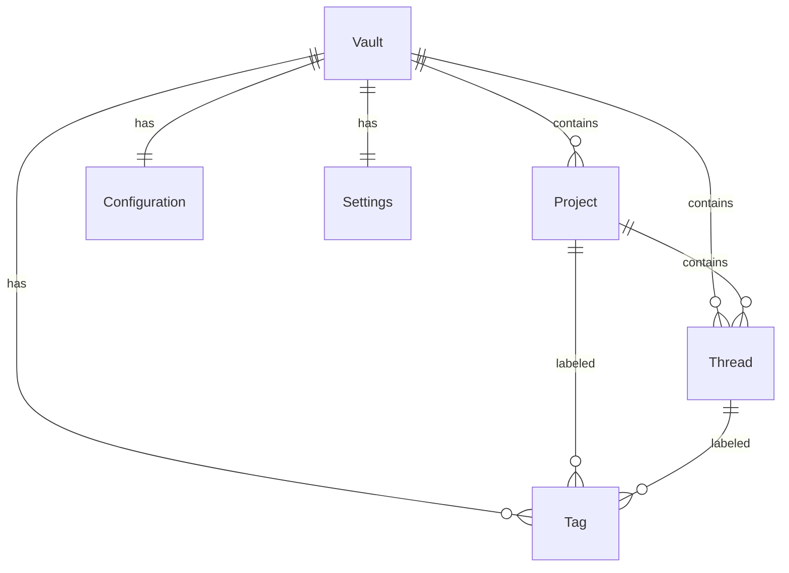
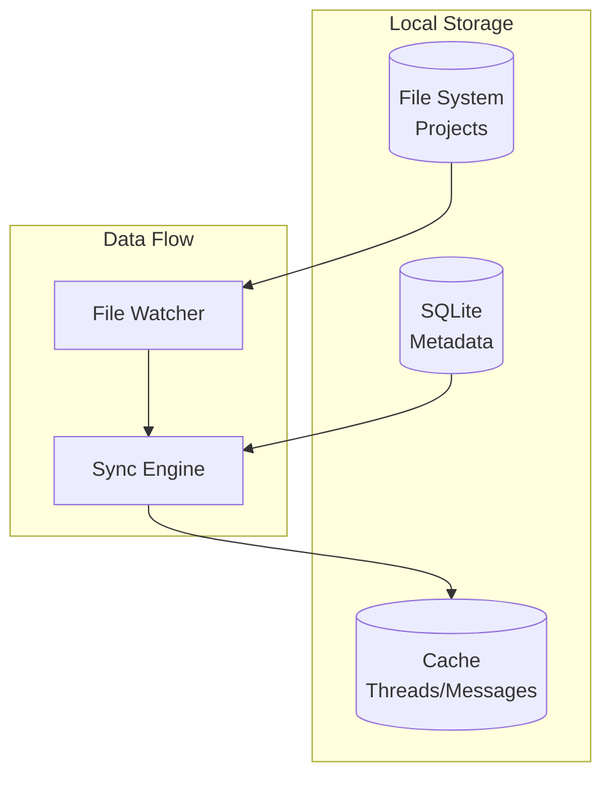
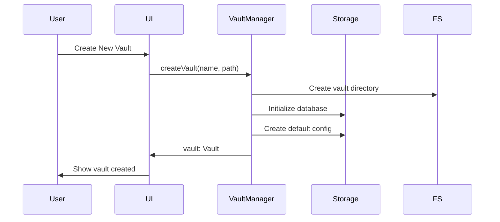
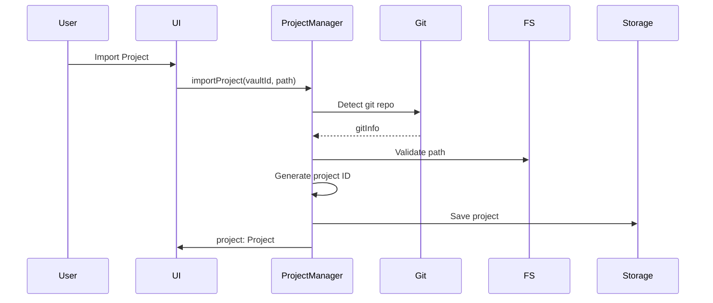
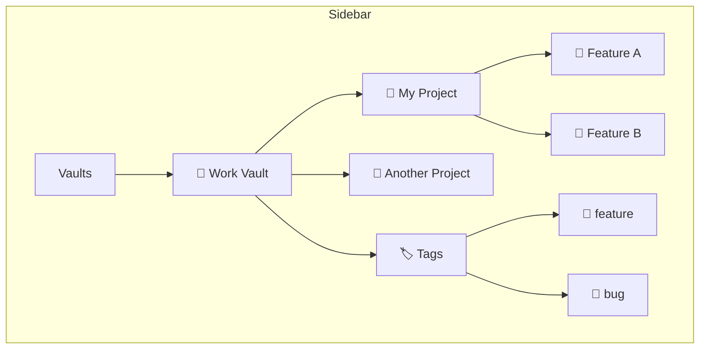
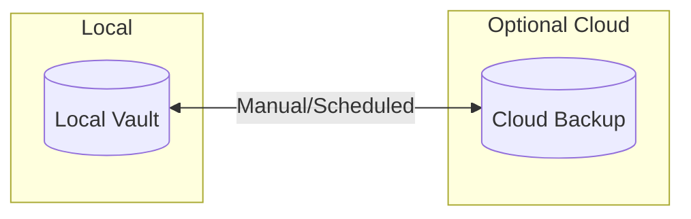

# RFC 0003: Vault and Project Management System

## Summary

本 RFC 定义 Acme 的 Vault 和项目管理系统的设计与实现。

## Motivation

Acme 需要一个强大的多层次数据管理方案：
- **Vault**: 最高级别的数据容器，类似 Notion Workspace
- **Project**: 具体项目（代码仓库）
- **Thread**: 对话会话
- **Tag**: 组织和管理资源

## Data Model



## Core Entities

### Vault

```typescript
// packages/core/src/vault/types.ts

export interface Vault {
  id: string;
  name: string;
  description?: string;
  icon?: string;
  color?: string;

  // Structure
  projects: Project[];
  threads: Thread[];
  tags: Tag[];

  // Configuration
  config: VaultConfig;

  // Settings
  settings: VaultSettings;

  // Metadata
  createdAt: Date;
  updatedAt: Date;
  lastOpenedAt?: Date;
}

export interface VaultConfig {
  // Provider settings
  providers: ProviderConfig[];

  // Agent settings
  agents: AgentConfig[];

  // Skill settings
  skills: SkillConfig[];

  // MCP settings
  mcps: MCPConfig[];

  // Command settings
  commands: CommandConfig[];
}

export interface VaultSettings {
  theme?: 'light' | 'dark' | 'system';
  defaultAgent?: string;
  defaultMode?: AgentMode;
  autoSave?: boolean;
  autoSaveInterval?: number;
}
```

### Project

```typescript
// packages/core/src/vault/types.ts

export interface Project {
  id: string;
  vaultId: string;
  name: string;
  path: string;
  description?: string;

  // Hierarchy
  parentId?: string;
  children?: Project[];

  // Organization
  tags: Tag[];

  // Project-specific settings
  settings: ProjectSettings;

  // Git info (if applicable)
  git?: GitInfo;

  // Metadata
  createdAt: Date;
  updatedAt: Date;
  lastOpenedAt?: Date;
}

export interface ProjectSettings {
  autoContext?: boolean;
  contextIncludes?: string[];
  contextExcludes?: string[];
  readOnly?: boolean;
}

export interface GitInfo {
  root: string;
  branch?: string;
  remotes?: string[];
}
```

### Thread

```typescript
// packages/core/src/vault/types.ts

export interface Thread {
  id: string;
  vaultId: string;
  projectId?: string;

  title: string;
  mode: ThreadMode;

  // Agent configuration for this thread
  agent: AgentConfig;

  // Messages
  messages: Message[];

  // State
  status: ThreadStatus;
  pinned: boolean;
  archived: boolean;

  // Window state (if floating)
  window?: ThreadWindow;

  // Tags
  tags: Tag[];

  // Metadata
  createdAt: Date;
  updatedAt: Date;
  lastMessageAt?: Date;
}

export interface ThreadWindow {
  floating: boolean;
  onTop: boolean;
  x: number;
  y: number;
  width: number;
  height: number;
  monitor?: string;
}

export enum ThreadStatus {
  ACTIVE = 'active',
  PAUSED = 'paused',
  COMPLETED = 'completed',
  ARCHIVED = 'archived',
}

export enum ThreadMode {
  LOCAL = 'local',
  WORKTREE = 'worktree',
  REMOTE = 'remote',
}
```

### Tag

```typescript
// packages/core/src/vault/types.ts

export interface Tag {
  id: string;
  vaultId: string;
  name: string;
  color: string;
  icon?: string;

  // Hierarchy
  parentId?: string;

  // Usage
  type: TagType;
  projectCount?: number;
  threadCount?: number;
}

export enum TagType {
  PROJECT = 'project',
  THREAD = 'thread',
  BOTH = 'both',
}
```

## Storage Architecture



## Directory Structure

```
~/.acme/
├── config/
│   ├── config.toml          # Global config
│   ├── providers/           # Provider credentials
│   └── keys/                # API keys (encrypted)
├── vaults/
│   ├── vault-uuid-1/
│   │   ├── .acme/
│   │   │   └── config.toml  # Vault config
│   │   ├── projects/
│   │   │   └── project-uuid/
│   │   │       └── .acme/
│   │   │           └── config.toml  # Project config
│   │   ├── threads/
│   │   │   └── thread-uuid.json
│   │   └── data/
│   │       └── acme.db      # SQLite database
│   └── vault-uuid-2/
│       └── ...
├── cache/
│   ├── threads/
│   ├── skills/
│   └── mcps/
└── logs/
```

## Vault Operations

### Create Vault



### Import Project



## Project Tree UI



## Search and Filter

```typescript
// packages/core/src/vault/search.ts

export interface SearchQuery {
  text?: string;
  vaultId?: string;
  projectId?: string;
  tags?: string[];
  mode?: ThreadMode;
  status?: ThreadStatus;
  dateRange?: {
    from?: Date;
    to?: Date;
  };
  agent?: string;
}

export interface SearchResult {
  type: 'thread' | 'project' | 'message';
  id: string;
  title: string;
  snippet?: string;
  score: number;
  highlights?: string[];
}
```

## Sync Considerations



## Alternatives Considered

1. **纯云端存储**
   - 缺点: 违背 "Local-first" 设计原则

2. **使用 IndexedDB**
   - 缺点: 不适合大量文件元数据

3. **每个 Vault 独立数据库**
   - 优点: 便于 Vault 隔离和迁移
   - 缺点: 管理复杂

## Implementation Plan

1. Phase 1: Core Data Model
   - TypeScript 类型定义
   - SQLite schema
   - 基本 CRUD 操作

2. Phase 2: File System Integration
   - Project 路径管理
   - File watcher
   - Git 检测

3. Phase 3: UI Integration
   - Sidebar 组件
   - Project tree
   - Search UI

## Open Questions

- [ ] 是否需要支持 Vault 导出/导入？
- [ ] 多设备同步策略？
- [ ] Vault 访问控制（分享功能）？
