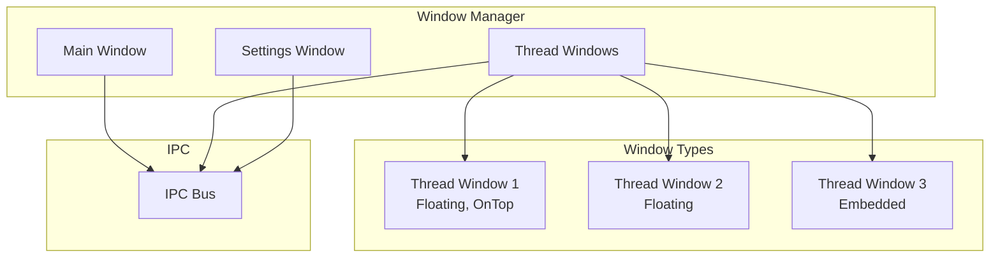
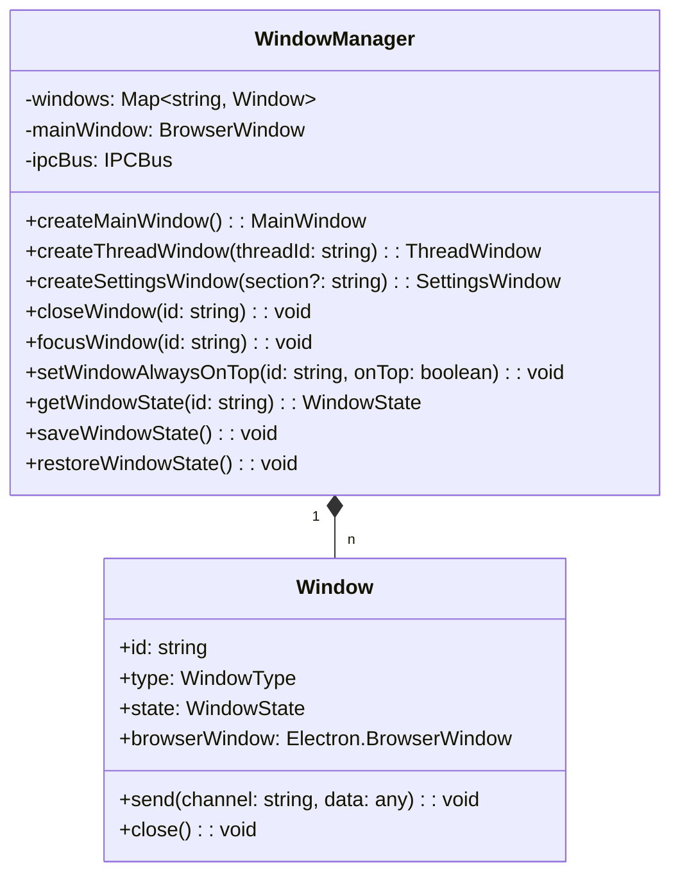
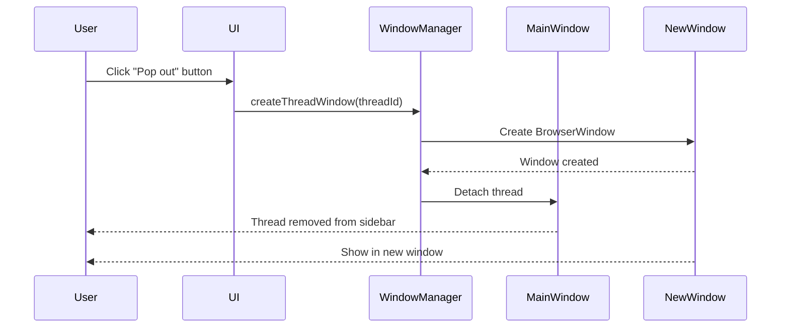
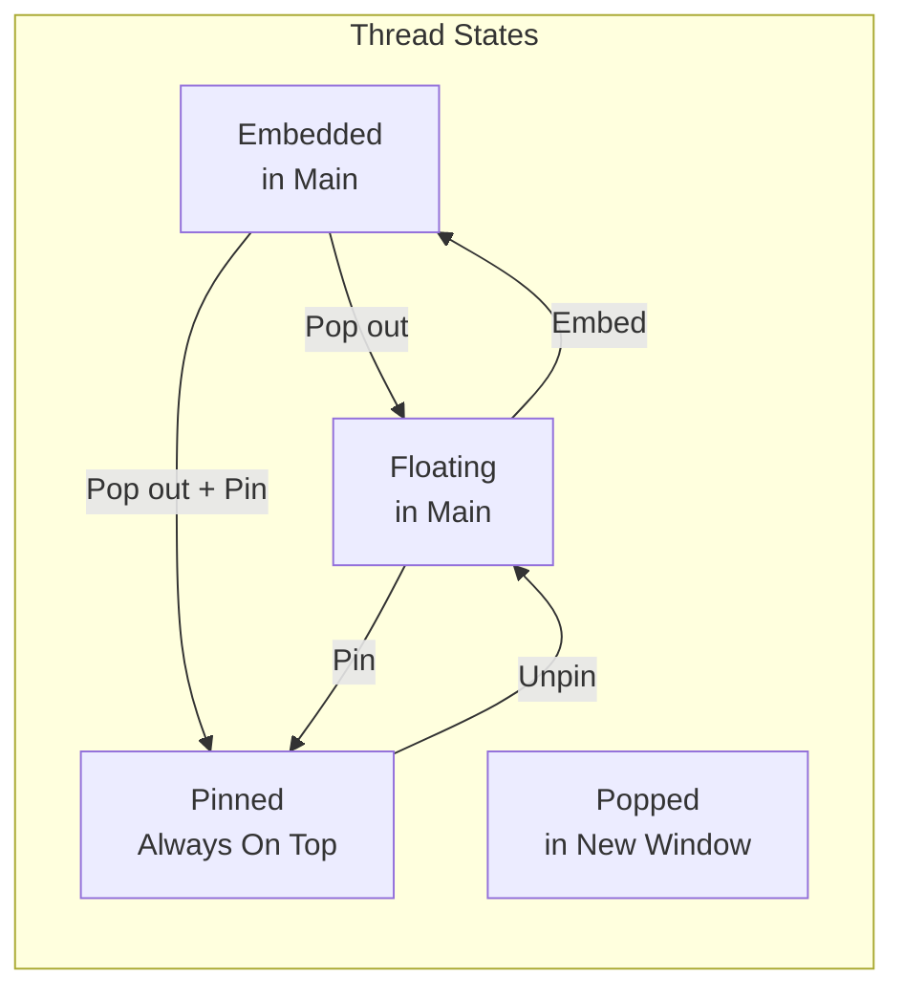
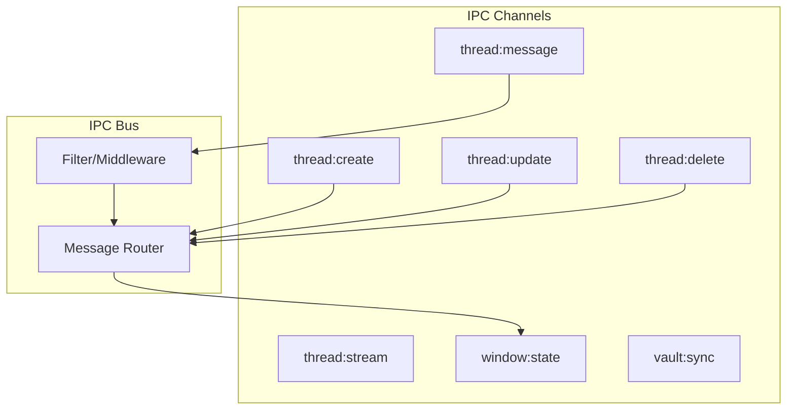
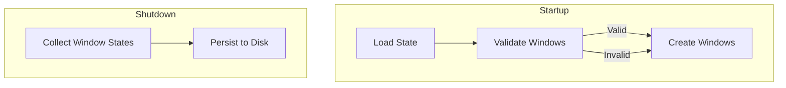
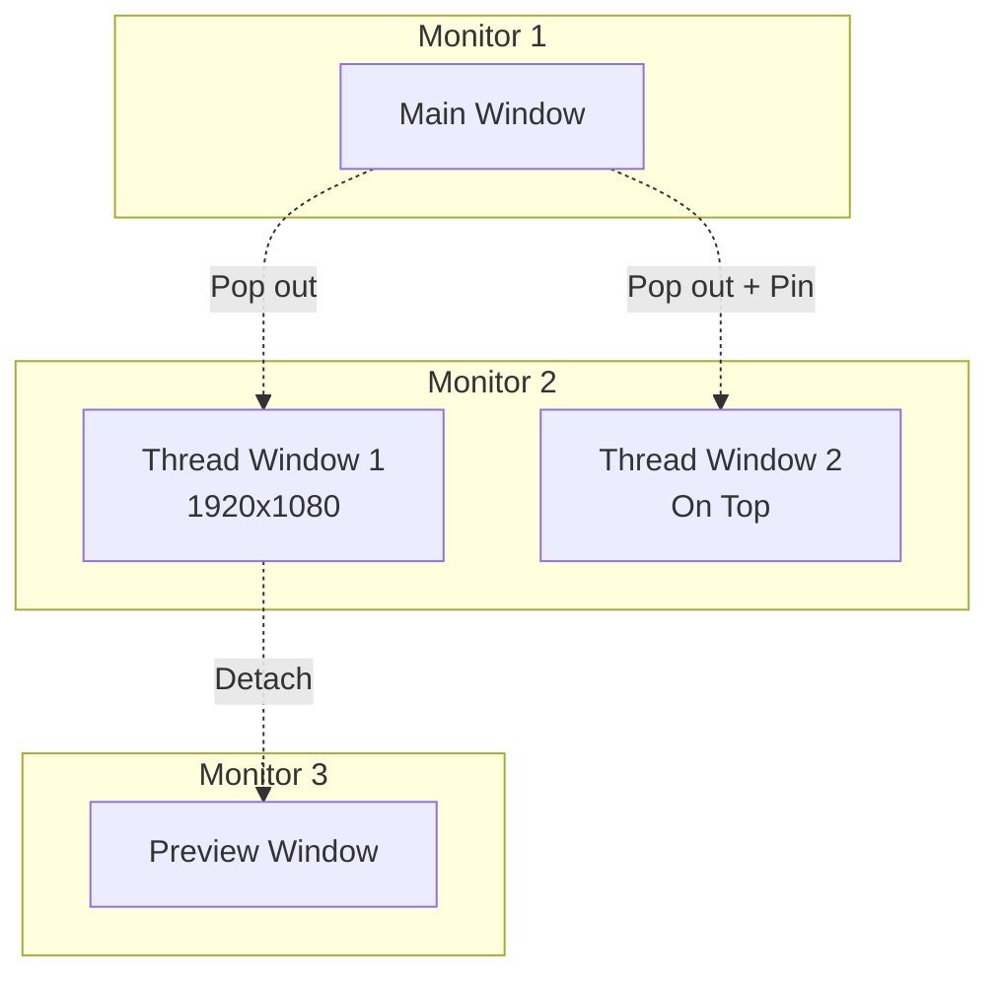

# RFC 0004: Multi-Window and Thread Management

## Summary

本 RFC 定义 Acme 的多窗口系统、Thread 管理以及窗口间通信机制。

## Motivation

Acme 需要支持：
- 主窗口中的多个 Thread 并行管理
- Thread 弹出为独立窗口
- 窗口置顶功能
- 窗口状态持久化

## Window Architecture



## Window Types

### Main Window

```typescript
interface MainWindow {
  id: 'main';
  type: 'main';
  state: {
    width: number;
    height: number;
    x: number;
    y: number;
    isMaximized: boolean;
    isFullScreen: boolean;
  };
  panels: {
    sidebar: { width: number; visible: boolean };
    toolPanel: { width: number; visible: boolean; activeTab: string };
  };
}
```

### Thread Window

```typescript
interface ThreadWindow {
  id: string;  // thread-id
  type: 'thread';
  parent: 'main';
  state: {
    width: number;
    height: number;
    x: number;
    y: number;
    isFloating: boolean;
    isOnTop: boolean;
    monitor?: string;
  };
  thread: {
    id: string;
    mode: ThreadMode;
  };
}
```

### Settings Window

```typescript
interface SettingsWindow {
  id: 'settings';
  type: 'settings';
  state: {
    width: number;
    height: number;
    x: number;
    y: number;
  };
  section?: string;  // 'general' | 'agents' | 'providers' | etc.
}
```

## Window Manager



## Thread Window Operations

### Pop-out Thread



### Float and Pin



## IPC Communication



### IPC Message Types

```typescript
// Shared IPC types

export interface IPCMessage<T = unknown> {
  id: string;
  channel: string;
  source: string;
  target?: string;
  timestamp: number;
  payload: T;
}

export interface ThreadMessagePayload {
  threadId: string;
  message: Message;
}

export interface ThreadStreamPayload {
  threadId: string;
  delta: string;
  done: boolean;
}

export interface WindowStatePayload {
  windowId: string;
  state: WindowState;
}
```

## Window State Persistence



```typescript
// packages/desktop/src/main/window/state.ts

export interface WindowStateStore {
  version: number;
  windows: Record<string, WindowState>;
  mainWindow: {
    bounds: Rectangle;
    maximized: boolean;
  };
}

export class WindowStateManager {
  private storePath: string;

  async load(): Promise<WindowStateStore> {
    const data = await readFile(this.storePath);
    return JSON.parse(data);
  }

  async save(state: WindowStateStore): Promise<void> {
    await writeFile(this.storePath, JSON.stringify(state, null, 2));
  }
}
```

## UI Layout

### Main Window Layout

```
┌─────────────────────────────────────────────────────────────────┐
│  Title Bar                                                     │
├────────────┬───────────────────────────────────────┬────────────┤
│            │                                       │            │
│  Sidebar   │         Thread Content                │   Tool     │
│            │                                       │   Panel    │
│  Projects  │  ┌─────────────────────────────────┐  │            │
│  Threads   │  │     Thread Header                │  │  Preview   │
│  Tags      │  ├─────────────────────────────────┤  │  ────────  │
│            │  │                                 │  │  Source    │
│            │  │     Chat Messages               │  │  Tree      │
│            │  │                                 │  │  ────────  │
│            │  │                                 │  │  File      │
│            │  ├─────────────────────────────────┤  │  Explorer  │
│            │  │     Composer                    │  │  ────────  │
│            │  └─────────────────────────────────┘  │  Browser   │
│            │                                       │            │
├────────────┴───────────────────────────────────────┴────────────┤
│  Status Bar                                                     │
└─────────────────────────────────────────────────────────────────┘
```

### Floating Thread Window

```
┌───────────────────────────────────────┐
│  Thread Title              [─][□][×] │
├───────────────────────────────────────┤
│                                       │
│     Chat Messages                     │
│                                       │
│                                       │
├───────────────────────────────────────┤
│     Composer                         │
└───────────────────────────────────────┘
```

## Multi-Monitor Support



## Keyboard Shortcuts

```typescript
const windowShortcuts = {
  // Window management
  'CmdOrCtrl+N': 'New Thread',
  'CmdOrCtrl+W': 'Close Window',
  'CmdOrCtrl+Shift+W': 'Close All Thread Windows',
  'CmdOrCtrl+T': 'New Thread in Tab',
  'CmdOrCtrl+\\': 'Toggle Sidebar',

  // Thread windows
  'CmdOrCtrl+Alt+P': 'Pop out Thread',
  'CmdOrCtrl+Alt+T': 'Toggle Always On Top',
  'CmdOrCtrl+Alt+M': 'Maximize Window',

  // Focus
  'CmdOrCtrl+1-9': 'Focus Thread 1-9',
  'CmdOrCtrl+Tab': 'Cycle Windows',
};
```

## Alternatives Considered

1. **仅支持 Tab 而非独立窗口**
   - 缺点: 无法同时查看多个 Thread

2. **使用 Web 原生窗口管理**
   - 缺点: 无法实现窗口置顶等高级功能

3. **每个窗口独立进程**
   - 缺点: 资源消耗大，IPC 复杂

## Implementation Plan

1. Phase 1: Basic Window Management
   - WindowManager 实现
   - 主窗口创建和关闭
   - 窗口状态持久化

2. Phase 2: Thread Windows
   - Thread 弹出功能
   - 窗口置顶
   - 窗口间通信

3. Phase 3: Advanced Features
   - 多显示器支持
   - 窗口布局保存/恢复
   - 全屏模式

## Open Questions

- [ ] 最大支持多少个并发窗口？
- [ ] 窗口崩溃恢复策略？
- [ ] 是否需要窗口分组功能？
