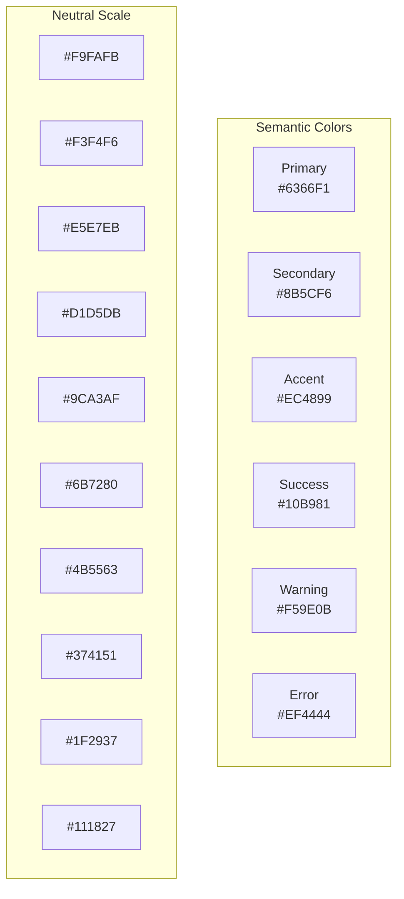
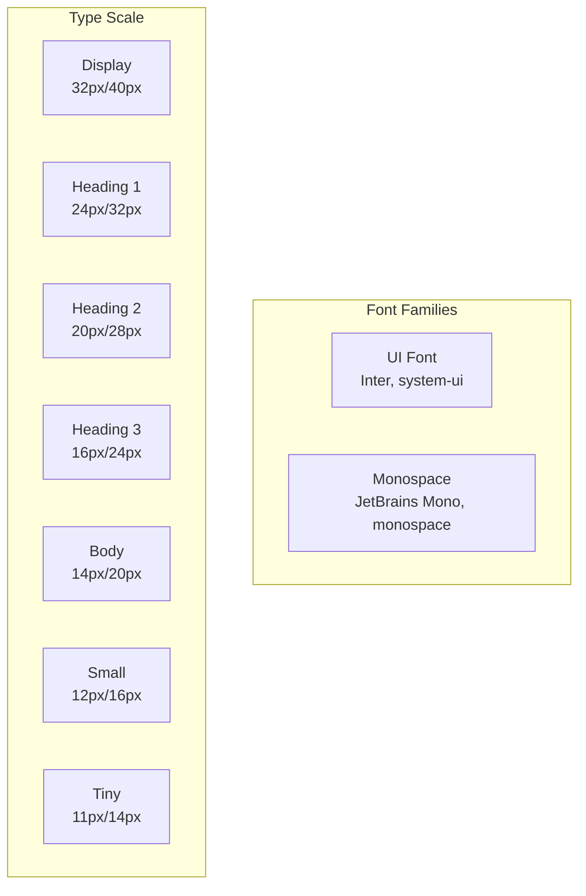
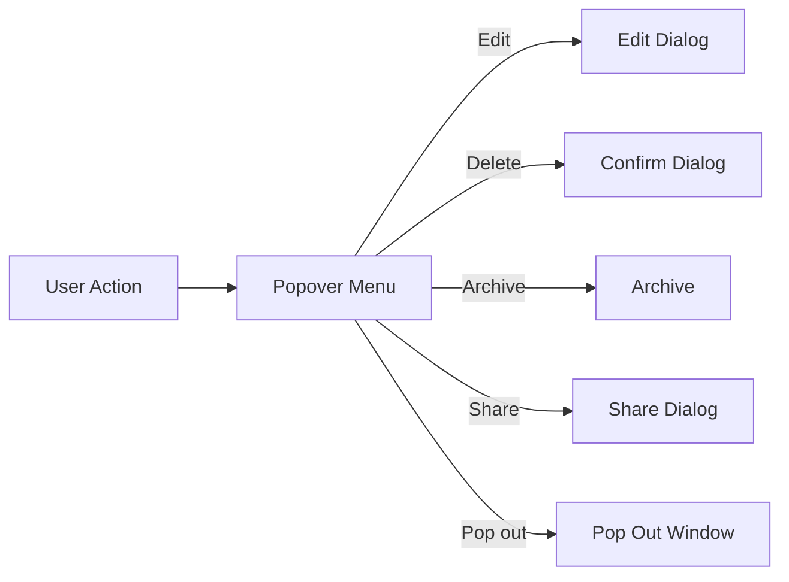
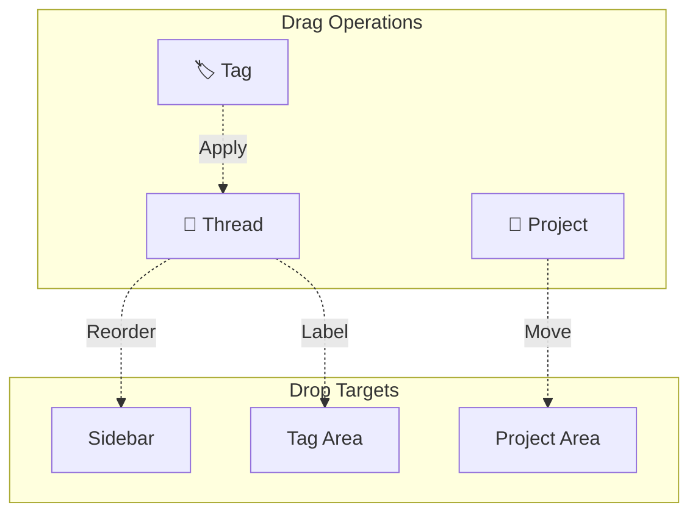
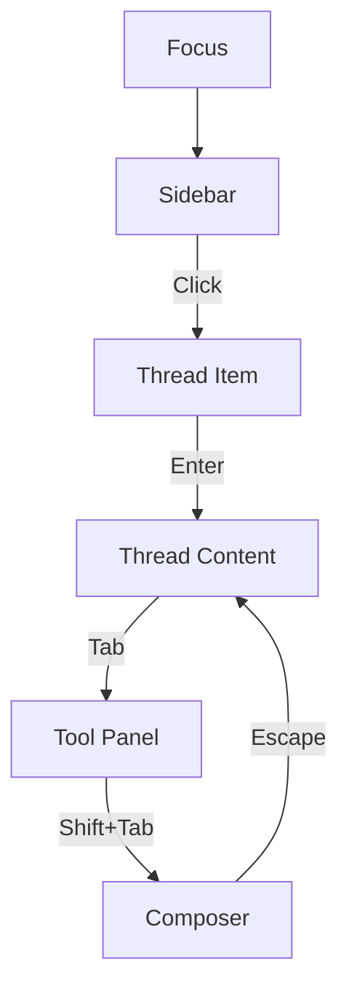

# RFC 0005: UI/UX Design System

## Summary

本 RFC 定义 Acme 桌面应用的 UI/UX 设计系统，包括视觉规范、组件库和交互模式。

## Motivation

Acme 需要一个统一的设计系统来确保：
- 跨平台一致的用户体验
- 良好的可访问性
- 高效的开发迭代
- 支持深色/浅色主题

## Design Principles

1. **简洁清晰**: 类似 Notion 的简约风格
2. **功能优先**: 每个元素都有明确用途
3. **一致性**: 统一的交互模式和视觉语言
4. **可访问性**: WCAG 2.1 AA 标准

## Color System



### Light Theme

```css
:root {
  /* Primary */
  --color-primary-50: #EEF2FF;
  --color-primary-100: #E0E7FF;
  --color-primary-500: #6366F1;
  --color-primary-600: #4F46E5;
  --color-primary-700: #4338CA;

  /* Neutral */
  --color-neutral-50: #F9FAFB;
  --color-neutral-100: #F3F4F6;
  --color-neutral-200: #E5E7EB;
  --color-neutral-300: #D1D5DB;
  --color-neutral-400: #9CA3AF;
  --color-neutral-500: #6B7280;
  --color-neutral-600: #4B5563;
  --color-neutral-700: #374151;
  --color-neutral-800: #1F2937;
  --color-neutral-900: #111827;

  /* Semantic */
  --color-success: #10B981;
  --color-warning: #F59E0B;
  --color-error: #EF4444;
  --color-info: #3B82F6;

  /* Background */
  --bg-primary: #FFFFFF;
  --bg-secondary: #F9FAFB;
  --bg-tertiary: #F3F4F6;

  /* Text */
  --text-primary: #111827;
  --text-secondary: #4B5563;
  --text-tertiary: #9CA3AF;
}
```

### Dark Theme

```css
.dark {
  /* Primary */
  --color-primary-50: #312E81;
  --color-primary-100: #3730A3;
  --color-primary-500: #6366F1;
  --color-primary-600: #818CF8;
  --color-primary-700: #A5B4FC;

  /* Neutral */
  --color-neutral-50: #111827;
  --color-neutral-100: #1F2937;
  --color-neutral-200: #374151;
  --color-neutral-300: #4B5563;
  --color-neutral-400: #6B7280;
  --color-neutral-500: #9CA3AF;
  --color-neutral-600: #D1D5DB;
  --color-neutral-700: #E5E7EB;
  --color-neutral-800: #F3F4F6;
  --color-neutral-900: #F9FAFB;

  /* Background */
  --bg-primary: #0F172A;
  --bg-secondary: #1E293B;
  --bg-tertiary: #334155;

  /* Text */
  --text-primary: #F9FAFB;
  --text-secondary: #D1D5DB;
  --text-tertiary: #9CA3AF;
}
```

## Typography



```css
:root {
  /* Font Families */
  --font-sans: 'Inter', system-ui, -apple-system, sans-serif;
  --font-mono: 'JetBrains Mono', 'Fira Code', monospace;

  /* Font Sizes */
  --text-xs: 11px;
  --text-sm: 12px;
  --text-base: 14px;
  --text-lg: 16px;
  --text-xl: 20px;
  --text-2xl: 24px;
  --text-3xl: 32px;

  /* Line Heights */
  --leading-tight: 1.25;
  --leading-normal: 1.5;
  --leading-relaxed: 1.625;
}
```

## Spacing System

```css
:root {
  /* 4px base grid */
  --space-0: 0;
  --space-1: 4px;
  --space-2: 8px;
  --space-3: 12px;
  --space-4: 16px;
  --space-5: 20px;
  --space-6: 24px;
  --space-8: 32px;
  --space-10: 40px;
  --space-12: 48px;
  --space-16: 64px;
}
```

## Component Library

### @acme/ui Structure

```mermaid
graph TB
    subgraph @acme/ui
        Foundation[Foundation]
        AI[AI Components]
        Chat[Chat Components]
        Editor[Editor]
        Markdown[Markdown]
        Hooks[Hooks]
        Icons[Icons]
    end

    subgraph Foundation
        Button[Button]
        Input[Input]
        Select[Select]
        Dialog[Dialog]
        Dropdown[Dropdown]
        Tooltip[Tooltip]
    end

    subgraph AI
        ChatMessage[ChatMessage]
        Composer[Composer]
        Thinking[Thinking]
        ToolCall[ToolCall]
    end
```

## Core Components

### Button

```mermaid
classDiagram
    class Button {
        +Variant variant
        +Size size
        +boolean disabled
        +boolean loading
        +onClick: () => void
    end

    class ButtonVariant {
        <<enumeration>>
        PRIMARY
        SECONDARY
        GHOST
        DANGER
    end

    class ButtonSize {
        <<enumeration>>
        XS
        SM
        MD
        LG
    end

    Button --> ButtonVariant
    Button --> ButtonSize
```

```tsx
interface ButtonProps {
  variant?: 'primary' | 'secondary' | 'ghost' | 'danger';
  size?: 'xs' | 'sm' | 'md' | 'lg';
  disabled?: boolean;
  loading?: boolean;
  icon?: ReactNode;
  iconPosition?: 'left' | 'right';
  children?: ReactNode;
  onClick?: () => void;
}
```

### Chat Message

```tsx
interface ChatMessageProps {
  id: string;
  role: 'user' | 'assistant' | 'system' | 'tool';
  content: string;
  timestamp?: Date;
  agent?: string;
  avatar?: string;
  attachments?: Attachment[];
  toolCalls?: ToolCall[];
  thinking?: string;
  onEdit?: (id: string, content: string) => void;
  onDelete?: (id: string) => void;
  onCopy?: (id: string, content: string) => void;
}
```

### Composer

```tsx
interface ComposerProps {
  placeholder?: string;
  maxLength?: number;
  autoFocus?: boolean;
  showAttachments?: boolean;
  showModeSelector?: boolean;
  modes?: ThreadMode[];
  selectedMode?: ThreadMode;
  onModeChange?: (mode: ThreadMode) => void;
  onSubmit?: (content: string, attachments?: File[]) => void;
  onCancel?: () => void;
}
```

## Layout Components

### Sidebar

```tsx
interface SidebarProps {
  width?: number;
  collapsed?: boolean;
  sections?: SidebarSection[];
  onSectionToggle?: (sectionId: string) => void;
  onItemSelect?: (item: SidebarItem) => void;
}

interface SidebarSection {
  id: string;
  title?: string;
  icon?: ReactNode;
  collapsible?: boolean;
  collapsed?: boolean;
  items: SidebarItem[];
}

interface SidebarItem {
  id: string;
  type: 'vault' | 'project' | 'thread' | 'tag' | 'command';
  icon?: ReactNode;
  label: string;
  badge?: string | number;
  children?: SidebarItem[];
  onClick?: () => void;
}
```

### Tool Panel

```tsx
interface ToolPanelProps {
  width?: number;
  tabs?: ToolTab[];
  activeTab?: string;
  onTabChange?: (tabId: string) => void;
}

interface ToolTab {
  id: string;
  icon: ReactNode;
  label: string;
  badge?: string | number;
  content: ReactNode;
}
```

## Interaction Patterns

### Thread Operations



### Drag and Drop



## Accessibility

### Keyboard Navigation

```typescript
const keyboardNavigation = {
  // Global
  'Escape': 'Close modal/popover',
  'Tab': 'Navigate focus',

  // Sidebar
  'ArrowUp/Down': 'Navigate items',
  'Enter': 'Select item',
  'Right Arrow': 'Expand/collapse',

  // Thread
  'CmdOrCtrl+Enter': 'Send message',
  'CmdOrCtrl+Shift+C': 'Copy message',

  // Composer
  'Tab': 'Cycle mode',
  'CmdOrCtrl+B': 'Bold',
  'CmdOrCtrl+I': 'Italic',
};
```

### Focus Management



## Animations

```css
:root {
  /* Durations */
  --duration-fast: 100ms;
  --duration-normal: 200ms;
  --duration-slow: 300ms;

  /* Easings */
  --ease-in: cubic-bezier(0.4, 0, 1, 1);
  --ease-out: cubic-bezier(0, 0, 0.2, 1);
  --ease-in-out: cubic-bezier(0.4, 0, 0.2, 1);
  --ease-spring: cubic-bezier(0.175, 0.885, 0.32, 1.275);
}
```

## Responsive Design

```css
/* Desktop-first approach */
:root {
  --sidebar-width: 260px;
  --sidebar-collapsed-width: 56px;
  --tool-panel-width: 320px;
}

/* Large screens */
@media (min-width: 1440px) {
  --tool-panel-width: 400px;
}

/* Compact mode */
@media (max-width: 1280px) {
  --sidebar-width: 220px;
  --tool-panel-width: 280px;
}
```

## Implementation Plan

1. Phase 1: Foundation
   - CSS variables and theme system
   - Base components (Button, Input, etc.)
   - Layout components

2. Phase 2: Chat Components
   - ChatMessage
   - Composer
   - ToolCall

3. Phase 3: App Shell
   - Sidebar
   - ToolPanel
   - Window chrome

## Open Questions

- [ ] 是否需要支持 RTL 语言？
- [ ] 动画性能优化策略？
- [ ] 组件测试覆盖率要求？
