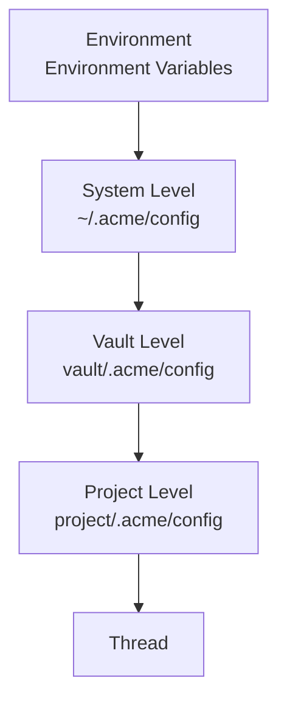
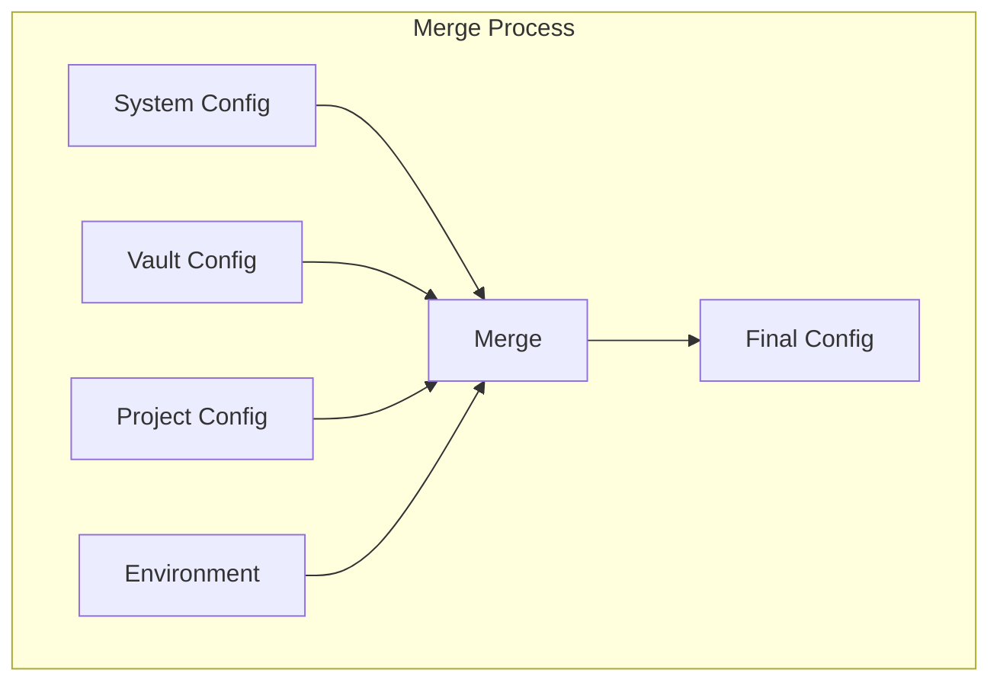
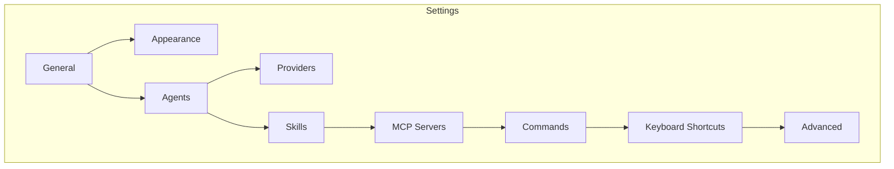
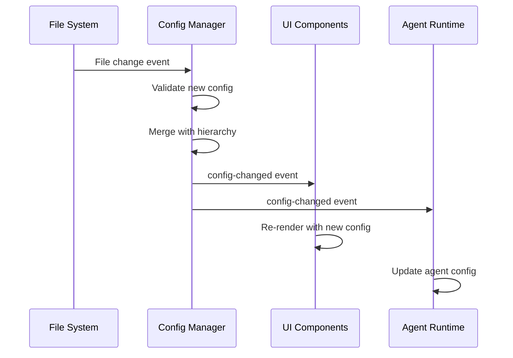

# RFC 0006: Configuration System Design

## Summary

本 RFC 定义 Acme 的多层配置系统，支持系统级、Vault 级、项目级和 Thread 级配置。

## Motivation

Acme 需要一个灵活的配置系统来支持：
- 不同级别的配置覆盖
- 多用户/多设备场景
- 团队共享配置
- 运行时配置热更新

## Configuration Hierarchy



## Configuration Layers

### Layer 1: System Level

```toml
# ~/.acme/config.toml

[app]
name = "Acme"
version = "1.0.0"

[ui]
theme = "system"  # light, dark, system
language = "en"
fontSize = 14

[agents]
defaultAgent = "acme"

[providers]
default = "anthropic"

[paths]
vaults = "~/.acme/vaults"
cache = "~/.acme/cache"
```

### Layer 2: Vault Level

```toml
# vault/.acme/config.toml

[vault]
name = "Work Vault"
icon = "💼"

[agents]
defaultAgent = "claude-code"
maxConcurrentThreads = 5

[providers]
providers = [
  { name = "anthropic", apiKey = "$ANTHROPIC_API_KEY" },
  { name = "openai", apiKey = "$OPENAI_API_KEY" }
]

[skills]
enabled = ["git-release", "code-review"]
```

### Layer 3: Project Level

```toml
# project/.acme/config.toml

[project]
name = "my-project"
path = "/path/to/project"

[context]
includes = ["src/**", "lib/**", "tests/**"]
excludes = ["node_modules/**", ".git/**", "dist/**"]

[agents]
agents = [
  { name = "acme", mode = "worktree" },
  { name = "plan", description = "Planning agent" }
]

[skills]
skills = ["acme-specific-skill"]
```

### Layer 4: Thread Level

```typescript
// Thread runtime config (not persisted to file)
const threadConfig = {
  mode: 'worktree',
  branch: 'feature-x',
  agent: 'claude-code',
  maxSteps: 100,
};
```

## Configuration Merge Strategy



```typescript
// packages/core/src/config/merge.ts

export interface ConfigMergeOptions {
  arrays?: 'replace' | 'append' | 'unique';
  objects?: 'deep' | 'shallow';
}

export function mergeConfigs(
  base: Config,
  override: Partial<Config>,
  options?: ConfigMergeOptions
): Config {
  const result = { ...base };

  for (const [key, value] of Object.entries(override)) {
    if (value === undefined) continue;

    const baseValue = result[key];

    if (Array.isArray(value) && Array.isArray(baseValue)) {
      result[key] = mergeArrays(baseValue, value, options?.arrays);
    } else if (isObject(value) && isObject(baseValue)) {
      result[key] = mergeConfigs(baseValue, value, options);
    } else {
      result[key] = value;
    }
  }

  return result;
}
```

## Configuration Types

### Provider Configuration

```typescript
// packages/core/src/config/provider.ts

export interface ProviderConfig {
  name: string;
  type: 'anthropic' | 'openai' | 'google' | 'local' | 'custom';

  // Connection
  apiKey?: string;
  apiKeyEnvVar?: string;
  baseURL?: string;

  // Models
  defaultModel?: string;
  models?: ModelConfig[];

  // Options
  options?: {
    timeout?: number;
    maxRetries?: number;
    streaming?: boolean;
  };
}

export interface ModelConfig {
  id: string;
  displayName?: string;
  capabilities?: {
    streaming?: boolean;
    reasoning?: boolean;
    vision?: boolean;
    functionCalling?: boolean;
  };
  limits?: {
    maxTokens?: number;
    maxInputTokens?: number;
    maxOutputTokens?: number;
  };
  cost?: {
    inputCostPerToken?: number;
    outputCostPerToken?: number;
  };
}
```

### Agent Configuration

```typescript
// packages/core/src/config/agent.ts

export interface AgentConfig {
  id: string;
  name: string;
  type: AgentType;

  // Provider
  provider?: string;
  model?: string;

  // Behavior
  mode?: ThreadMode;
  prompt?: string;
  temperature?: number;
  maxSteps?: number;
  timeout?: number;

  // Permissions
  permissions?: PermissionConfig;

  // Tools
  tools?: ToolConfig[];

  // Skills
  skills?: string[];

  // MCP
  mcps?: MCPConfig[];
}

export interface PermissionConfig {
  file?: PermissionLevel;
  bash?: PermissionLevel;
  edit?: PermissionLevel;
  webfetch?: PermissionLevel;
  mcp?: PermissionLevel;
  skill?: PermissionLevel;
}
```

### Skill Configuration

```typescript
// packages/core/src/config/skill.ts

export interface SkillConfig {
  name: string;

  // Source
  source: 'local' | 'global' | 'marketplace';

  // Permissions
  permissions?: PermissionConfig;

  // Options
  options?: Record<string, unknown>;
}

export interface SkillDefinition {
  name: string;
  description: string;
  license?: string;
  compatibility?: string[];
  metadata?: Record<string, string>;
  content: string;
}
```

### MCP Configuration

```typescript
// packages/core/src/config/mcp.ts

export interface MCPConfig {
  name: string;

  // Type
  type: 'local' | 'remote';

  // Local
  command?: string;
  args?: string[];
  env?: Record<string, string>;
  cwd?: string;

  // Remote
  url?: string;
  headers?: Record<string, string>;
  auth?: {
    type: 'bearer' | 'oauth';
    token?: string;
    tokenEnvVar?: string;
  };

  // Options
  enabled?: boolean;
  required?: boolean;
  startupTimeout?: number;
  toolTimeout?: number;
  enabledTools?: string[];
  disabledTools?: string[];
}
```

## Configuration UI

### Settings Structure



## Configuration File Format

### TOML Format

```toml
# ~/.acme/config.toml

[provider.anthropic]
type = "anthropic"
apiKey = "$ANTHROPIC_API_KEY"
defaultModel = "claude-sonnet-4-20250514"

[provider.openai]
type = "openai"
apiKey = "$OPENAI_API_KEY"
defaultModel = "gpt-4o"

[agent.acme]
type = "acme"
provider = "anthropic"
model = "claude-sonnet-4-20250514"
maxSteps = 100
temperature = 0.7

[agent.plan]
type = "acme"
provider = "anthropic"
model = "claude-haiku-4-20250514"
permissions.file = "ask"
permissions.bash = "ask"
permissions.edit = "deny"

[mcp.context7]
type = "remote"
url = "https://mcp.context7.com/mcp"

[mcp.filesystem]
type = "local"
command = "npx"
args = ["-y", "@modelcontextprotocol/server-filesystem", "/"]

[skill.git-release]
source = "global"

[command.test]
description = "Run tests"
template = "Run the full test suite"
agent = "build"
```

## Schema Validation

```typescript
// packages/schemas/src/config.ts

export const ConfigSchema = {
  type: 'object',
  properties: {
    app: {
      type: 'object',
      properties: {
        name: { type: 'string' },
        version: { type: 'string' },
      },
    },
    ui: {
      type: 'object',
      properties: {
        theme: { enum: ['light', 'dark', 'system'] },
        language: { type: 'string' },
        fontSize: { type: 'number', minimum: 10, maximum: 24 },
      },
    },
    providers: {
      type: 'object',
      additionalProperties: ProviderConfigSchema,
    },
    agents: {
      type: 'object',
      additionalProperties: AgentConfigSchema,
    },
    skills: {
      type: 'object',
      additionalProperties: SkillConfigSchema,
    },
    mcps: {
      type: 'object',
      additionalProperties: MCPConfigSchema,
    },
  },
};
```

## Hot Reload



## Security

```typescript
// Sensitive value handling
export function resolveEnvVar(value: string): string | undefined {
  if (value.startsWith('$')) {
    const envVar = value.slice(1);
    return process.env[envVar];
  }
  return value;
}

export function maskSensitive(value: string): string {
  if (value.length <= 8) return '****';
  return value.slice(0, 4) + '****' + value.slice(-4);
}
```

## Alternatives Considered

1. **YAML 格式**
   - 优点: 更易读
   - 缺点: TOML 在 Rust/JS 生态更流行

2. **JSON 格式**
   - 优点: 广泛支持
   - 缺点: 不支持注释

3. **每个配置项独立文件**
   - 优点: 便于模块化
   - 缺点: 管理复杂

## Implementation Plan

1. Phase 1: Core Config
   - Config 类型定义
   - TOML 解析和序列化
   - 层级合并逻辑

2. Phase 2: Validation
   - JSON Schema 定义
   - 验证逻辑
   - 错误处理

3. Phase 3: UI Integration
   - Settings 页面
   - 配置编辑组件
   - 热更新机制

## Open Questions

- [ ] 是否需要配置版本迁移？
- [ ] 如何处理配置冲突？
- [ ] 是否需要配置模板系统？
