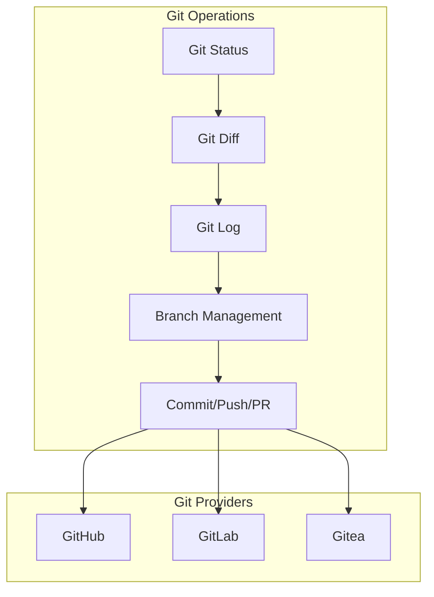
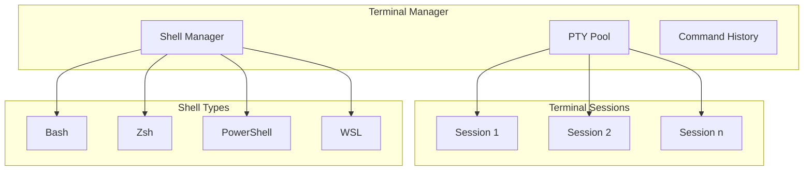
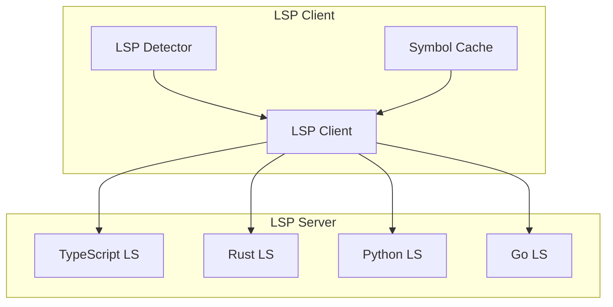
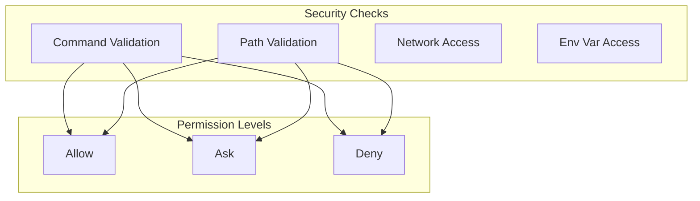
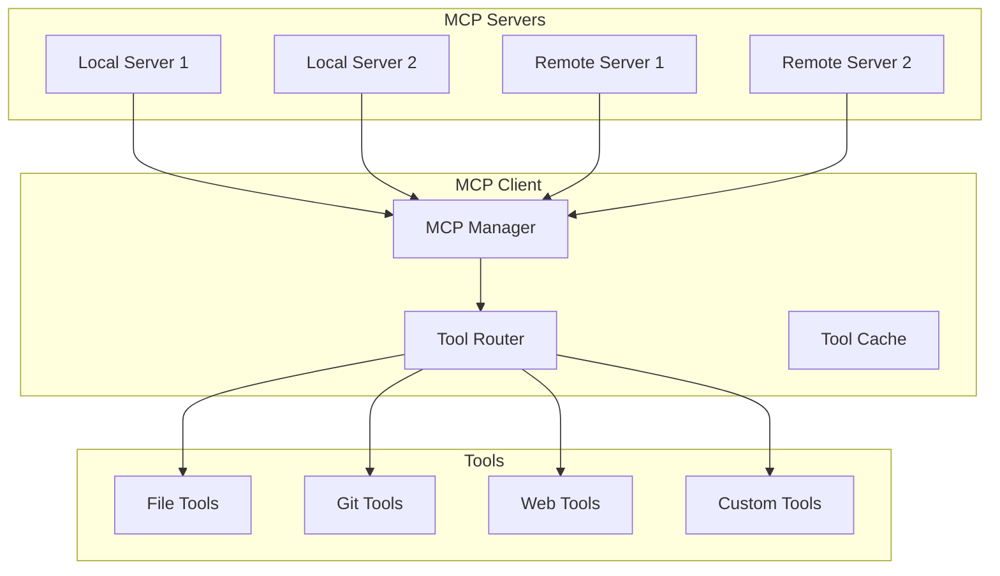
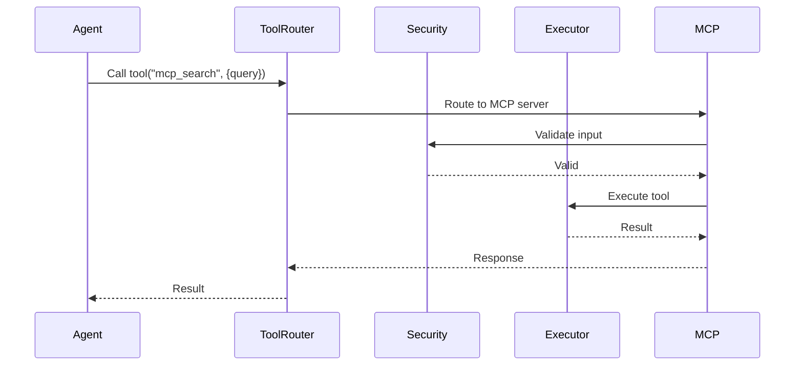

# RFC 0007: Toolchain Integration

## Summary

本 RFC 定义 Acme 与外部工具链的集成方案，包括 Git、终端、LSP 检测、安全校验和 MCP 协议。

## Motivation

Acme 需要与开发者工作流中的常用工具集成：
- **Git**: 版本控制
- **Terminal**: 命令执行
- **LSP**: 语言服务
- **MCP**: 扩展协议
- **Security**: 权限控制

## Git Integration



### Git Operations API

```typescript
// packages/shared/src/git/types.ts

export interface GitInfo {
  root: string;
  branch: string;
  branches: Branch[];
  remotes: Remote[];
  status: GitStatus;
  tags: Tag[];
}

export interface GitStatus {
  current: string | null;
  tracking: string | null;
  ahead: number;
  behind: number;
  staged: FileStatus[];
  modified: FileStatus[];
  untracked: string[];
  conflicted: string[];
}

export interface GitOperation {
  // Repository
  init(path: string): Promise<void>;
  clone(url: string, path: string): Promise<void>;

  // Branch
  branches(): Promise<Branch[]>;
  createBranch(name: string, checkout?: boolean): Promise<void>;
  deleteBranch(name: string, force?: boolean): Promise<void>;
  checkout(branch: string, create?: boolean): Promise<void>;

  // Changes
  status(): Promise<GitStatus>;
  diff(paths?: string[]): Promise<DiffResult[]>;
  stage(paths: string[]): Promise<void>;
  unstage(paths: string[]): Promise<void>;

  // Commit
  commit(message: string): Promise<string>;
  amend(message?: string, noEdit?: boolean): Promise<void>;

  // Remote
  push(remote?: string, branch?: string): Promise<void>;
  pull(remote?: string, branch?: string): Promise<void>;
  fetch(remote?: string): Promise<void>;

  // Worktree
  worktrees(): Promise<Worktree[]>;
  addWorktree(path: string, branch: string): Promise<void>;
  removeWorktree(path: string): Promise<void>;
}
```

### Git Diff View

```mermaid
graph LR
    subgraph Diff View
        File1[File: src/index.ts]
        Hunk1[@@ -1,5 +1,7 @@]
        Line1[ - old line]
        Line2[+ new line]
        Line3[  context]
    end

    File1 --> Hunk1
    Hunk1 --> Line1
    Hunk1 --> Line2
    Hunk1 --> Line3
```

## Terminal Integration



### Terminal API

```typescript
// packages/shared/src/terminal/types.ts

export interface TerminalSession {
  id: string;
  cwd: string;
  shell: ShellType;
  env: Record<string, string>;

  // Lifecycle
  start(): Promise<void>;
  resize(cols: number, rows: number): void;
  write(data: string): void;
  stop(): Promise<void>;

  // Events
  onData: (callback: (data: string) => void) => void;
  onExit: (callback: (code: number) => void) => void;
}

export interface CommandExecution {
  command: string;
  cwd?: string;
  env?: Record<string, string>;
  timeout?: number;

  // Output
  stdout: string;
  stderr: string;
  exitCode: number;

  // Streaming
  stream?: AsyncIterable<string>;
}

export class TerminalManager {
  private sessions: Map<string, TerminalSession>;
  private pool: PTYPool;

  async createSession(options: TerminalOptions): Promise<TerminalSession>;
  async execute(command: string, options?: ExecuteOptions): Promise<CommandExecution>;
  async executeStream(command: string, options?: ExecuteOptions): AsyncIterable<string>;
  getSession(id: string): TerminalSession | undefined;
}
```

### Terminal UI

```
┌─────────────────────────────────────────┐
│ terminal ~ bash                    [×]  │
├─────────────────────────────────────────┤
│ $ cd ~/projects/acme                    │
│ $ npm test                              │
│                                         │
│ ✓ PASS  src/index.test.ts               │
│ ✓ PASS  src/utils.test.ts               │
│                                         │
│ Test Suites: 2 passed, 2 total          │
│ Tests:       15 passed, 15 total        │
│                                         │
│ $ _                                     │
└─────────────────────────────────────────┘
```

## LSP Integration



### LSP Detection

```typescript
// packages/shared/src/lsp/detector.ts

export interface LSPConfig {
  name: string;
  command: string[];
  args?: string[];
  rootPatterns: string[];
  languages: string[];
}

export class LSPDetector {
  private configs: LSPConfig[] = [
    {
      name: 'typescript',
      command: ['typescript-language-server', '--stdio'],
      rootPatterns: ['tsconfig.json', 'package.json'],
      languages: ['typescript', 'javascript'],
    },
    {
      name: 'rust-analyzer',
      command: ['rust-analyzer'],
      rootPatterns: ['Cargo.toml'],
      languages: ['rust'],
    },
    {
      name: 'pyright',
      command: ['pyright-langserver', '--stdio'],
      rootPatterns: ['pyproject.toml', 'requirements.txt'],
      languages: ['python'],
    },
  ];

  async detect(rootPath: string): Promise<LSPConfig[]> {
    const results: LSPConfig[] = [];

    for (const config of this.configs) {
      if (await this.matchesRoot(config, rootPath)) {
        results.push(config);
      }
    }

    return results;
  }

  private async matchesRoot(config: LSPConfig, rootPath: string): Promise<boolean> {
    for (const pattern of config.rootPatterns) {
      const matches = await glob(pattern, { cwd: rootPath });
      if (matches.length > 0) return true;
    }
    return false;
  }
}
```

## Security Validation



### Security Validation API

```typescript
// packages/shared/src/security/validator.ts

export interface SecurityContext {
  workspace: string;
  project?: string;
  vault?: string;
  userId?: string;
}

export interface SecurityRule {
  type: 'command' | 'path' | 'network' | 'env';
  pattern: string | RegExp;
  action: PermissionLevel;
  message?: string;
}

export class SecurityValidator {
  private rules: SecurityRule[];

  constructor(rules: SecurityRule[]) {
    this.rules = rules;
  }

  validateCommand(command: string, context: SecurityContext): ValidationResult {
    for (const rule of this.rules) {
      if (rule.type === 'command' && this.matches(command, rule.pattern)) {
        return {
          allowed: rule.action === PermissionLevel.ALLOW,
          requiresConfirmation: rule.action === PermissionLevel.ASK,
          message: rule.message,
        };
      }
    }
    return { allowed: true };
  }

  validatePath(path: string, context: SecurityContext): ValidationResult {
    // Resolve path and check bounds
    const resolved = path.resolve(context.workspace);
    if (!resolved.startsWith(context.workspace)) {
      return { allowed: false, message: 'Path outside workspace' };
    }
    // Check rules...
  }

  private matches(value: string, pattern: string | RegExp): boolean {
    if (pattern instanceof RegExp) {
      return pattern.test(value);
    }
    // Glob pattern matching
    return minimatch(value, pattern);
  }
}
```

### Built-in Security Rules

```toml
# Security rules (in config)

[rules.command]
# Dangerous commands
"rm -rf /" = "deny"
"rm -rf /*" = "deny"
"mkfs.*" = "deny"
"dd if=.* of=/" = "deny"

# System modification
"sudo *" = "ask"
"chmod 777 *" = "ask"
"kill -9 *" = "ask"

# Network
"curl .* \| sh" = "ask"
"wget .* \| sh" = "ask"

[rules.path]
# Sensitive paths
"~/.ssh/**" = "ask"
"~/.aws/**" = "ask"
"/etc/**" = "ask"
"**/.env" = "ask"

[rules.network]
# External access
"http://*" = "allow"
"https://*" = "allow"
```

## MCP Protocol Integration



### MCP Manager

```typescript
// packages/shared/src/mcp/manager.ts

export interface MCPServer {
  name: string;
  type: 'local' | 'remote';
  enabled: boolean;

  // Local
  command?: string;
  args?: string[];
  env?: Record<string, string>;

  // Remote
  url?: string;
  headers?: Record<string, string>;

  // Status
  status: 'disconnected' | 'connecting' | 'connected' | 'error';
  error?: string;
}

export interface MCPTool {
  name: string;
  server: string;
  description: string;
  inputSchema: JSONSchema;
  outputSchema?: JSONSchema;
}

export class MCPManager {
  private servers: Map<string, MCPServer>;
  private clients: Map<string, MCPClient>;
  private tools: Map<string, MCPTool>;

  async addServer(config: MCPServer): Promise<void>;
  async removeServer(name: string): Promise<void>;
  async startServer(name: string): Promise<void>;
  async stopServer(name: string): Promise<void>;

  getTools(): MCPTool[];
  getToolsByServer(server: string): MCPTool[];
  callTool(name: string, input: unknown): Promise<unknown>;
}
```

## Tool Execution Flow



## Alternatives Considered

1. **完全沙箱化执行**
   - 优点: 安全性高
   - 缺点: 功能受限

2. **使用 Docker 容器**
   - 优点: 隔离性好
   - 缺点: 性能开销大，Windows 支持差

3. **系统级权限控制**
   - 优点: 粒度细
   - 缺点: 跨平台复杂

## Implementation Plan

1. Phase 1: Core Tools
   - Git 操作封装
   - 终端管理
   - 基础安全校验

2. Phase 2: LSP Integration
   - LSP 检测
   - 语言服务

3. Phase 3: MCP
   - MCP Client 实现
   - 工具路由

## Open Questions

- [ ] 是否支持自定义安全规则导入？
- [ ] 工具执行超时策略？
- [ ] 如何处理工具依赖？
