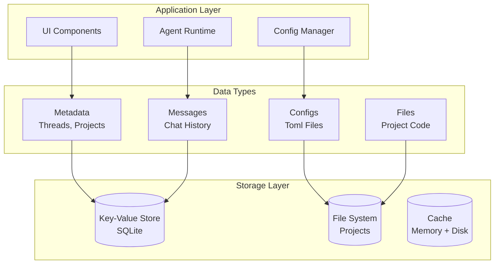
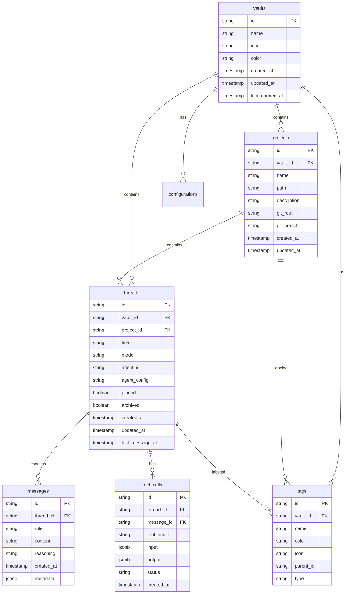
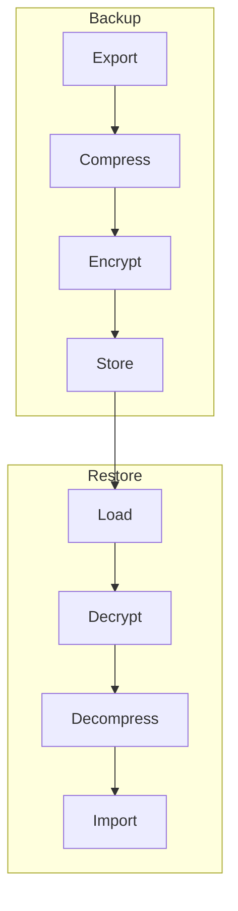

# RFC 0008: Data Layer Design

## Summary

本 RFC 定义 Acme 的数据层设计，包括本地存储方案、数据结构、持久化策略和同步机制。

## Motivation

Acme 采用 **Local-first** 设计原则：
- 所有数据默认存储在本地
- 用户完全拥有和控制数据
- 可选的云端备份/同步

## Storage Architecture



## Database Schema

### SQLite Schema



## Key-Value Store API

```typescript
// packages/core/src/storage/kv.ts

export interface KVStore {
  // Basic operations
  get<T>(key: string): Promise<T | undefined>;
  set<T>(key: string, value: T): Promise<void>;
  delete(key: string): Promise<void>;
  has(key: string): Promise<boolean>;

  // Batch operations
  getMany<T>(keys: string[]): Promise<(T | undefined)[]>;
  setMany<T>(entries: Record<string, T>): Promise<void>;
  deleteMany(keys: string[]): Promise<void>;

  // Query operations
  list(prefix: string): Promise<string[]>;
  listWithValues<T>(prefix: string): Promise<Record<string, T>>;

  // Transaction
  transaction<T>(fn: (tx: Transaction) => Promise<T>): Promise<T>;
}

export interface Transaction {
  get<T>(key: string): Promise<T | undefined>;
  set<T>(key: string, value: T): void;
  delete(key: string): void;
  commit(): Promise<void>;
  rollback(): void;
}
```

## File System Structure

```mermaid
graph TB
    subgraph Acme Home ~/.acme/
        Config[config/]
        Vaults[vaults/]
        Cache[cache/]
        Logs[logs/]
    end

    subgraph vaults/vault-uuid/
        VaultMeta[.acme/config.toml]
        VaultDB[data/acme.db]
        Projects[projects/]
        Threads[threads/]
    end

    subgraph projects/project-uuid/
        ProjectMeta[.acme/config.toml]
        SourceCode[src/, lib/, ...]
    end

    subgraph threads/thread-uuid/
        ThreadMeta[thread.json]
        History[messages.jsonl]
    end
```

## Data Models

### Vault

```typescript
// packages/core/src/storage/models/vault.ts

export interface VaultRecord {
  id: string;
  name: string;
  icon: string | null;
  color: string | null;
  description: string | null;
  createdAt: Date;
  updatedAt: Date;
  lastOpenedAt: Date | null;
}

export interface VaultRepository {
  create(data: CreateVaultInput): Promise<VaultRecord>;
  findById(id: string): Promise<VaultRecord | null>;
  findAll(): Promise<VaultRecord[]>;
  update(id: string, data: UpdateVaultInput): Promise<VaultRecord>;
  delete(id: string): Promise<void>;
}
```

### Thread

```typescript
// packages/core/src/storage/models/thread.ts

export interface ThreadRecord {
  id: string;
  vaultId: string;
  projectId: string | null;
  title: string;
  mode: ThreadMode;
  agentId: string;
  agentConfig: AgentConfig;
  status: ThreadStatus;
  pinned: boolean;
  archived: boolean;
  createdAt: Date;
  updatedAt: Date;
  lastMessageAt: Date | null;
}

export interface MessageRecord {
  id: string;
  threadId: string;
  role: MessageRole;
  content: string;
  reasoning: string | null;
  metadata: Record<string, unknown>;
  createdAt: Date;
}

export interface ThreadRepository {
  create(data: CreateThreadInput): Promise<ThreadRecord>;
  findById(id: string): Promise<ThreadRecord | null>;
  findByVault(vaultId: string, options?: FindOptions): Promise<ThreadRecord[]>;
  update(id: string, data: UpdateThreadInput): Promise<ThreadRecord>;
  delete(id: string): Promise<void>;

  // Messages
  addMessage(threadId: string, message: CreateMessageInput): Promise<MessageRecord>;
  getMessages(threadId: string, options?: MessageOptions): Promise<MessageRecord[]>;
}
```

## Message Storage

```typescript
// packages/core/src/storage/models/message.ts

// Messages are stored in append-only JSONL format for efficient streaming
// and easy to process with line-based tools

export interface MessageStore {
  // Append a message (append-only for performance)
  append(threadId: string, message: Message): Promise<void>;

  // Read messages with pagination
  read(
    threadId: string,
    options?: {
      after?: string;  // cursor
      limit?: number;
    }
  ): Promise<Message[]>;

  // Search messages (full-text search)
  search(
    threadId: string,
    query: string
  ): Promise<SearchResult[]>;

  // Compact old messages into snapshot
  compact(threadId: string, before: Date): Promise<void>;
}
```

## Cache Strategy

```mermaid
graph TB
    subgraph Cache Layers
        Memory[Memory Cache<br/>LRU]
        Disk[Disk Cache<br/>SQLite]
    end

    subgraph Cache Keys
        Thread[thread:{id}]
        Project[project:{id}]
        Config[config:{type}:{id}]
        Search[search:{queryHash}]
    end

    Memory --> Disk
    Thread --> Memory
    Project --> Memory
    Config --> Memory
    Search --> Memory
```

```typescript
// packages/core/src/storage/cache.ts

export interface CacheOptions {
  ttl?: number;           // Time to live in ms
  maxSize?: number;       // Max entries
  strategy?: 'lru' | 'lfu';
}

export class Cache {
  private memory: Map<string, CacheEntry>;
  private disk?: SQLite;
  private options: CacheOptions;

  async get<T>(key: string): Promise<T | undefined> {
    // Check memory first
    const memoryEntry = this.memory.get(key);
    if (memoryEntry && !this.isExpired(memoryEntry)) {
      return memoryEntry.value as T;
    }

    // Check disk cache
    if (this.disk) {
      const diskEntry = await this.disk.get(key);
      if (diskEntry) {
        this.memory.set(key, diskEntry);  // Promote to memory
        return diskEntry.value as T;
      }
    }

    return undefined;
  }

  async set<T>(key: string, value: T, ttl?: number): Promise<void> {
    const entry: CacheEntry = {
      value,
      expiresAt: ttl ? Date.now() + ttl : undefined,
    };

    this.memory.set(key, entry);

    if (this.disk) {
      await this.disk.set(key, entry);
    }
  }
}
```

## Backup and Restore



```typescript
// packages/core/src/storage/backup.ts

export interface BackupOptions {
  includeThreads?: boolean;
  includeConfigs?: boolean;
  includeProjects?: boolean;
  compress?: boolean;
  encrypt?: boolean;
  password?: string;
}

export class BackupManager {
  async createBackup(vaultId: string, options: BackupOptions): Promise<BackupFile> {
    const data = await this.collectData(vaultId, options);
    const json = JSON.stringify(data);

    let result = json;
    if (options.compress) {
      result = await this.compress(result);
    }
    if (options.encrypt && options.password) {
      result = await this.encrypt(result, options.password);
    }

    return {
      version: 1,
      createdAt: new Date(),
      data: result,
    };
  }

  async restoreBackup(backup: BackupFile, options: BackupOptions): Promise<void> {
    let data = backup.data;

    if (options.encrypt && options.password) {
      data = await this.decrypt(data, options.password);
    }
    if (options.compress) {
      data = await this.decompress(data);
    }

    const parsed = JSON.parse(data);
    await this.importData(parsed, options);
  }
}
```

## Sync Strategy (Optional)

```mermaid
graph LR
    subgraph Local
        KV1[(SQLite)]
    end

    subgraph Cloud (Optional)
        Remote[(Remote Server)]
    end

    subgraph Sync Engine
        Change[Change Log]
        Resolve[Conflict Resolution]
        Apply[Apply Changes]
    end

    KV1 -->|Changes| Change
    Change -->|Conflict Check| Resolve
    Resolve -->|Apply| Remote
    Remote -->|Changes| Resolve
    Resolve -->|Apply| KV1
```

```typescript
// packages/core/src/storage/sync.ts

export interface SyncOptions {
  enabled: boolean;
  remoteUrl?: string;
  authToken?: string;
  syncInterval?: number;
  conflictResolution?: 'local' | 'remote' | 'manual';
}

export interface ChangeLog {
  id: string;
  entity: 'vault' | 'project' | 'thread' | 'message';
  entityId: string;
  operation: 'create' | 'update' | 'delete';
  data: unknown;
  timestamp: Date;
  synced: boolean;
}

export class SyncEngine {
  private changeLog: ChangeLog[];

  async sync(): Promise<SyncResult> {
    // 1. Push local changes
    const unsynced = this.changeLog.filter(c => !c.synced);
    await this.pushChanges(unsynced);

    // 2. Pull remote changes
    const remoteChanges = await this.pullChanges();
    await this.applyRemoteChanges(remoteChanges);

    // 3. Resolve conflicts
    await this.resolveConflicts();

    return { pushed: unsynced.length, pulled: remoteChanges.length };
  }
}
```

## Data Migration

```typescript
// packages/core/src/storage/migrate.ts

export interface Migration {
  version: number;
  up(): Promise<void>;
  down(): Promise<void>;
}

export class MigrationManager {
  private migrations: Migration[] = [
    {
      version: 1,
      up: async () => {
        // Initial schema
      },
      down: async () => {
        // Rollback
      },
    },
    {
      version: 2,
      up: async () => {
        // Add threads table
      },
      down: async () => {
        // Rollback
      },
    },
  ];

  async migrate(from: number, to: number): Promise<void> {
    const pending = this.migrations.filter(m => m.version > from && m.version <= to);

    for (const migration of pending) {
      await migration.up();
    }
  }
}
```

## Alternatives Considered

1. **纯文件存储 (JSON)**
   - 优点: 简单，无需数据库
   - 缺点: 查询性能差

2. **IndexedDB**
   - 优点: 浏览器原生
   - 缺点: 不适合 Electron 场景

3. **Realm**
   - 优点: 性能好
   - 缺点: 商业许可

## Implementation Plan

1. Phase 1: Core Storage
   - SQLite schema
   - KV Store 实现
   - Repository 层

2. Phase 2: Message Store
   - JSONL 存储
   - 消息搜索

3. Phase 3: Cache
   - LRU 内存缓存
   - 磁盘缓存

4. Phase 4: Backup/Sync
   - 导出/导入
   - 可选同步

## Open Questions

- [ ] 最大消息历史长度？
- [ ] 缓存淘汰策略？
- [ ] 多设备同步冲突解决策略？
