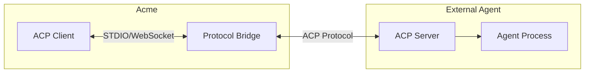
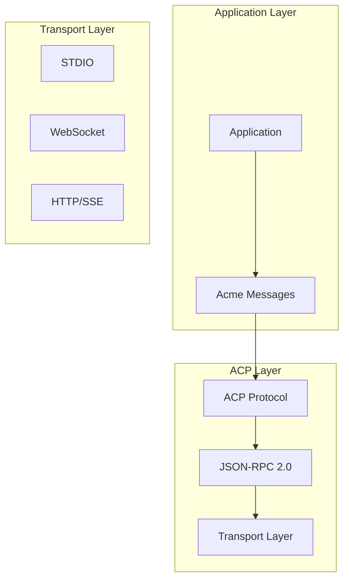
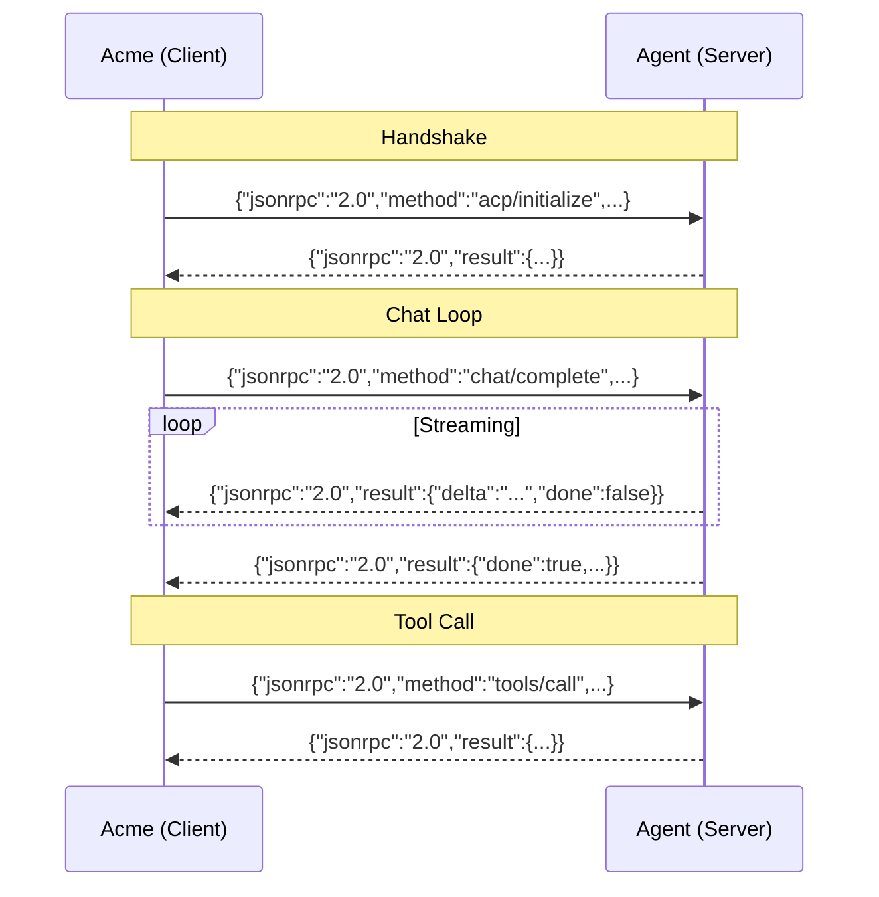
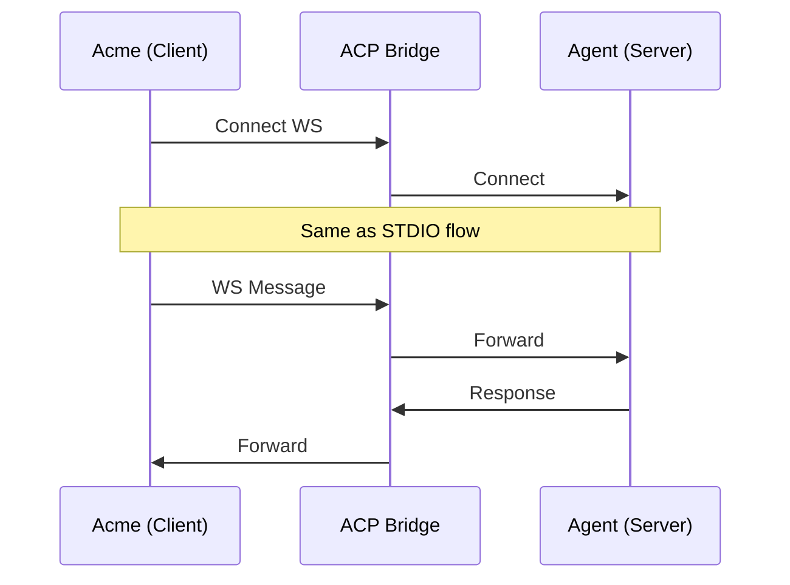
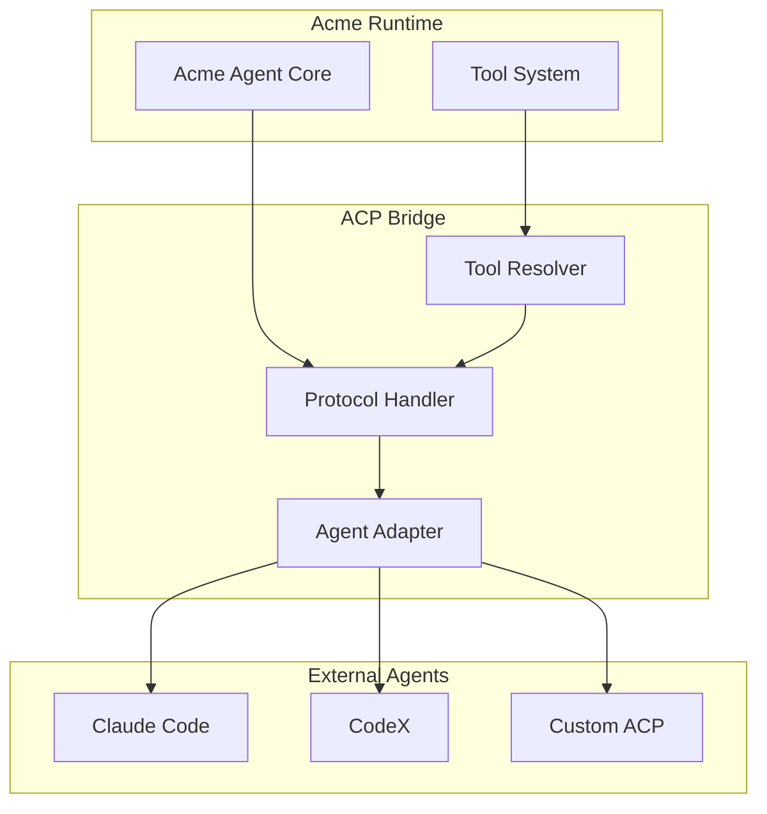

# RFC 0009: ACP Protocol Design

## Summary

本 RFC 定义 Agent Client Protocol (ACP) 的设计与实现，用于支持 Acme 与第三方 Code Agent 的通信。

## Motivation

Acme 需要支持多种 Code Agent：
- Claude Code
- CodeX
- 其他 ACP 兼容 Agent

ACP 协议提供：
- 标准化的 Agent 接口
- 统一的通信格式
- 会话管理
- 工具调用抽象

## Protocol Overview



## Protocol Stack



## Message Types

### 1. Initialize

```typescript
// ACP Message: initialize
interface InitializeRequest {
  jsonrpc: '2.0';
  id: string;
  method: 'acp/initialize';
  params: {
    protocolVersion: string;
    capabilities: ClientCapabilities;
    clientInfo: {
      name: string;
      version: string;
    };
  };
}

interface InitializeResponse {
  jsonrpc: '2.0';
  id: string;
  result: {
    protocolVersion: string;
    capabilities: ServerCapabilities;
    serverInfo: {
      name: string;
      version: string;
    };
  };
}

interface ClientCapabilities {
  streaming?: boolean;
  notifications?: boolean;
  tools?: boolean;
}

interface ServerCapabilities {
  streaming?: boolean;
  notifications?: boolean;
  tools?: boolean;
}
```

### 2. Chat

```typescript
// ACP Message: chat/complete
interface ChatRequest {
  jsonrpc: '2.0';
  id: string;
  method: 'chat/complete';
  params: {
    messages: Message[];
    model?: string;
    temperature?: number;
    maxTokens?: number;
    tools?: ToolDefinition[];
    systemPrompt?: string;
  };
}

interface ChatResponse {
  jsonrpc: '2.0';
  id: string;
  result?: {
    message: Message;
    usage?: {
      inputTokens: number;
      outputTokens: number;
    };
  };
  error?: ResponseError;
}

// Streaming response
interface ChatStreamResponse {
  jsonrpc: '2.0';
  id: string;
  result: {
    delta: string;
    reasoning?: string;
    done: boolean;
    message?: Message;  // Final message when done
  };
}
```

### 3. Tools

```typescript
// ACP Message: tools/list
interface ListToolsRequest {
  jsonrpc: '2.0';
  id: string;
  method: 'tools/list';
}

interface ListToolsResponse {
  jsonrpc: '2.0';
  id: string;
  result: {
    tools: ToolDefinition[];
  };
}

// ACP Message: tools/call
interface CallToolRequest {
  jsonrpc: '2.0';
  id: string;
  method: 'tools/call';
  params: {
    name: string;
    arguments: Record<string, unknown>;
  };
}

interface CallToolResponse {
  jsonrpc: '2.0';
  id: string;
  result?: {
    success: boolean;
    output?: unknown;
    error?: string;
  };
}
```

### 4. Session

```typescript
// ACP Message: session/start
interface SessionStartRequest {
  jsonrpc: '2.0';
  id: string;
  method: 'session/start';
  params: {
    workspace: string;
    context?: Record<string, unknown>;
  };
}

interface SessionStartResponse {
  jsonrpc: '2.0';
  id: string;
  result: {
    sessionId: string;
  };
}

// ACP Message: session/end
interface SessionEndRequest {
  jsonrpc: '2.0';
  id: string;
  method: 'session/end';
  params: {
    sessionId: string;
    reason?: string;
  };
}
```

### 5. Notifications

```typescript
// ACP Notifications (server -> client)

interface ToolCallNotification {
  jsonrpc: '2.0';
  method: 'notifications/tool_call';
  params: {
    tool: string;
    arguments: Record<string, unknown>;
  };
}

interface ProgressNotification {
  jsonrpc: '2.0';
  method: 'notifications/progress';
  params: {
    message: string;
    progress?: number;
  };
}

interface ErrorNotification {
  jsonrpc: '2.0';
  method: 'notifications/error';
  params: {
    code: number;
    message: string;
  };
}
```

## Transport: STDIO



### STDIO Message Format

```
// Each message is a JSON object followed by a newline
{"jsonrpc":"2.0","id":"1","method":"chat/complete",...}
{"jsonrpc":"2.0","id":"1","result":{"delta":"Hello","done":false}}
...
```

## Transport: WebSocket



## ACP Client Implementation

```typescript
// packages/acp/src/client.ts

export class ACPClient {
  private transport: Transport;
  private requestId = 0;
  private pendingRequests: Map<string, Deferred<Response>> = new Map();

  constructor(transport: Transport) {
    this.transport = transport;
    this.transport.onMessage((msg) => this.handleMessage(msg));
  }

  async initialize(): Promise<InitializeResult> {
    return this.request<InitializeResult>('acp/initialize', {
      protocolVersion: '1.0',
      capabilities: {
        streaming: true,
        notifications: true,
        tools: true,
      },
      clientInfo: {
        name: 'acme',
        version: '1.0.0',
      },
    });
  }

  async chat(params: ChatParams): Promise<ChatResponse> {
    return this.request<ChatResponse>('chat/complete', params);
  }

  async *chatStream(params: ChatParams): AsyncIterable<ChatStreamResponse> {
    const response = await this.chat(params);

    // For streaming, we use a different approach
    // The transport handles the streaming internally
    yield* this.transport.stream(params);
  }

  async listTools(): Promise<ToolDefinition[]> {
    const result = await this.request<ListToolsResult>('tools/list', {});
    return result.tools;
  }

  async callTool(name: string, args: Record<string, unknown>): Promise<ToolResult> {
    return this.request<ToolResult>('tools/call', { name, arguments: args });
  }

  private request<T>(method: string, params: unknown): Promise<T> {
    const id = String(++this.requestId);
    const deferred = new Deferred<T>();

    this.pendingRequests.set(id, deferred);
    this.transport.send({ jsonrpc: '2.0', id, method, params });

    return deferred.promise;
  }

  private handleMessage(msg: ACPMessage): void {
    if ('id' in msg && msg.id) {
      const deferred = this.pendingRequests.get(String(msg.id));
      if (deferred) {
        this.pendingRequests.delete(String(msg.id));
        if ('error' in msg) {
          deferred.reject(new Error(msg.error.message));
        } else {
          deferred.resolve(msg.result);
        }
      }
    } else if ('method' in msg && msg.method?.startsWith('notifications/')) {
      this.handleNotification(msg);
    }
  }
}
```

## ACP Bridge



```typescript
// packages/acp/src/bridge.ts

export interface ACPServerConfig {
  command: string;
  args?: string[];
  env?: Record<string, string>;
  cwd?: string;
}

export class ACPBridge {
  private client: ACPClient;
  private config: ACPServerConfig;
  private process?: ChildProcess;

  constructor(config: ACPServerConfig) {
    this.config = config;
    this.client = new ACPClient(new STDIOTransport());
  }

  async start(): Promise<void> {
    this.process = spawn(this.config.command, this.config.args, {
      env: { ...process.env, ...this.config.env },
      cwd: this.config.cwd,
    });

    await this.client.initialize();
  }

  async stop(): Promise<void> {
    this.process?.kill();
  }

  // Bridge Acme tools to external agent
  async getAvailableTools(): Promise<ToolDefinition[]> {
    return this.client.listTools();
  }

  async executeTool(name: string, args: Record<string, unknown>): Promise<ToolResult> {
    return this.client.callTool(name, args);
  }
}
```

## Tool Schema Mapping

```typescript
// Tool definitions are converted between Acme and ACP formats

export function acmeToolToACP(tool: AcmeTool): ToolDefinition {
  return {
    name: tool.name,
    description: tool.description,
    inputSchema: tool.inputSchema,
  };
}

export function acpToolToAcme(tool: ToolDefinition): AcmeTool {
  return {
    name: tool.name,
    description: tool.description,
    inputSchema: tool.inputSchema,
    execute: async (args) => {
      const result = await acme.acpClient.callTool(tool.name, args);
      return result;
    },
  };
}
```

## Error Handling

```typescript
// ACP Error Codes
export enum ACPErrorCode {
  ParseError = -32700,
  InvalidRequest = -32600,
  MethodNotFound = -32601,
  InvalidParams = -32602,
  InternalError = -32603,

  // Application errors
  ToolNotFound = 10001,
  ToolExecutionFailed = 10002,
  SessionNotFound = 10003,
  SessionExpired = 10004,
  Unauthorized = 10005,
}

export interface ACPError {
  code: number;
  message: string;
  data?: unknown;
}
```

## Protocol Versioning

```typescript
// Version negotiation

interface VersionInfo {
  major: number;
  minor: number;
  patch: number;
}

function compareVersions(a: VersionInfo, b: VersionInfo): number {
  if (a.major !== b.major) return a.major - b.major;
  if (a.minor !== b.minor) return a.minor - b.minor;
  return a.patch - b.patch;
}

// Client proposes version, server responds with version it supports
// If incompatible, connection is rejected
```

## Alternatives Considered

1. **使用 JSON-RPC over HTTP**
   - 缺点: 不适合 STDIO 场景

2. **使用 gRPC**
   - 缺点: 对于 Agent 场景过重

3. **自定义协议**
   - 缺点: 生态支持差

## Implementation Plan

1. Phase 1: Protocol Core
   - Message types
   - Transport abstraction
   - Client implementation

2. Phase 2: Bridge
   - Process management
   - Tool mapping
   - Session management

3. Phase 3: Agent Adapters
   - Claude Code adapter
   - CodeX adapter

## Open Questions

- [ ] 是否需要支持多路复用（多个 session）？
- [ ] 心跳/keepalive 机制？
- [ ] 如何处理工具调用超时？
