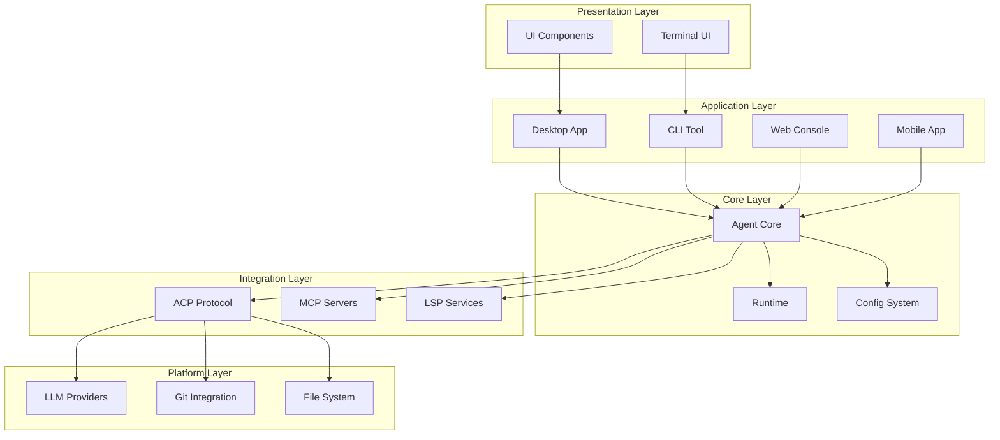
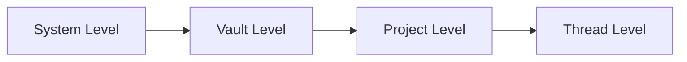

# RFC 001: Acme 架构概述

## 概述

本文档定义 Acme 系统的整体架构。Acme 是一款基于 Electron 开发的桌面应用程序，定位为类似 OpenAI Codex App 的 AI 编程助手，支持多 Code Agent 接入。

## 目标

1. **多 Agent 支持**：支持 Acme Agent、Claude Code、OpenCode、CodeX 等主流 Code Agent
2. **ACP 协议兼容**：通过 ACP 协议支持第三方 Agent
3. **Local-first 设计**：所有数据保存在本地
4. **多层次配置**：支持系统级、Vault 级、项目级配置
5. **可扩展性**：支持 Skill、MCP、Command 等扩展机制

## 架构图

## 核心组件

### 1. 应用层 (Apps)

| 应用 | 描述 | 技术栈 |
|------|------|--------|
| `apps/desktop` | 桌面应用程序 | Electron + React |
| `apps/cli` | 命令行工具 | Node.js |
| `apps/console` | Web 控制台 | Next.js |
| `apps/mobile` | 移动应用 | React Native |
| `apps/viewer` | Thread 分享查看器 | Next.js |
| `apps/web` | 官方网站 | Next.js |
| `apps/api-server` | API 服务器 | Elysia |

### 2. 核心包 (Packages)

| 包 | 描述 |
|------|------|
| `packages/core` | 核心类型、接口、工具函数 |
| `packages/ai` | AI 能力抽象层 (类似 Vercel AI) |
| `packages/agent` | Agent 核心包 |
| `packages/code-agent` | Acme Agent 实现 |
| `packages/acp` | ACP 协议实现 |
| `packages/shared` | 共享工具库 |
| `packages/ui` | UI 组件库 |
| `packages/schemas` | JSON Schema 定义 |

### 3. 数据层次

## 配置层级

Acme 采用多层次配置系统：

1. **系统级 (System)**: 全局配置，对所有 Vault 和项目生效
2. **Vault 级 (Vault)**: 单个 Vault 的配置
3. **项目级 (Project)**: 单个项目的配置
4. **线程级 (Thread)**: 单个会话的配置

## 安全性

- 所有数据本地存储
- API Key 安全存储
- 沙箱环境运行
- 权限控制系统

## 总结

Acme 架构遵循以下原则：

1. **模块化**：各组件职责清晰，可独立演进
2. **可扩展**：通过 ACP、MCP、Skill 等机制支持扩展
3. **本地优先**：数据本地存储，保护用户隐私
4. **多层次**：配置、权限、Agent 等都支持多层次管理
