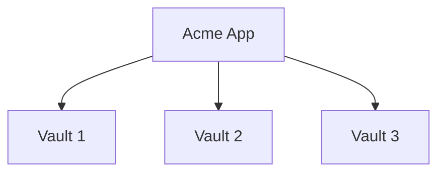
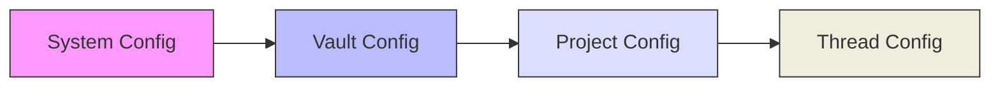

# RFC 002: Vault 和项目系统

## 概述

本文档定义 Acme 中的 Vault 和 Project 概念及其数据结构。Vault 是 Acme 中的最高级别容器，每个 Vault 可以拥有独立的项目集合和配置。

## 目标

1. 定义 Vault 和 Project 的数据结构
2. 设计层级关系和继承机制
3. 定义配置继承和覆盖规则

## Vault 概念

Vault 是 Acme 中的顶级容器，类似于 Codex App 中的"项目"概念，但更加广义：

- 每个 Vault 可以有独立的配置
- Vault 可以有独立的窗口
- Vault 之间的数据完全隔离



## 数据结构

### Vault

```typescript
interface Vault {
  // 唯一标识
  id: string;

  // 显示名称
  name: string;

  // 描述
  description?: string;

  // 创建时间
  createdAt: number;

  // 更新时间
  updatedAt: number;

  // 配置
  config: VaultConfig;

  // 项目列表
  projects: Project[];

  // Vault 级 Agent 配置
  agents: VaultAgentConfig[];

  // Vault 级 Provider 配置
  providers: VaultProviderConfig[];

  // Vault 级 MCP 配置
  mcp: VaultMcpConfig[];

  // Vault 级 Command 配置
  commands: VaultCommandConfig[];

  // Vault 级 Skill 配置
  skills: VaultSkillConfig[];

  // 标签
  tags: string[];
}
```

### Project

```typescript
interface Project {
  // 唯一标识
  id: string;

  // 所属 Vault ID
  vaultId: string;

  // 显示名称
  name: string;

  // 项目路径
  path: string;

  // Git 仓库信息
  git?: GitInfo;

  // 创建时间
  createdAt: number;

  // 最后访问时间
  lastAccessedAt: number;

  // 配置
  config: ProjectConfig;

  // 项目级 Agent 配置
  agents: ProjectAgentConfig[];

  // 项目级 Provider 配置
  providers: ProjectProviderConfig[];

  // 项目级 MCP 配置
  mcp: ProjectMcpConfig[];

  // 项目级 Command 配置
  commands: ProjectCommandConfig[];

  // 项目级 Skill 配置
  skills: ProjectSkillConfig[];

  // 标签
  tags: string[];
}
```

### GitInfo

```typescript
interface GitInfo {
  // 仓库根目录
  root: string;

  // 当前分支
  branch: string;

  // 远程仓库 URL
  remoteUrl?: string;

  // 是否为 Git 仓库
  isRepository: boolean;
}
```

## 配置继承机制

配置按照以下优先级覆盖：

```
Thread Config > Project Config > Vault Config > System Config
```

### 继承规则



### 配置合并示例

```typescript
// System 配置
const systemConfig = {
  provider: {
    default: 'openai',
    Anthropic: { model: 'claude-sonnet-4-20250514' }
  },
  agent: {
    build: { model: 'claude-sonnet-4-20250514' }
  },
  mcp: {
    enabled: ['filesystem']
  }
};

// Vault 配置
const vaultConfig = {
  provider: {
    Anthropic: { model: 'claude-opus-4-6-20250514' }  // 覆盖 System
  },
  agent: {
    build: { tools: ['*'] }  // 添加新配置
  }
};

// 最终合并后
const mergedConfig = {
  provider: {
    default: 'openai',  // 来自 System
    Anthropic: { model: 'claude-opus-4-6-20250514' }  // 来自 Vault，覆盖
  },
  agent: {
    build: {
      model: 'claude-sonnet-4-20250514',  // 来自 System
      tools: ['*']  // 来自 Vault
    }
  },
  mcp: {
    enabled: ['filesystem']  // 来自 System
  }
};
```

## Vault 操作

### 创建 Vault

```bash
acme vault create
```

交互式创建：
- 输入 Vault 名称
- 选择存储位置
- 选择初始配置

### 管理项目

```bash
# 添加项目到 Vault
acme project add --vault <vault-id>

# 列出 Vault 中的项目
acme project list --vault <vault-id>

# 切换当前项目
acme project switch <project-id>
```

## 文件存储

Vault 数据存储在以下位置：

```
~/.acme/
├── vaults/
│   ├── {vault-id}/
│   │   ├── config.json
│   │   ├── projects.json
│   │   └── data/
│   │       └── threads/
│   └── {vault-id}/
│       └── ...
└── shared/
    └── cache/
```

## 总结

Vault 和 Project 系统提供了：

1. **数据隔离**：不同 Vault 之间完全隔离
2. **灵活配置**：支持多层次配置覆盖
3. **易于管理**：通过 CLI 和 UI 轻松管理
4. **继承机制**：配置自动继承和覆盖
