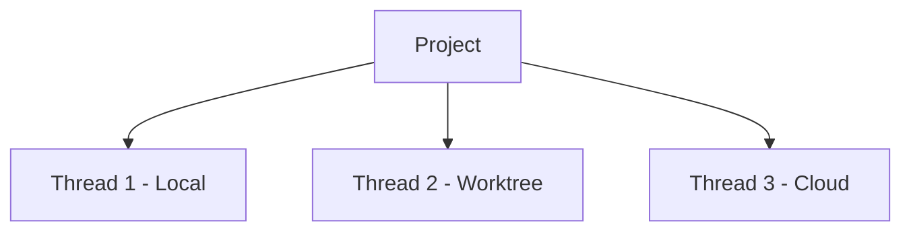
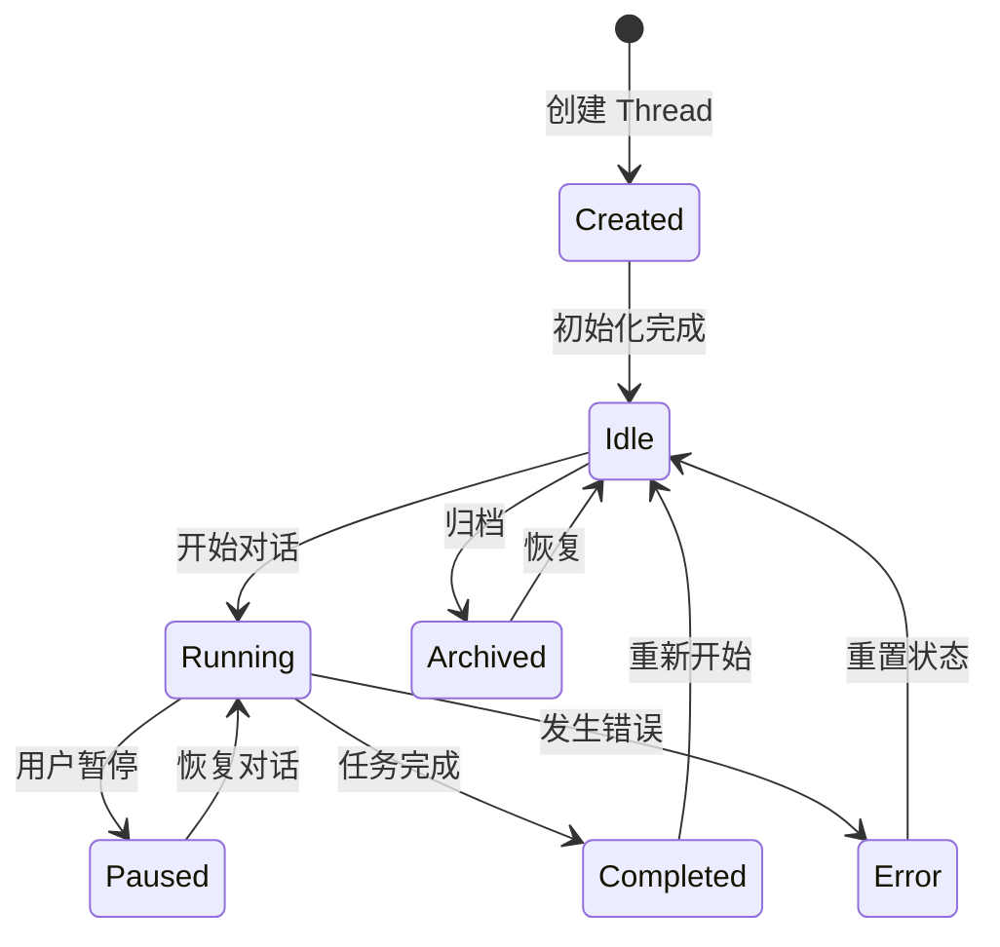

# RFC 003: Thread 会话系统

## 概述

本文档定义 Acme 中的 Thread（会话）概念。Thread 是用户与 Agent 交互的基本单位，每个 Thread 维护独立的对话历史和状态。

## 目标

1. 定义 Thread 的数据结构
2. 设计 Thread 生命周期
3. 支持多种 Thread 模式（Local、Worktree）
4. 支持 Thread 分享功能

## Thread 概念

Thread 是用户与 AI Agent 交互的会话单元：



## 数据结构

### Thread

```typescript
interface Thread {
  // 唯一标识
  id: string;

  // 所属项目 ID
  projectId: string;

  // 标题
  title: string;

  // 创建时间
  createdAt: number;

  // 最后活跃时间
  lastActiveAt: number;

  // 模式：local | worktree | cloud
  mode: ThreadMode;

  // 当前 Agent
  agent: AgentRef;

  // 对话消息
  messages: Message[];

  // 上下文文件
  context: Context[];

  // 状态
  status: ThreadStatus;

  // 是否归档
  archived: boolean;

  // 标签
  tags: string[];
}

type ThreadMode = 'local' | 'worktree' | 'cloud';

type ThreadStatus = 'idle' | 'running' | 'paused' | 'completed' | 'error';
```

### Message

```typescript
interface Message {
  // 唯一标识
  id: string;

  // 消息角色
  role: 'user' | 'assistant' | 'system' | 'tool' | 'tool-result';

  // 内容
  content: MessageContent;

  // 时间戳
  timestamp: number;

  // 附件
  attachments?: Attachment[];

  // 元数据
  metadata?: Record<string, unknown>;
}

type MessageContent = string | MultimodalContent;

interface MultimodalContent {
  // 文本内容
  text?: string;

  // 图片
  images?: ImageContent[];

  // 文件
  files?: FileContent[];
}

interface ImageContent {
  // 图片类型
  type: 'image';

  // 图片数据（base64 或 URL）
  source: string;

  // MIME 类型
  mimeType: string;

  // 可选的 alt 文本
  altText?: string;
}

interface FileContent {
  // 文件类型
  type: 'file';

  // 文件路径
  path: string;

  // 文件名
  name: string;

  // MIME 类型
  mimeType: string;
}
```

### Context

```typescript
interface Context {
  // 上下文类型
  type: 'file' | 'directory' | 'git-diff' | 'terminal' | 'ide';

  // 上下文路径或内容
  source: string;

  // 描述
  description?: string;

  // 添加时间
  addedAt: number;
}
```

### AgentRef

```typescript
interface AgentRef {
  // Agent 类型：acme | claude-code | opencode | codex | acp
  type: 'acme' | 'claude-code' | 'opencode' | 'codex' | 'acp';

  // Agent 标识符
  id?: string;

  // Agent 名称
  name?: string;

  // ACP 端点（如果是 ACP 类型）
  endpoint?: string;
}
```

## Thread 模式

### Local 模式

在当前项目目录中直接运行 Agent：

```typescript
const localThread: Thread = {
  mode: 'local',
  // Agent 直接在项目目录中操作
};
```

### Worktree 模式

使用 Git Worktree 隔离变更：

```typescript
const worktreeThread: Thread = {
  mode: 'worktree',
  // 自动创建 Git Worktree
  worktree: {
    branch: 'acme/worktree-xxx',
    path: '/path/to/worktree'
  }
};
```

### Cloud 模式

在云端运行 Agent（需要云端环境配置）：

```typescript
const cloudThread: Thread = {
  mode: 'cloud',
  // 在远程云环境中运行
  cloud: {
    provider: 'aws' | 'gcp' | 'azure',
    instance: 'instance-id'
  }
};
```

## Thread 生命周期



## Thread 管理

### CLI 操作

```bash
# 创建新的 Thread
acme thread create --project <project-id>

# 列出项目的 Thread
acme thread list --project <project-id>

# 查看 Thread 历史
acme thread history <thread-id>

# 归档 Thread
acme thread archive <thread-id>

# 恢复 Thread
acme thread restore <thread-id>

# 分享 Thread
acme thread share <thread-id>
```

### 分享功能

分享 Thread 生成一个只读链接：

```typescript
interface ThreadShare {
  // 分享 ID
  id: string;

  // Thread ID
  threadId: string;

  // 分享 URL
  url: string;

  // 过期时间（可选）
  expiresAt?: number;

  // 访问密码（可选）
  password?: string;
}
```

## UI 表示

Thread 在 UI 中以以下方式呈现：


### 侧边栏

- 项目列表
- Thread 列表（按项目分组）
- 快速搜索
- 新建 Thread 按钮

### 聊天面板

- 消息列表
- 输入框（支持多模态）
- Agent 切换
- 模式切换

### 工具面板

- 文件浏览器
- Git 状态
- 终端
- 预览

## 总结

Thread 系统提供：

1. **会话管理**：创建、恢复、归档会话
2. **多模式支持**：Local、Worktree、Cloud 三种模式
3. **上下文保持**：维护文件和终端状态
4. **分享功能**：生成只读分享链接
5. **状态追踪**：记录活跃状态和历史
