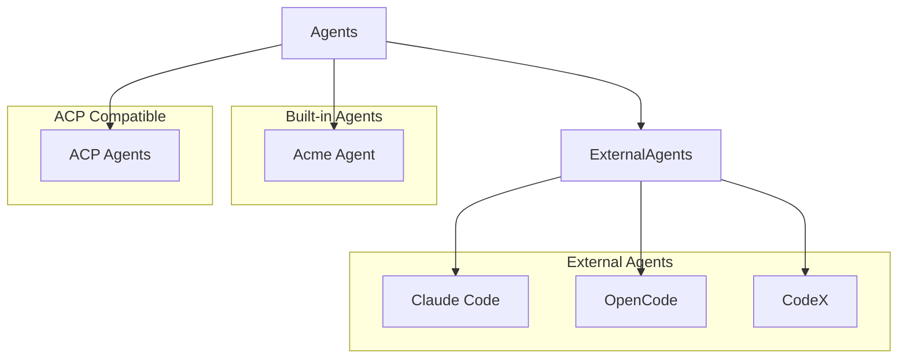
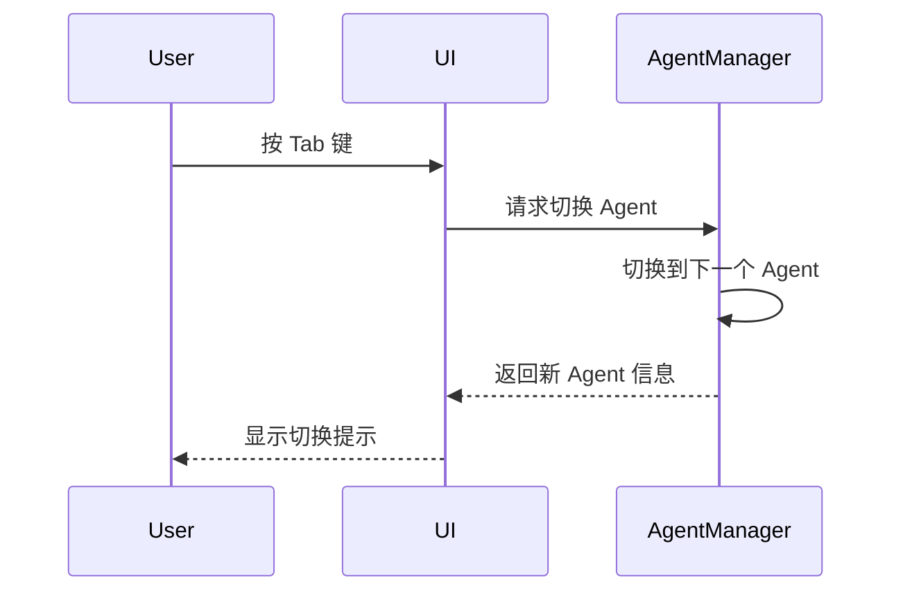
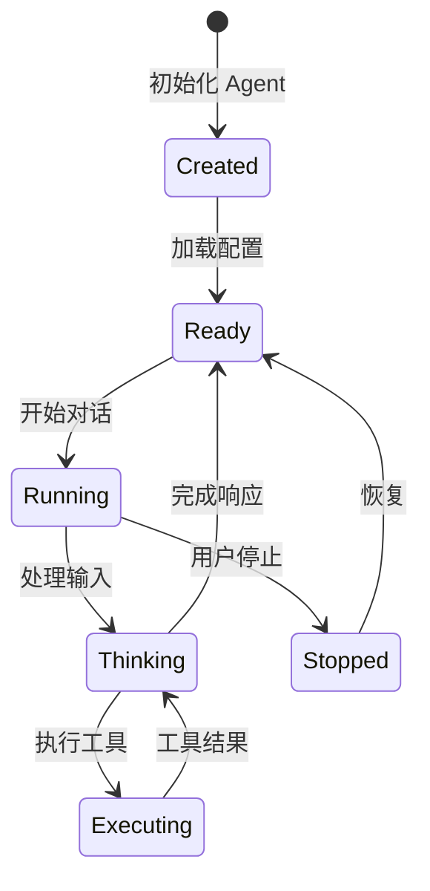

# RFC 004: Agent 系统设计

## 概述

本文档定义 Acme 中的 Agent 系统。Agent 是执行编程任务的核心组件，Acme 支持多种类型的 Agent，包括 Acme Agent、Claude Code、OpenCode、CodeX 以及通过 ACP 协议接入的第三方 Agent。

## 目标

1. 定义 Agent 抽象层
2. 设计 Agent 类型和分类
3. 实现 Agent 配置管理
4. 支持 Agent 切换和协作

## Agent 分类



## Agent 类型

### Primary Agent

Primary Agent 是主要交互对象，处理用户的主要对话：

```typescript
interface PrimaryAgent {
  // Agent 类型
  type: 'acme' | 'claude-code' | 'opencode' | 'codex' | 'acp';

  // 唯一标识
  id: string;

  // 显示名称
  name: string;

  // 描述
  description: string;

  // 模型配置
  model: ModelConfig;

  // 工具权限
  permissions: AgentPermissions;

  // 系统提示
  systemPrompt?: string;

  // 温度
  temperature?: number;

  // 最大步数
  maxSteps?: number;
}
```

### Subagent

Subagent 是专业化的辅助 Agent，用于特定任务：

```typescript
interface Subagent {
  // Agent 类型
  type: 'acme' | 'acp';

  // 唯一标识
  id: string;

  // 显示名称
  name: string;

  // 描述
  description: string;

  // 模式：subagent | all
  mode: 'subagent' | 'all';

  // 模型配置
  model: ModelConfig;

  // 可用工具
  tools: string[];

  // 是否隐藏（不在 UI 中显示）
  hidden?: boolean;
}
```

### ModelConfig

```typescript
interface ModelConfig {
  // 模型 ID（格式：provider/model-id）
  model: string;

  // 温度
  temperature?: number;

  // Top P
  topP?: number;

  // 最大 tokens
  maxTokens?: number;

  // 提供商特定配置
  options?: Record<string, unknown>;
}
```

### AgentPermissions

```typescript
interface AgentPermissions {
  // 文件编辑权限
  edit: PermissionLevel;

  // Bash 命令权限
  bash: PermissionLevel | CommandPermissions;

  // 网络访问权限
  webfetch: PermissionLevel;

  // 工具调用权限
  tools?: Record<string, PermissionLevel>;

  // Subagent 调用权限
  task?: Record<string, PermissionLevel>;
}

type PermissionLevel = 'allow' | 'deny' | 'ask';

interface CommandPermissions {
  // 默认权限
  '*'?: PermissionLevel;

  // 具体命令权限
  [command: string]: PermissionLevel | undefined;
}
```

## Acme Agent 实现

Acme Agent 是 Acme 原生的 Code Agent，参考 Codex 和 OpenCode 的实现：

```typescript
class AcmeAgent implements PrimaryAgent {
  // Agent 配置
  config: AgentConfig;

  // 当前会话
  session: AgentSession;

  // 工具注册表
  tools: ToolRegistry;

  // 消息处理器
  messageHandler: MessageHandler;

  // 异步执行任务
  async run(input: string): Promise<void>;

  // 切换 Agent 模式
  switchMode(mode: 'build' | 'plan'): void;
}
```

### 内置 Primary Agents

| Agent | 描述 | 权限 |
|-------|------|------|
| `build` | 默认开发 Agent | 所有工具 |
| `plan` | 计划模式（只读） | 无写权限 |

### 内置 Subagents

| Agent | 描述 | 用途 |
|-------|------|------|
| `general` | 通用研究 Agent | 执行多步骤复杂任务 |
| `explore` | 代码探索 Agent | 快速搜索和理解代码库 |

## Agent 配置

### 配置方式

1. **JSON 配置**

```json
{
  "agent": {
    "build": {
      "type": "acme",
      "model": "anthropic/claude-sonnet-4-20250514",
      "temperature": 0.3,
      "maxSteps": 100
    },
    "plan": {
      "type": "acme",
      "model": "anthropic/claude-haiku-4-20250514",
      "permission": {
        "edit": "deny",
        "bash": "deny"
      }
    }
  }
}
```

2. **Markdown 配置**

在 `~/.acme/agents/` 或 `.acme/agents/` 目录创建 Markdown 文件：

```markdown
---
name: reviewer
description: Code review agent
mode: subagent
model: anthropic/claude-sonnet-4-20250514
temperature: 0.1
permission:
  edit: deny
  bash: deny
---

You are a code reviewer. Focus on:
- Security issues
- Performance problems
- Code quality
- Best practices
```

## Agent 切换

### Tab 键切换

在对话中使用 Tab 键切换 Primary Agent：



### @ 提及调用 Subagent

在消息中使用 @ 提及调用 Subagent：

```
@explore 查找处理用户认证的代码
```

## Agent 工具

Agent 可以使用以下内置工具：

| 工具 | 描述 |
|------|------|
| `Read` | 读取文件 |
| `Write` | 写入文件 |
| `Edit` | 编辑文件 |
| `Bash` | 执行命令 |
| `Glob` | 搜索文件 |
| `Grep` | 搜索内容 |
| `WebFetch` | 获取网页 |
| `TodoWrite` | 任务管理 |
| `LSP` | 语言服务 |

## 生命周期



## 总结

Agent 系统提供：

1. **多类型支持**：内置和外部 Agent
2. **灵活配置**：多层次配置系统
3. **权限控制**：细粒度权限管理
4. **模式切换**：Build/Plan 模式切换
5. **Subagent**：专业化任务处理
