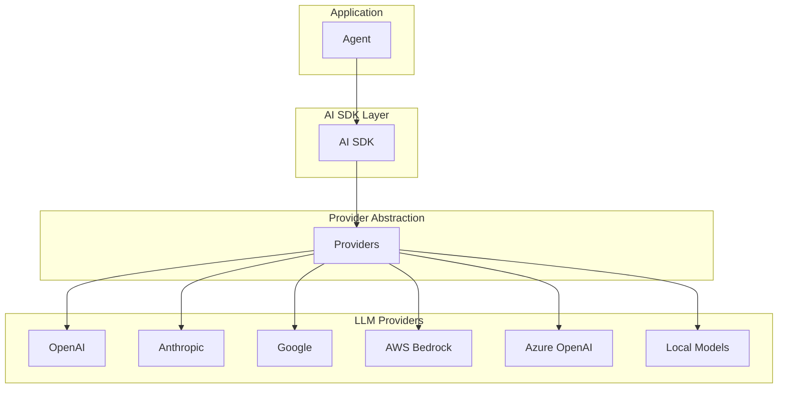

# RFC 005: Provider 管理系统

## 概述

本文档定义 Acme 中的 LLM Provider 管理系统。Provider 是 AI 模型的来源，Acme 通过统一的抽象层支持多种 LLM 提供商。

## 目标

1. 定义 Provider 抽象接口
2. 支持多种 LLM 提供商
3. 设计 API Key 管理机制
4. 实现模型选择和配置

## 架构设计



## Provider 配置

### Provider 类型

```typescript
interface ProviderConfig {
  // Provider 类型
  type: ProviderType;

  // API Key
  apiKey?: string;

  // Base URL（可选）
  baseURL?: string;

  // 默认模型
  defaultModel?: string;

  // 可用模型列表
  models?: string[];

  // 提供商特定配置
  options?: ProviderOptions;
}

type ProviderType =
  | 'openai'
  | 'anthropic'
  | 'google'
  | 'aws'
  | 'azure'
  | 'local'
  | 'ollama'
  | 'custom';
```

### 支持的 Provider

| Provider | 类型 | 模型示例 |
|----------|------|----------|
| OpenAI | `openai` | gpt-4o, gpt-4o-mini |
| Anthropic | `anthropic` | claude-opus, claude-sonnet, claude-haiku |
| Google | `google` | gemini-2.0-flash |
| AWS Bedrock | `aws` | claude-3-opus, claude-3-sonnet |
| Azure OpenAI | `azure` | gpt-4, gpt-4-turbo |
| Ollama | `ollama` | llama3, codellama |
| Local | `local` | 本地模型 |

### 配置示例

```json
{
  "provider": {
    "openai": {
      "apiKey": "sk-...",
      "defaultModel": "gpt-4o"
    },
    "anthropic": {
      "apiKey": "sk-ant-...",
      "defaultModel": "claude-sonnet-4-20250514"
    },
    "aws": {
      "region": "us-east-1",
      "defaultModel": "anthropic.claude-3-sonnet-20240229-v1:0"
    }
  }
}
```

## API Key 管理

### 安全存储

API Keys 安全存储在本地：

```
~/.acme/
└── auth/
    └── credentials.json (加密存储)
```

### 凭证结构

```typescript
interface Credentials {
  // 加密的凭证数据
  encrypted: string;

  // 凭证版本
  version: number;

  // 更新时间
  updatedAt: number;
}
```

### CLI 管理

```bash
# 添加 Provider
acme provider add

# 列出 Providers
acme provider list

# 设置默认 Provider
acme provider set-default <provider>

# 删除 Provider
acme provider remove <provider>
```

## 模型选择

### 模型配置

```typescript
interface ModelSelection {
  // Provider
  provider: string;

  // 模型 ID
  model: string;

  // 模型名称（显示用）
  displayName?: string;

  // 模型描述
  description?: string;

  // 上下文窗口大小
  contextWindow?: number;

  // 是否支持多模态
  multimodal?: boolean;

  // 是否支持工具调用
  tools?: boolean;

  // 价格信息
  pricing?: {
    input: number;
    output: number;
    currency: string;
  };
}
```

### 模型选择建议

```typescript
interface ModelRecommendation {
  // 场景
  scenario: 'coding' | 'reasoning' | 'fast' | 'cheap' | 'creative';

  // 推荐模型
  model: string;

  // 原因
  reason: string;
}
```

## 使用方式

### 在 Agent 中使用

```json
{
  "agent": {
    "build": {
      "model": "anthropic/claude-sonnet-4-20250514"
    },
    "plan": {
      "model": "anthropic/claude-haiku-4-20250514"
    }
  }
}
```

### 运行时切换

```
/model openai/gpt-4o
/model anthropic/claude-opus-4-6-20250514
```

## 本地模型支持

### Ollama 集成

```json
{
  "provider": {
    "ollama": {
      "baseURL": "http://localhost:11434",
      "defaultModel": "llama3"
    }
  }
}
```

### LM Studio 集成

```json
{
  "provider": {
    "lmstudio": {
      "baseURL": "http://localhost:1234/v1",
      "defaultModel": "llama3-70b"
    }
  }
}
```

## 总结

Provider 系统提供：

1. **多提供商支持**：OpenAI、Anthropic、Google、AWS 等
2. **统一抽象**：通过 AI SDK 统一接口
3. **安全存储**：API Keys 加密存储
4. **灵活配置**：多模型选择和配置
5. **本地支持**：Ollama、LM Studio 等本地模型
