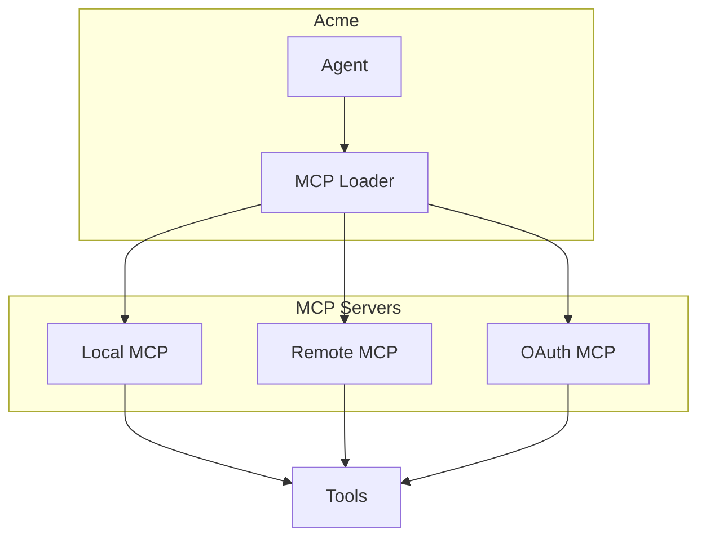
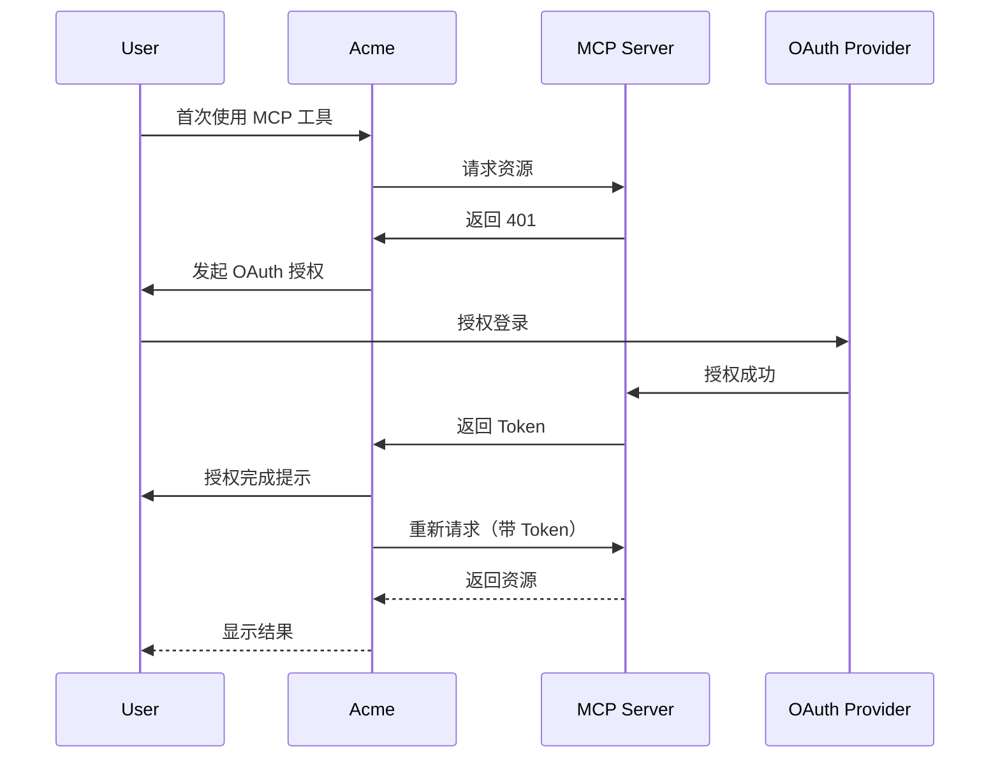

# RFC 006: MCP 集成

## 概述

本文档定义 Acme 中的 MCP（Model Context Protocol）集成。MCP 是用于扩展 AI Agent 能力的标准协议，Acme 支持本地和远程 MCP 服务器。

## 目标

1. 支持本地 MCP 服务器
2. 支持远程 MCP 服务器
3. 实现 MCP OAuth 认证
4. 设计 MCP 工具管理

## MCP 架构



## MCP 配置

### 配置结构

```typescript
interface McpServerConfig {
  // 服务器名称
  name: string;

  // 服务器类型
  type: 'local' | 'remote';

  // 启动命令（Local 类型）
  command?: string[];

  // 服务 URL（Remote 类型）
  url?: string;

  // 环境变量（Local 类型）
  environment?: Record<string, string>;

  // 请求头（Remote 类型）
  headers?: Record<string, string>;

  // OAuth 配置
  oauth?: McpOAuthConfig;

  // 启用状态
  enabled?: boolean;

  // 超时时间
  timeout?: number;
}

interface McpOAuthConfig {
  // 客户端 ID
  clientId?: string;

  // 客户端密钥
  clientSecret?: string;

  // 授权 URL
  authUrl?: string;

  // Token URL
  tokenUrl?: string;

  // 作用域
  scopes?: string[];
}
```

### 本地 MCP 配置

```json
{
  "mcp": {
    "filesystem": {
      "type": "local",
      "command": ["npx", "-y", "@modelcontextprotocol/server-filesystem", "/home/user/projects"],
      "enabled": true
    },
    "github": {
      "type": "local",
      "command": ["npx", "-y", "@modelcontextprotocol/server-github"],
      "environment": {
        "GITHUB_PERSONAL_ACCESS_TOKEN": "${GITHUB_TOKEN}"
      },
      "enabled": true
    }
  }
}
```

### 远程 MCP 配置

```json
{
  "mcp": {
    "jira": {
      "type": "remote",
      "url": "https://jira.example.com/mcp",
      "enabled": true,
      "headers": {
        "Authorization": "Bearer ${JIRA_TOKEN}"
      }
    }
  }
}
```

### OAuth MCP 配置

```json
{
  "mcp": {
    "linear": {
      "type": "remote",
      "url": "https://mcp.linear.app/mcp",
      "enabled": true,
      "oauth": {
        "clientId": "your-client-id",
        "clientSecret": "your-client-secret"
      }
    }
  }
}
```

## MCP 管理

### CLI 操作

```bash
# 列出可用 MCP
acme mcp list

# 添加本地 MCP
acme mcp add <name>

# 添加远程 MCP
acme mcp add-remote <name> <url>

# 认证 MCP
acme mcp auth <name>

# 启用/禁用 MCP
acme mcp enable <name>
acme mcp disable <name>

# 移除 MCP
acme mcp remove <name>
```

## 工具映射

MCP 工具自动映射到 Agent：

```typescript
// MCP 工具示例
const mcpTools = {
  // 文件系统工具
  'filesystem_read_file': { ... },
  'filesystem_write_file': { ... },
  'filesystem_list_directory': { ... },

  // GitHub 工具
  'github_search_repositories': { ... },
  'github_get_pull_request': { ... },

  // PagerDuty 工具
  'pagerduty_incidents_list': { ... },
  'pagerduty_incidents_show': { ... },
};
```

## OAuth 流程



## 最佳实践

### 上下文管理

```typescript
// MCP 工具会占用上下文空间，注意：
// 1. 只启用必要的 MCP 服务器
// 2. 定期检查工具列表
// 3. 禁用不使用的 MCP
```

### 错误处理

```typescript
// MCP 连接错误处理
try {
  const result = await mcpClient.callTool('tool-name', args);
} catch (error) {
  if (error.code === 'ECONNREFUSED') {
    // 服务器未启动
    console.error('MCP server not running');
  } else if (error.code === '401') {
    // 需要重新认证
    console.error('MCP authentication required');
  }
}
```

## 总结

MCP 集成提供：

1. **本地支持**：运行本地 MCP 服务器
2. **远程支持**：连接远程 MCP 服务器
3. **OAuth 认证**：自动处理 OAuth 流程
4. **工具映射**：自动转换为 Agent 工具
5. **灵活配置**：多层次配置覆盖
