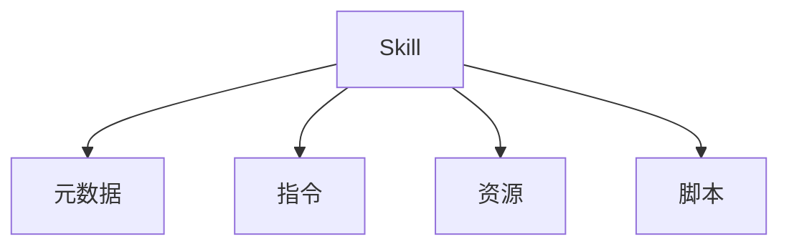

# RFC 007: Skill 系统

## 概述

本文档定义 Acme 中的 Skill 系统。Skill 是扩展 Agent 能力的标准化方式，类似于 OpenAI Codex 的 Agent Skills。

## 目标

1. 定义 Skill 格式和结构
2. 设计 Skill 加载机制
3. 实现 Skill 触发规则
4. 支持 Skill 共享

## Skill 概念

Skill 是一个能力包，包含：

- **指令**：告诉 Agent 如何执行任务
- **资源**：参考文档和数据
- **脚本**：可选的可执行代码



## Skill 结构

### 目录结构

```
my-skill/
├── SKILL.md              # 必需：指令和元数据
├── agents/
│   └── openai.yaml       # 可选：UI 配置
├── scripts/              # 可选：可执行脚本
├── references/          # 可选：参考文档
└── assets/               # 可选：资源文件
```

### SKILL.md 格式

```markdown
---
name: skill-name
description: 详细描述此 Skill 何时触发以及何时不触发
---

# Skill 指令

你是技能专家。以下是执行任务的指令：

## 触发条件

- 当用户要求 ...
- 当需要 ...

## 执行步骤

1. 步骤一：...
2. 步骤二：...
3. 步骤三：...

## 注意事项

- 注意一：...
- 注意二：...
```

### openai.yaml 格式

```yaml
interface:
  display_name: "显示名称"
  short_description: "简短描述"
  icon_small: "./assets/small-logo.svg"
  icon_large: "./assets/large-logo.png"
  brand_color: "#3B82F6"
  default_prompt: "可选的默认使用提示"

policy:
  allow_implicit_invocation: true  # 是否允许隐式触发

dependencies:
  tools:
    - type: "mcp"
      value: "my-mcp-server"
      description: "MCP 服务器描述"
```

## Skill 加载

### 加载位置

```typescript
// Skill 搜索路径
const skillPaths = [
  // 项目级
  '$CWD/.acme/skills',
  '$CWD/../.acme/skills',  // Git 仓库父目录
  '$REPO_ROOT/.acme/skills',  // Git 仓库根目录

  // 用户级
  '$HOME/.acme/skills',

  // 系统级
  '/etc/acme/skills',

  // 内置
  '$ACME_HOME/skills',
];
```

### 层级优先级


## Skill 触发

### 显式触发

使用 `$` 符号显式调用 Skill：

```
$skill-name 帮助我创建 PR
$code-review 审查这段代码
```

### 隐式触发

根据 Skill 描述自动匹配：

```markdown
description: "当用户要求创建 GitHub PR 时触发"
```

```typescript
// 自动匹配逻辑
const implicitTrigger = async (userMessage: string, skills: Skill[]) => {
  for (const skill of skills) {
    // 检查消息是否匹配 Skill 描述
    if (await matchesDescription(userMessage, skill.description)) {
      return skill;
    }
  }
};
```

## Skill 管理

### CLI 操作

```bash
# 列出可用 Skill
acme skill list

# 安装 Skill
acme skill install <skill-name>
acme skill install <github-repo>

# 创建 Skill
acme skill create

# 启用/禁用 Skill
acme skill enable <skill-name>
acme skill disable <skill-name>
```

### 配置文件

```json
{
  "skills": {
    "config": [
      {
        "path": "/path/to/skill/SKILL.md",
        "enabled": true
      }
    ]
  }
}
```

## Skill 示例

### 代码审查 Skill

```markdown
---
name: code-review
description: 当需要审查代码质量、安全性或最佳实践时触发
---

# 代码审查 Skill

你是代码审查专家。

## 审查要点

- 代码质量
- 安全性问题
- 性能问题
- 最佳实践
- 错误处理

## 输出格式

1. 问题列表
2. 建议改进
3. 总结
```

### PR 创建 Skill

```markdown
---
name: create-pr
description: 当用户要求创建 GitHub Pull Request 时触发
---

# PR 创建 Skill

你是 GitHub PR 专家。

## 步骤

1. 检查当前分支状态
2. 确保提交信息规范
3. 创建 PR
4. 添加描述和标签
```

## 渐进式上下文

Skill 使用渐进式上下文加载：

```typescript
// 1. 初始加载：只加载元数据
const skillMetadata = {
  name: "code-review",
  description: "代码审查 Skill...",
  path: "/path/to/SKILL.md"
};

// 2. 触发时：加载完整指令
const fullInstructions = await loadSkillInstructions(skill.path);

// 3. 需要时：加载参考文档
const references = await loadReferences(skill.references);
```

## 总结

Skill 系统提供：

1. **标准化格式**：基于 Agent Skills 标准
2. **灵活加载**：多路径加载机制
3. **触发规则**：显式和隐式触发
4. **渐进式加载**：优化上下文使用
5. **可扩展性**：支持脚本和资源
