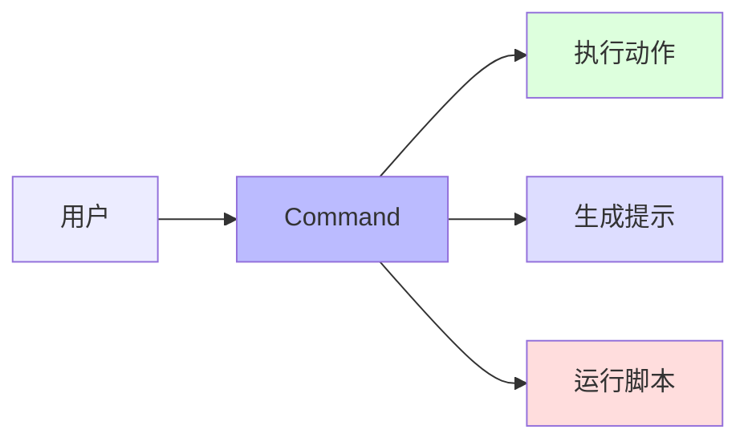
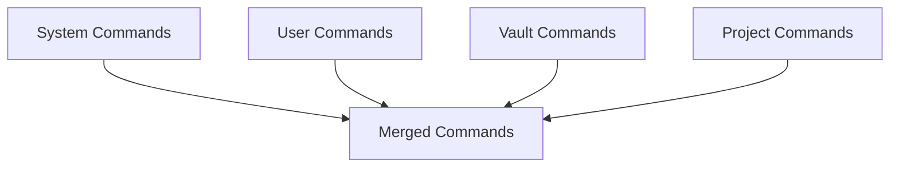

# RFC 008: Command 系统

## 概述

本文档定义 Acme 中的 Command 系统。Command 是用户自定义的快捷命令，可以快速执行常用操作或触发特定行为。

## 目标

1. 定义 Command 格式
2. 设计 Command 执行机制
3. 支持参数和变量
4. 实现快捷键绑定

## Command 概念



## Command 类型

### 1. Prompt Command

生成提示词供 Agent 处理：

```yaml
name: review-code
description: 代码审查
prompt: |
  请审查以下代码，重点关注：
  - 安全性
  - 性能
  - 代码风格
  - 潜在 bug
```

### 2. Action Command

执行动作：

```yaml
name: run-tests
description: 运行测试
action:
  type: bash
  command: npm test
```

### 3. Agent Command

切换 Agent：

```yaml
name: plan-mode
description: 切换到计划模式
agent:
  name: plan
  mode: plan
```

### 4. Composite Command

组合多个命令：

```yaml
name: pr-ready
description: 准备 PR
commands:
  - run-tests
  - code-review
  - update-changelog
```

## Command 定义

### 完整结构

```typescript
interface Command {
  // Command 名称
  name: string;

  // 描述
  description?: string;

  // 类型
  type: 'prompt' | 'action' | 'agent' | 'composite';

  // Prompt 类型配置
  prompt?: string | PromptTemplate;

  // Action 类型配置
  action?: ActionConfig;

  // Agent 类型配置
  agent?: AgentConfig;

  // Composite 类型配置
  commands?: string[];

  // 快捷键
  keybinding?: string;

  // 图标
  icon?: string;

  // 可见性
  visible?: boolean;
}

type PromptTemplate = string | Array<string | Variable>;

interface Variable {
  type: 'input' | 'select' | 'file' | 'git-diff';

  name: string;
  label?: string;
  placeholder?: string;
  options?: string[];
  required?: boolean;
}
```

### 配置示例

#### Prompt Command with Variables

```yaml
name: explain-code
description: 解释代码
type: prompt
prompt: |
  请解释以下代码的功能：
  {{code}}
variables:
  - name: code
    type: file
    label: 选择文件
    required: true
```

#### Action Command

```yaml
name: install-deps
description: 安装依赖
type: action
action:
  type: bash
  command: npm install
  cwd: ${project.path}
```

#### Composite Command

```yaml
name: full-test
description: 完整测试流程
type: composite
commands:
  - lint
  - type-check
  - unit-test
  - integration-test
```

## Command 存储

### 存储位置

```
~/.acme/
└── commands/
    ├── global.yaml      # 全局 Command
    └── commands.yaml    # 用户 Command

<project>/
└── .acme/
    └── commands.yaml   # 项目级 Command
```

### 合并规则



## 执行机制

### 直接执行

```bash
/test
/run-tests
```

### 快捷键执行

```yaml
name: new-thread
keybinding: cmd+n
action:
  type: ui
  action: new-thread
```

### 参数执行

```bash
/explain src/utils/helper.ts
```

## CLI 操作

```bash
# 列出可用 Command
acme command list

# 创建 Command
acme command create

# 编辑 Command
acme command edit <name>

# 删除 Command
acme command delete <name>

# 执行 Command
acme command run <name>
```

## 快捷键系统

### 快捷键配置

```typescript
interface Keybinding {
  // 快捷键组合
  key: string;

  // 描述
  description: string;

  // Command 名称
  command?: string;

  // Action
  action?: string;
}
```

### 默认快捷键

| 快捷键 | 功能 |
|--------|------|
| `Cmd+N` | 新建 Thread |
| `Cmd+K` | 命令面板 |
| `Cmd+J` | 切换终端 |
| `Cmd+B` | 切换侧边栏 |
| `Tab` | 切换 Agent |
| `Cmd+S` | 保存当前状态 |

## 总结

Command 系统提供：

1. **多类型支持**：Prompt、Action、Agent、Composite
2. **变量支持**：灵活的参数输入
3. **快捷键**：快速执行常用操作
4. **层级管理**：系统、用户、Vault、项目多级
5. **可组合**：支持命令组合
