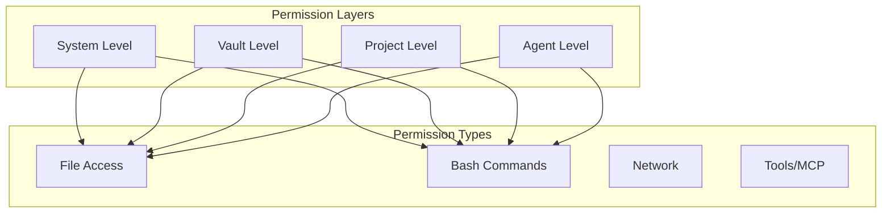
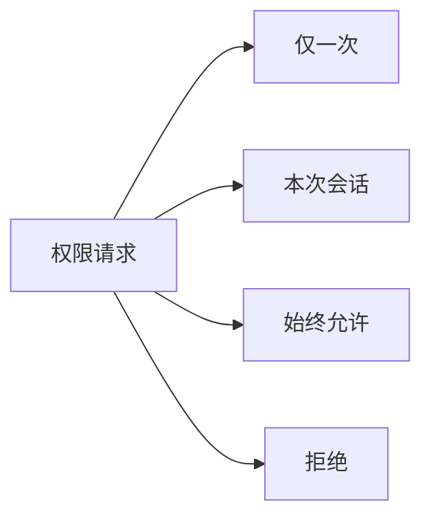
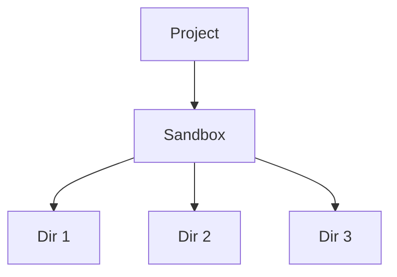

# RFC 009: 权限和安全系统

## 概述

本文档定义 Acme 中的权限和安全系统。包括 Agent 操作权限、文件系统访问控制、网络访问控制等。

## 目标

1. 定义权限模型
2. 实现权限控制
3. 设计审批流程
4. 支持沙箱隔离

## 权限模型



## 权限级别

### 权限级别定义

```typescript
type PermissionLevel = 'allow' | 'deny' | 'ask';

interface Permission {
  // 权限级别
  level: PermissionLevel;

  // 范围（可选）
  scope?: string;

  // 条件（可选）
  condition?: PermissionCondition;
}

interface PermissionCondition {
  // 文件路径匹配
  path?: string | string[];

  // 命令匹配
  command?: string | string[];

  // 网络域名匹配
  domain?: string | string[];
}
```

### 文件权限

```typescript
interface FilePermission {
  // 读取权限
  read: PermissionLevel | {
    allow: string[];   // 允许的路径模式
    deny?: string[];  // 拒绝的路径模式
  };

  // 写入权限
  write: PermissionLevel | {
    allow: string[];
    deny?: string[];
  };

  // 删除权限
  delete: PermissionLevel | {
    allow: string[];
    deny?: string[];
  };
}
```

### Bash 权限

```typescript
interface BashPermission {
  // 默认权限
  default: PermissionLevel;

  // 具体命令配置
  commands?: {
    // 允许的命令
    allow?: string[];

    // 拒绝的命令
    deny?: string[];

    // 需要询问的命令
    ask?: string[];
  };

  // 环境变量限制
  environment?: {
    allow?: string[];
    deny?: string[];
  };
}
```

### 网络权限

```typescript
interface NetworkPermission {
  // 允许访问
  allow?: string[];  // 域名模式

  // 拒绝访问
  deny?: string[];

  // 默认行为
  default: PermissionLevel;
}
```

## 权限配置示例

### 全局配置

```json
{
  "permission": {
    "file": {
      "read": "allow",
      "write": {
        "allow": ["${project.path}/**"]
      },
      "delete": "ask"
    },
    "bash": {
      "default": "ask",
      "commands": {
        "allow": [
          "git status*",
          "npm test",
          "pnpm *"
        ],
        "deny": [
          "rm -rf /*",
          "format",
          "del"
        ],
        "ask": [
          "git push",
          "npm publish"
        ]
      }
    },
    "network": {
      "default": "allow",
      "deny": ["*.internal"]
    }
  }
}
```

### Agent 级配置

```json
{
  "agent": {
    "plan": {
      "permission": {
        "edit": "deny",
        "bash": "deny",
        "webfetch": "deny"
      }
    },
    "build": {
      "permission": {
        "edit": "allow",
        "bash": {
          "default": "ask",
          "commands": {
            "allow": ["git status", "npm *", "pnpm *"],
            "deny": ["rm -rf"]
          }
        }
      }
    }
  }
}
```

## 审批系统

### 审批类型

```typescript
interface ApprovalRequest {
  // 请求 ID
  id: string;

  // 请求类型
  type: 'file-edit' | 'bash' | 'network' | 'tool';

  // 描述
  description: string;

  // 详细信息
  details: {
    // 文件路径
    path?: string;

    // 命令
    command?: string;

    // 目标
    target?: string;

    // 预览
    preview?: string;
  };

  // 请求时间
  requestedAt: number;

  // 状态
  status: ApprovalStatus;
}

type ApprovalStatus = 'pending' | 'approved' | 'denied' | 'expired';
```

### 审批选项



| 选项 | 描述 | 作用域 |
|------|------|--------|
| 仅一次 | 允许本次操作 | 单次 |
| 本会话 | 当前 Thread 有效 | Session |
| 始终 | 永久添加到允许列表 | 永久 |

## 沙箱隔离

### 沙箱模式

```typescript
interface SandboxConfig {
  // 启用沙箱
  enabled: boolean;

  // 允许的目录
  allowedDirs: string[];

  // 允许的网络
  allowedNetwork: string[];

  // 环境变量
  envWhitelist: string[];

  // 最大执行时间
  maxExecutionTime?: number;
}
```

### 工作目录限制



## 审批和安全 UI

### 请求提示

```
┌─────────────────────────────────────────┐
│  🔒 权限请求                             │
├─────────────────────────────────────────┤
│  Agent 尝试执行以下操作：               │
│                                         │
│  命令: git push                         │
│  目标: origin/main                     │
│                                         │
│  ┌─ 允许 ─────────────────────────┐    │
│  │ [ ] 记住此决定                 │    │
│  └───────────────────────────────┘    │
│                                         │
│  [仅一次] [本会话] [始终允许] [拒绝]    │
└─────────────────────────────────────────┘
```

## CLI 配置

```bash
# 查看当前权限配置
acme permission show

# 设置默认权限
acme permission set-default

# 添加白名单
acme permission allow --type bash --command "npm publish"

# 添加黑名单
acme permission deny --type bash --command "rm -rf"
```

## 总结

权限系统提供：

1. **多层级**：系统、Vault、项目、Agent 多级控制
2. **细粒度**：文件和命令级别权限
3. **审批机制**：灵活的请求审批
4. **沙箱隔离**：安全的运行环境
5. **可配置**：灵活的配置选项
