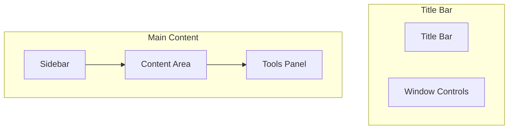
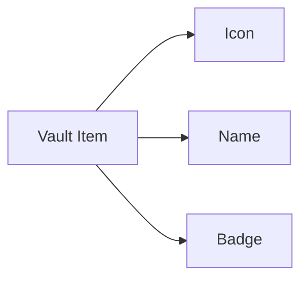
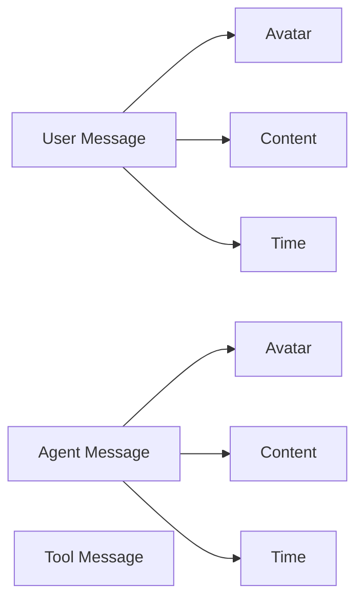
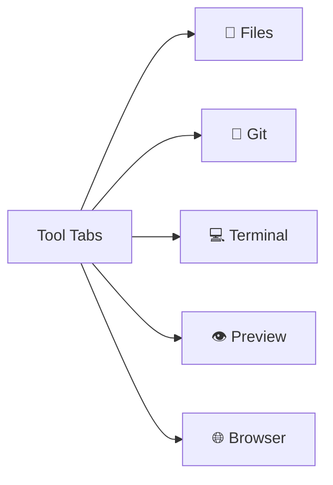

# RFC 010: UI/UX 设计规范

## 概述

本文档定义 Acme 桌面应用程序的 UI/UX 设计规范。

## 设计目标

1. **简洁高效**：保持界面简洁，聚焦核心功能
2. **熟悉感**：参考 Notion、VS Code 等优秀应用
3. **一致性**：统一的视觉语言和交互模式
4. **可定制**：支持主题和布局定制

## 整体布局

### 主窗口结构



### 布局区域

```
┌──────────────────────────────────────────────────────┐
│  [≡] Acme - Vault Name              [_] [□] [×]   │
├────────┬─────────────────────────────────┬─────────┤
│        │                                 │         │
│  Vault │      Thread / Chat Area        │  Tools  │
│  List  │                                 │  Panel  │
│        │                                 │         │
│  ────  │                                 │  ────   │
│        │                                 │         │
│ Project│                                 │ Preview │
│  List  │                                 │   Tree  │
│        │                                 │         │
│  ────  │                                 │  ────   │
│        │                                 │         │
│ Thread │                                 │ Terminal│
│  List  │                                 │         │
│        │                                 │         │
├────────┴─────────────────────────────────┴─────────┤
│  [Input Area]                         [Send →]    │
└──────────────────────────────────────────────────────┘
```

## 侧边栏 (Sidebar)

### Vault 列表



- 显示所有 Vault
- 支持 Vault 搜索
- 支持 Vault 新建

### 项目列表

- 按 Vault 分组
- 显示项目图标和名称
- 右键菜单：打开、删除、属性

### Thread 列表

- 显示 Thread 标题
- 显示最后活跃时间
- 显示状态图标（运行中、已完成）
- 支持归档

## 聊天区域

### 消息样式



### 消息类型

1. **User Message**：用户输入
2. **Assistant Message**：Agent 响应
3. **Tool Message**：工具调用结果
4. **System Message**：系统提示

### 消息格式

```typescript
interface MessageUI {
  // 头像
  avatar: string;

  // 名称
  name: string;

  // 消息内容
  content: {
    // 文本
    text?: string;

    // 代码块
    code?: CodeBlock[];

    // 文件差异
    diff?: DiffBlock[];

    // 图片
    images?: Image[];
  };

  // 时间
  timestamp: string;

  // 操作
  actions?: ['copy', 'edit', 'delete'];
}
```

## 工具面板

### 面板切换



### 文件浏览器

- 树形结构显示
- 支持文件搜索
- 支持右键菜单

### Git 面板

- 分支切换
- 差异查看
- 提交历史
- 提交操作

### 终端

- 集成终端
- 支持多标签
- 支持复制粘贴

## 主题系统

### 主题配置

```typescript
interface Theme {
  // 主题名称
  name: string;

  // 主题类型
  type: 'light' | 'dark' | 'system';

  // 颜色定义
  colors: {
    // 基础色
    primary: string;
    secondary: string;
    accent: string;

    // 背景色
    background: string;
    surface: string;
    elevated: string;

    // 文本色
    text: string;
    textSecondary: string;

    // 状态色
    success: string;
    warning: string;
    error: string;
    info: string;

    // 边框色
    border: string;
  };

  // 字体配置
  typography: {
    fontFamily: string;
    fontSize: {
      xs: string;
      sm: string;
      base: string;
      lg: string;
      xl: string;
    };
  };
}
```

### 内置主题

| 主题 | 类型 | 描述 |
|------|------|------|
| Light | light | 浅色主题 |
| Dark | dark | 深色主题 |
| System | system | 跟随系统 |

## 组件规范

### 按钮

```typescript
interface ButtonProps {
  // 变体
  variant: 'primary' | 'secondary' | 'ghost' | 'danger';

  // 尺寸
  size: 'sm' | 'md' | 'lg';

  // 状态
  disabled?: boolean;
  loading?: boolean;
}
```

### 输入框

```typescript
interface InputProps {
  // 类型
  type: 'text' | 'password' | 'search';

  // 尺寸
  size: 'sm' | 'md' | 'lg';

  // 图标
  icon?: ReactNode;

  // 后缀
  suffix?: ReactNode;
}
```

### 消息输入框

```typescript
interface ChatInputProps {
  // 占位符
  placeholder: string;

  // 多行支持
  multiline: boolean;

  // 最大行数
  maxRows: number;

  // 文件附件
  attachments: boolean;

  // 语音输入
  voice: boolean;

  // 快捷命令
  commands: boolean;
}
```

## 交互规范

### 快捷键

| 快捷键 | 功能 |
|--------|------|
| `Cmd+N` | 新建 Thread |
| `Cmd+K` | 命令面板 |
| `Cmd+J` | 切换终端 |
| `Cmd+B` | 切换侧边栏 |
| `Cmd+P` | 快速打开文件 |
| `Cmd+Shift+P` | 命令面板 |
| `Tab` | 切换 Agent |
| `Cmd+Enter` | 发送消息 |

### 拖拽操作

- 支持文件拖拽到输入框
- 支持图片拖拽添加
- 支持面板拖拽调整大小

### 上下文菜单

- 右键菜单支持
- 菜单项支持图标和快捷键

## 响应式设计

### 窗口尺寸

| 尺寸 | 宽度 | 布局 |
|------|------|------|
| 小 | < 800px | 隐藏侧边栏 |
| 中 | 800-1200px | 侧边栏可折叠 |
| 大 | > 1200px | 完整布局 |

### 浮窗模式

支持将 Thread 弹出为独立窗口：

```
┌─────────────────┐
│ Thread Title  [−][×] │
├─────────────────┤
│                 │
│  Messages       │
│                 │
├─────────────────┤
│ [Input...]    [→] │
└─────────────────┘
```

- 窗口可置顶
- 窗口可调整大小
- 支持多显示器

## 总结

UI/UX 设计规范：

1. **清晰的层次结构**：侧边栏、内容区、工具面板
2. **一致的视觉语言**：统一的颜色、字体、间距
3. **高效的工作流**：快捷键、命令面板
4. **灵活的定制**：主题、布局可调整
5. **多窗口支持**：浮窗模式
