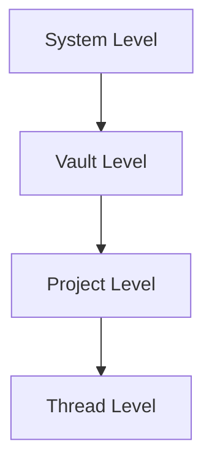
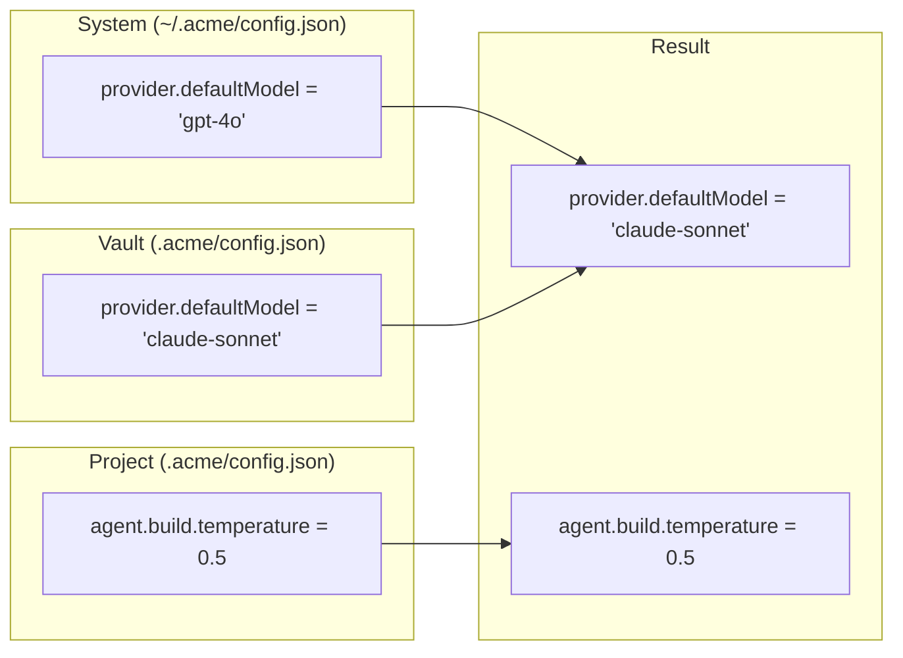

# RFC 011: 配置系统

## 概述

本文档定义 Acme 的配置系统。Acme 使用多层次配置系统，支持 JSON、YAML、TOML 等格式。

## 目标

1. 定义配置格式和结构
2. 设计配置优先级
3. 实现配置验证
4. 支持配置共享

## 配置格式

### 支持格式

| 格式 | 扩展名 | 优先级 |
|------|--------|--------|
| JSON | `.json` | 1 |
| JSONC | `.jsonc` | 1 |
| YAML | `.yaml` | 1 |
| TOML | `.toml` | 1 |

## 配置结构

### 主配置文件

```json
{
  "$schema": "https://acme.ai/config.json",

  // 应用配置
  "app": {
    "name": "Acme",
    "version": "1.0.0"
  },

  // Provider 配置
  "provider": { },

  // Agent 配置
  "agent": { },

  // MCP 配置
  "mcp": { },

  // Skill 配置
  "skills": { },

  // Command 配置
  "commands": { },

  // 权限配置
  "permission": { },

  // 主题配置
  "theme": { },

  // 快捷键配置
  "keybindings": { }
}
```

## 配置层级

### 层级结构



### 配置位置

| 层级 | 位置 |
|------|------|
| 系统级 | `~/.acme/config.*` |
| Vault 级 | `<vault>/.acme/config.*` |
| 项目级 | `<project>/.acme/config.*` |
| Thread 级 | 运行时参数 |

### 优先级

```
命令行参数 > Thread 配置 > Project 配置 > Vault 配置 > System 配置
```

## 配置示例

### 最小配置

```json
{
  "provider": {
    "openai": {
      "apiKey": "sk-..."
    }
  }
}
```

### 完整配置

```json
{
  "$schema": "https://acme.ai/config.json",

  "app": {
    "name": "Acme",
    "theme": "dark"
  },

  "provider": {
    "openai": {
      "apiKey": "${OPENAI_API_KEY}",
      "defaultModel": "gpt-4o"
    },
    "anthropic": {
      "apiKey": "${ANTHROPIC_API_KEY}",
      "defaultModel": "claude-sonnet-4-20250514"
    }
  },

  "agent": {
    "build": {
      "model": "anthropic/claude-sonnet-4-20250514",
      "temperature": 0.3,
      "maxSteps": 100
    },
    "plan": {
      "model": "anthropic/claude-haiku-4-20250514",
      "permission": {
        "edit": "deny",
        "bash": "deny"
      }
    }
  },

  "mcp": {
    "filesystem": {
      "type": "local",
      "command": ["npx", "-y", "@modelcontextprotocol/server-filesystem", "/home/user/projects"],
      "enabled": true
    }
  },

  "permission": {
    "file": {
      "read": "allow",
      "write": {
        "allow": ["${project.path}/**"]
      },
      "delete": "ask"
    },
    "bash": {
      "default": "ask",
      "commands": {
        "allow": ["git status*", "npm *", "pnpm *"]
      }
    }
  },

  "theme": {
    "type": "dark"
  },

  "keybindings": {
    "newThread": "cmd+n",
    "commandPalette": "cmd+k"
  }
}
```

## 环境变量

### 支持的环境变量

```typescript
const envVariables = {
  // API Keys
  'OPENAI_API_KEY': 'OpenAI API Key',
  'ANTHROPIC_API_KEY': 'Anthropic API Key',
  'GOOGLE_API_KEY': 'Google API Key',

  // 代理
  'HTTP_PROXY': 'HTTP 代理',
  'HTTPS_PROXY': 'HTTPS 代理',

  // 应用配置
  'ACME_HOME': 'Acme 根目录',
  'ACME_CONFIG': '配置文件路径',
};
```

### 使用方式

```json
{
  "provider": {
    "openai": {
      "apiKey": "${OPENAI_API_KEY}"
    }
  }
}
```

## 配置验证

### Schema 定义

```typescript
import { z } from 'zod';

const ConfigSchema = z.object({
  $schema: z.string().optional(),

  app: z.object({
    name: z.string().default('Acme'),
    theme: z.enum(['light', 'dark', 'system']).default('system'),
  }).optional(),

  provider: z.record(z.string(), ProviderConfigSchema).optional(),

  agent: z.record(z.string(), AgentConfigSchema).optional(),

  mcp: z.record(z.string(), McpConfigSchema).optional(),

  permission: PermissionSchema.optional(),

  theme: ThemeSchema.optional(),

  keybindings: z.record(z.string(), z.string()).optional(),
});
```

### 验证命令

```bash
# 验证配置
acme config validate

# 查看配置
acme config show

# 查看生效配置
acme config show --effective
```

## 配置继承

### 继承示例



## CLI 操作

```bash
# 初始化配置
acme init

# 编辑配置
acme config edit

# 查看配置
acme config show

# 验证配置
acme config validate

# 导出配置
acme config export

# 导入配置
acme config import <file>
```

## 配置文件

### 目录结构

```
~/.acme/
├── config.json           # 主配置
├── auth.json            # 凭证（加密）
├── cache/               # 缓存
├── data/                # 数据
│   ├── vaults/
│   └── threads/
├── logs/                # 日志
└── skills/              # 全局 Skills

<project>/
└── .acme/
    ├── config.json      # 项目配置
    ├── agents/          # Agent 定义
    ├── commands.yaml    # Commands
    ├── skills/          # Skills
    └── .gitignore      # 忽略配置
```

## 总结

配置系统提供：

1. **多格式支持**：JSON、YAML、TOML
2. **层级继承**：系统到线程多层级
3. **环境变量**：安全的密钥管理
4. **Schema 验证**：配置合法性检查
5. **灵活扩展**：易于添加新配置项
