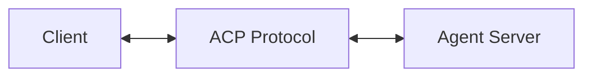
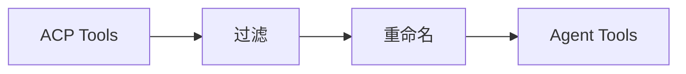

# RFC 012: ACP 协议支持

## 概述

本文档定义 Acme 对 ACP（Agent Client Protocol）的支持。ACP 是用于 AI Agent 与客户端通信的标准协议。

## 目标

1. 实现 ACP 协议客户端
2. 支持第三方 Agent 接入
3. 提供统一的 Agent 接口

## ACP 协议

### 协议概述

ACP (Agent Client Protocol) 是一个用于客户端与 Agent 通信的协议：



### 消息类型

```typescript
// ACP 消息类型
type AcpMessageType =
  | 'initialize'
  | 'initialized'
  | 'tools/list'
  | 'tools/listChanged'
  | 'tools/call'
  | 'resources/list'
  | 'resources/read'
  | 'resources/subscribe'
  | 'resources/unsubscribe'
  | 'resources/listChanged'
  | 'prompts/list'
  | 'prompts/get'
  | 'prompts/render'
  | 'complete/complete'
  | 'logging/log'
  | 'ping'
  | 'pong';
```

## Acme ACP 客户端

### 客户端实现

```typescript
interface AcpClient {
  // 连接到 Agent
  connect(endpoint: string, options?: ConnectOptions): Promise<void>;

  // 断开连接
  disconnect(): Promise<void>;

  // 获取可用工具
  listTools(): Promise<Tool[]>;

  // 调用工具
  callTool(name: string, args?: Record<string, unknown>): Promise<ToolResult>;

  // 获取资源
  listResources(): Promise<Resource[]>;

  // 读取资源
  readResource(uri: string): Promise<ResourceContent>;

  // 发送消息
  sendMessage(message: string, context?: MessageContext): Promise<Message>;

  // 流式响应
  sendMessageStream(
    message: string,
    context?: MessageContext
  ): AsyncIterable<MessagePart>;
}
```

### 连接选项

```typescript
interface ConnectOptions {
  // 认证方式
  auth?: {
    type: 'none' | 'bearer' | 'basic' | 'apikey';
    credentials?: string;
  };

  // 请求头
  headers?: Record<string, string>;

  // 超时时间
  timeout?: number;

  // 重试策略
  retry?: {
    maxRetries: number;
    retryDelay: number;
  };
}
```

## Agent 注册

### 注册第三方 Agent

```json
{
  "agents": {
    "my-agent": {
      "type": "acp",
      "name": "My Custom Agent",
      "endpoint": "http://localhost:3000/mcp",
      "enabled": true,
      "auth": {
        "type": "bearer",
        "credentials": "${MY_AGENT_TOKEN}"
      }
    }
  }
}
```

### Agent 配置

```typescript
interface AcpAgentConfig {
  // Agent 类型
  type: 'acp';

  // 显示名称
  name: string;

  // 端点 URL
  endpoint: string;

  // 认证配置
  auth?: {
    type: 'none' | 'bearer' | 'basic' | 'apikey';
    credentials?: string;
  };

  // 工具映射
  toolMapping?: {
    // 排除的工具
    exclude?: string[];

    // 重命名的工具
    rename?: Record<string, string>;
  };

  // 资源映射
  resourceMapping?: {
    exclude?: string[];
    rename?: Record<string, string>;
  };

  // 是否启用
  enabled?: boolean;
}
```

## 使用示例

### CLI 连接

```bash
# 启动本地 Agent
acme agent serve --port 3000

# 连接到 Agent
acme agent connect http://localhost:3000

# 列出可用 Agent
acme agent list
```

### 配置连接

```json
{
  "agents": {
    "claude-code": {
      "type": "acp",
      "name": "Claude Code",
      "endpoint": "http://localhost:3100",
      "enabled": true
    },
    "opencode": {
      "type": "acp",
      "name": "OpenCode",
      "endpoint": "http://localhost:8080",
      "enabled": true
    },
    "codex": {
      "type": "acp",
      "name": "CodeX",
      "endpoint": "http://localhost:9000",
      "enabled": true
    }
  }
}
```

### 使用 ACP Agent

```bash
# 使用特定 Agent
acme serve --agent claude-code

# 或在配置中设置
{
  "agent": {
    "default": "claude-code"
  }
}
```

## 工具映射

### 自动映射



### 自定义映射

```json
{
  "agents": {
    "my-agent": {
      "type": "acp",
      "endpoint": "http://localhost:3000",
      "toolMapping": {
        "exclude": ["dangerous_tool"],
        "rename": {
          "old_name": "new_name"
        }
      }
    }
  }
}
```

## 支持的 Agent

### 兼容列表

| Agent | 协议 | 状态 |
|-------|------|------|
| Claude Code | ACP | 支持 |
| OpenCode | ACP | 支持 |
| Codex | ACP | 支持 |
| Claude Desktop | MCP | 支持 (via MCP) |

### 启动参数

```bash
# Claude Code
claude --mcp localhost:3100

# OpenCode
opencode serve --port 8080

# Codex
codex serve --port 9000
```

## 错误处理

```typescript
// 连接错误
try {
  await client.connect('http://localhost:3000');
} catch (error) {
  if (error.code === 'ECONNREFUSED') {
    console.error('Agent 未运行');
  } else if (error.code === '401') {
    console.error('认证失败');
  }
}

// 工具调用错误
try {
  const result = await client.callTool('tool_name', args);
} catch (error) {
  if (error.code === 'TOOL_NOT_FOUND') {
    console.error('工具不存在');
  } else if (error.code === 'TOOL_ERROR') {
    console.error('工具执行错误:', error.message);
  }
}
```

## 总结

ACP 协议支持提供：

1. **标准协议**：遵循 ACP 规范
2. **灵活认证**：多种认证方式
3. **工具映射**：过滤和重命名工具
4. **统一接口**：统一的 Agent 接口
5. **广泛兼容**：支持主流 Code Agent
