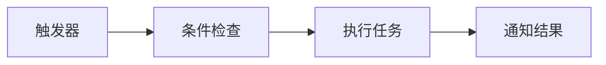
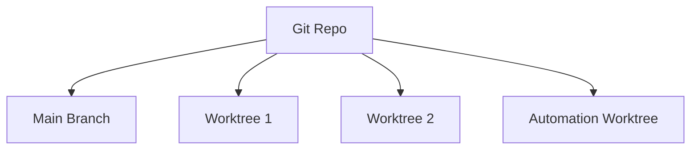

# RFC 013: 自动化任务

## 概述

本文档定义 Acme 中的自动化任务系统。自动化允许用户定时或触发执行特定任务。

## 目标

1. 定义自动化类型
2. 设计触发条件
3. 实现任务调度
4. 支持结果通知

## 自动化概念



## 自动化类型

### 1. 定时任务

按计划时间执行：

```typescript
interface ScheduledAutomation {
  // 类型
  type: 'scheduled';

  // 名称
  name: string;

  // 描述
  description?: string;

  // 触发计划
  schedule: {
    // Cron 表达式
    cron: string;

    // 时区
    timezone?: string;
  };

  // 执行操作
  action: AutomationAction;

  // 启用状态
  enabled: boolean;
}
```

### 2. 事件触发

基于事件触发：

```typescript
interface EventAutomation {
  // 类型
  type: 'event';

  // 名称
  name: string;

  // 描述
  description?: string;

  // 触发事件
  trigger: {
    // 事件类型
    event: 'push' | 'pr' | 'issue' | 'error';

    // 过滤器
    filter?: {
      branch?: string;
      files?: string[];
      keywords?: string[];
    };
  };

  // 执行操作
  action: AutomationAction;

  // 启用状态
  enabled: boolean;
}
```

### 3. 手动触发

用户手动触发：

```typescript
interface ManualAutomation {
  // 类型
  type: 'manual';

  // 名称
  name: string;

  // 描述
  description?: string;

  // 执行操作
  action: AutomationAction;

  // 快捷键
  keybinding?: string;
}
```

## 触发条件

### Cron 表达式

```typescript
// 每小时执行
cron: '0 * * * *'

// 每天凌晨执行
cron: '0 0 * * *'

// 每周一执行
cron: '0 9 * * 1'

// 每15分钟执行
cron: '*/15 * * * *'
```

### 事件过滤器

```typescript
// Git Push 事件
trigger: {
  event: 'push',
  filter: {
    branch: 'main',
    files: ['src/**/*.ts'],
    keywords: ['fix:', 'feat:']
  }
}
```

## 自动化动作

### 1. 运行 Agent

```typescript
interface AgentAction {
  type: 'agent';

  // Agent 名称
  agent: string;

  // 提示词
  prompt: string;

  // 模式
  mode: 'build' | 'plan';

  // 超时
  timeout?: number;
}
```

### 2. 运行命令

```typescript
interface CommandAction {
  type: 'command';

  // 命令
  command: string;

  // 工作目录
  cwd?: string;

  // 环境变量
  env?: Record<string, string>;
}
```

### 3. 发送通知

```typescript
interface NotificationAction {
  type: 'notification';

  // 通知类型
  channel: 'email' | 'slack' | 'webhook';

  // 消息
  message: string;

  // 目标
  target?: string;
}
```

## 配置示例

### 定时任务

```json
{
  "automations": {
    "daily-standup": {
      "type": "scheduled",
      "name": "每日站会报告",
      "description": "生成每日代码提交报告",
      "schedule": {
        "cron": "0 9 * * 1-5",
        "timezone": "Asia/Shanghai"
      },
      "action": {
        "type": "agent",
        "agent": "build",
        "prompt": "生成昨日代码提交摘要"
      },
      "enabled": true
    }
  }
}
```

### 事件触发

```json
{
  "automations": {
    "fix-review": {
      "type": "event",
      "name": "Bug 修复审查",
      "trigger": {
        "event": "push",
        "filter": {
          "branch": "main",
          "keywords": ["fix:", "bug:"]
        }
      },
      "action": {
        "type": "agent",
        "agent": "review",
        "prompt": "审查最近的 bug 修复"
      },
      "enabled": true
    }
  }
}
```

## 执行环境

### Worktree 执行



自动化在独立的 Worktree 中运行：

```typescript
// 自动创建 Worktree
const worktree = await createAutomationWorktree({
  // 基于的分支
  baseBranch: 'main',

  // Worktree 路径
  path: '.acme/automations/automation-xxx',

  // 自动清理
  autoCleanup: true,
});
```

## 结果处理

### 成功处理

```typescript
interface SuccessResult {
  status: 'success';

  // 执行时长
  duration: number;

  // 输出
  output: string;

  // 生成的文件
  files?: string[];
}
```

### 错误处理

```typescript
interface ErrorResult {
  status: 'error';

  // 错误信息
  error: string;

  // 堆栈
  stack?: string;

  // 重试次数
  retries: number;
}
```

### 通知

```typescript
// 执行完成后发送通知
{
  "onComplete": {
    "notify": true,
    "channels": ["slack", "email"],
    "includeOutput": true
  }
}
```

## CLI 操作

```bash
# 列出自动化
acme automation list

# 创建自动化
acme automation create

# 启用自动化
acme automation enable <name>

# 禁用自动化
acme automation disable <name>

# 运行自动化
acme automation run <name>

# 删除自动化
acme automation delete <name>

# 查看日志
acme automation logs <name>
```

## UI 管理

### 自动化面板

```
┌─────────────────────────────────────────┐
│  Automations                      [+ ]  │
├─────────────────────────────────────────┤
│                                         │
│  [🕐] 每日报告          [运行中] [⚙]   │
│      每日上午 9:00                      │
│                                         │
│  [🔔] PR 审查           [启用] [⚙]    │
│      main 分支 push 时                  │
│                                         │
│  [📊] 错误监控          [启用] [⚙]    │
│      检测到错误时                        │
│                                         │
└─────────────────────────────────────────┘
```

## 总结

自动化任务系统提供：

1. **多种触发**：定时、事件、手动触发
2. **灵活执行**：Agent、命令、通知
3. **Worktree 隔离**：安全隔离执行环境
4. **结果通知**：多渠道通知
5. **日志记录**：完整的执行日志
