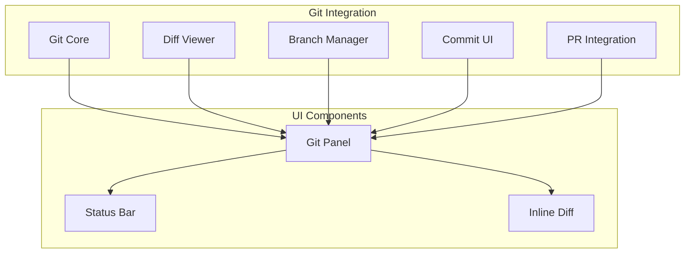
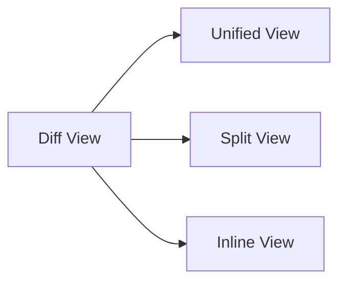
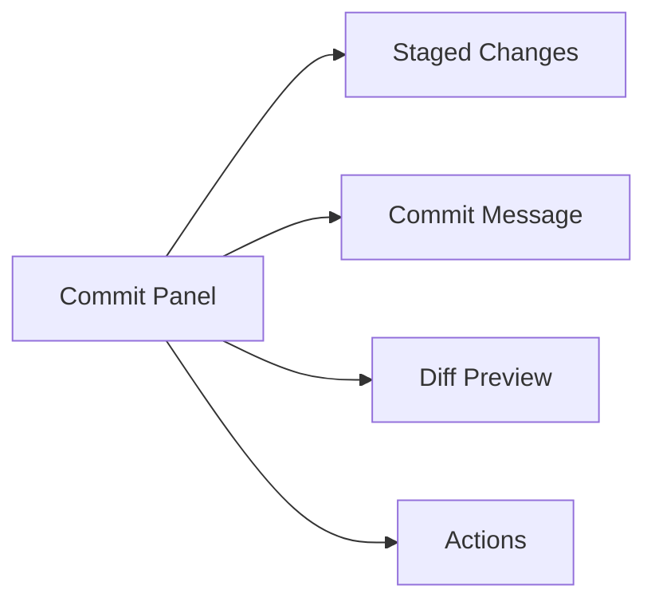
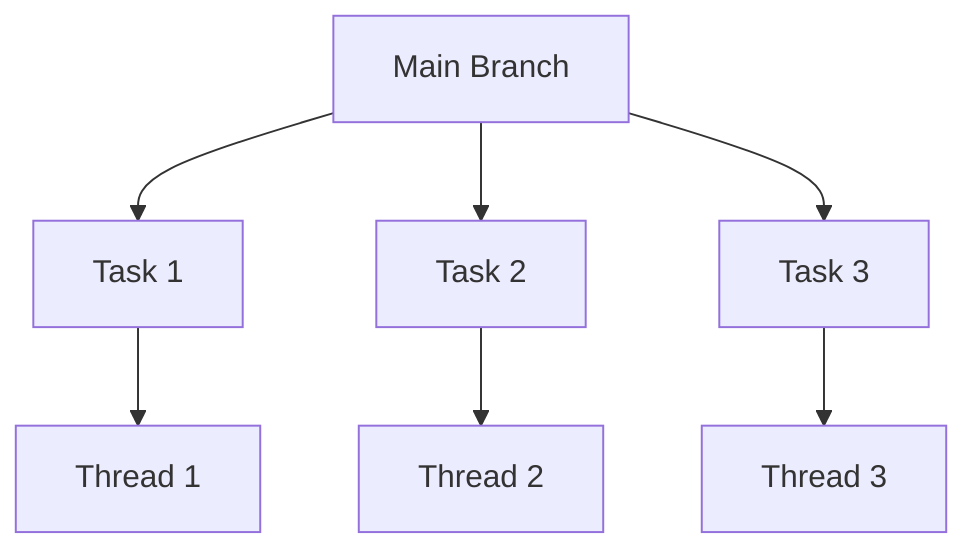

# RFC 014: Git 集成

## 概述

本文档定义 Acme 中的 Git 集成功能。Git 集成是 Code Agent 的核心功能，提供代码版本控制支持。

## 目标

1. 提供基础 Git 操作
2. 实现差异查看和编辑
3. 支持分支管理
4. 集成 Pull Request

## 功能架构



## Git 核心功能

### 仓库检测

```typescript
interface GitInfo {
  // 仓库根目录
  root: string;

  // 当前分支
  branch: string;

  // 远程仓库
  remotes: Remote[];

  // 状态
  status: GitStatus;

  // 标签
  tags: string[];

  // 最近提交
  recentCommits: Commit[];
}

interface GitStatus {
  // 当前分支
  current: string;

  // 追踪的远程分支
  tracking?: string;

  // 暂存的文件
  staged: FileStatus[];

  // 未暂存的文件
  modified: FileStatus[];

  // 未跟踪的文件
  untracked: FileStatus[];

  // 冲突文件
  conflicted: FileStatus[];
}
```

### 基本操作

```typescript
class Git {
  // 初始化仓库
  async init(path: string): Promise<void>;

  // 克隆仓库
  async clone(url: string, path: string): Promise<void>;

  // 拉取
  async pull(remote?: string, branch?: string): Promise<void>;

  // 推送
  async push(remote?: string, branch?: string): Promise<void>;

  // 获取
  async fetch(remote?: string): Promise<void>;

  // 切换分支
  async checkout(branch: string): Promise<void>;

  // 创建分支
  async branch(name: string, createFrom?: string): Promise<void>;

  // 删除分支
  async deleteBranch(name: string, force?: boolean): Promise<void>;

  // 提交
  async commit(message: string, files?: string[]): Promise<string>;

  // 合并
  async merge(branch: string): Promise<void>;

  // 变基
  async rebase(branch: string): Promise<void>;

  // 储藏
  async stash(message?: string): Promise<void>;

  // 恢复储藏
  async stashPop(index?: number): Promise<void>;
}
```

## Diff 视图

### 差异比较

```typescript
interface DiffResult {
  // 文件路径
  path: string;

  // 旧文件
  oldFile?: string;

  // 新文件
  newFile?: string;

  // 差异
  hunks: DiffHunk[];
}

interface DiffHunk {
  // 旧文件起始行
  oldStart: number;

  // 旧文件行数
  oldLines: number;

  // 新文件起始行
  newStart: number;

  // 新文件行数
  newLines: number;

  // 内容
  lines: DiffLine[];
}

interface DiffLine {
  // 类型
  type: 'context' | 'add' | 'delete';

  // 内容
  content: string;

  // 行号（旧）
  oldLineNumber?: number;

  // 行号（新）
  newLineNumber?: number;

  // 注释
  comments?: Comment[];
}
```

### Diff 展示



### 交互操作

```typescript
interface DiffActions {
  // 暂存文件/块
  stage(path: string, hunks?: number[]): Promise<void>;

  // 取消暂存
  unstage(path: string, hunks?: number[]): Promise<void>;

  // 放弃更改
  discard(path: string, hunks?: number[]): Promise<void>;

  // 查看历史
  history(path: string): Promise<Commit[]>;

  // 添加评论
  addComment(path: string, line: number, comment: string): Promise<void>;
}
```

## 分支管理

### 分支列表

```typescript
interface BranchList {
  // 当前分支
  current: string;

  // 本地分支
  local: Branch[];

  // 远程分支
  remote: Branch[];
}

interface Branch {
  // 分支名
  name: string;

  // 是否当前分支
  current: boolean;

  // 追踪的远程分支
  tracking?: string;

  // 最后提交
  commit: Commit;

  // 领先/落后
  ahead?: number;

  behind?: number;
}
```

### 分支操作

```typescript
interface BranchActions {
  // 创建并切换
  createBranch(name: string, from?: string): Promise<void>;

  // 切换分支
  switchBranch(name: string): Promise<void>;

  // 删除分支
  deleteBranch(name: string, force?: boolean): Promise<void>;

  // 重命名分支
  renameBranch(oldName: string, newName: string): Promise<void>;

  // 合并分支
  mergeBranch(source: string, message?: string): Promise<void>;

  // 变基
  rebaseBranch(source: string): Promise<void>;
}
```

## 提交界面

### 提交面板



### 提交配置

```typescript
interface CommitConfig {
  // 提交信息
  message: string;

  // 详细描述
  description?: string;

  // 要提交的文件
  files: string[];

  // 作者
  author?: {
    name: string;
    email: string;
  };

  // GPG 签名
  sign?: boolean;
}
```

## Pull Request 集成

### PR 操作

```typescript
interface PullRequest {
  // 仓库
  repo: string;

  // 编号
  number?: number;

  // 标题
  title: string;

  // 描述
  description: string;

  // 源分支
  head: string;

  // 目标分支
  base: string;

  // 状态
  state: 'open' | 'closed' | 'merged';

  // 审查
  reviews: Review[];
}

interface PRActions {
  // 创建 PR
  create(pr: CreatePR): Promise<PullRequest>;

  // 更新 PR
  update(number: number, updates: Partial<PullRequest>): Promise<void>;

  // 查看 PR
  get(number: number): Promise<PullRequest>;

  // 列出 PR
  list(options?: ListPROptions): Promise<PullRequest[]>;

  // 合并 PR
  merge(number: number, method?: 'merge' | 'squash' | 'rebase'): Promise<void>;

  // 评论
  comment(number: number, body: string): Promise<void>;
}
```

## 工作树 (Worktree)

### Worktree 支持

```typescript
interface Worktree {
  // Worktree 路径
  path: string;

  // 分支名
  branch: string;

  // 关联的远程
  remote?: string;

  // 状态
  status: 'clean' | 'dirty';
}

interface WorktreeActions {
  // 创建 Worktree
  create(path: string, branch: string): Promise<Worktree>;

  // 删除 Worktree
  remove(path: string, force?: boolean): Promise<void>;

  // 列出 Worktree
  list(): Promise<Worktree[]>;
}
```

### Worktree 使用场景



## UI 集成

### Git 面板

```
┌─────────────────────────────────────────┐
│  Git                              [⚙] │
├─────────────────────────────────────────┤
│  main*                    3 commits ▲  │
├─────────────────────────────────────────┤
│  Staged (2)                             │
│  M  src/index.ts                       │
│  A  src/utils.ts                       │
├─────────────────────────────────────────┤
│  Unstaged (1)                          │
│  M  src/app.ts                         │
├─────────────────────────────────────────┤
│  [Commit]              [Push] [Pull]   │
└─────────────────────────────────────────┘
```

### 快捷操作

| 操作 | 快捷键 |
|------|--------|
| 查看状态 | `Cmd+Shift+G` |
| 暂存更改 | `Cmd+S` |
| 提交 | `Cmd+Enter` |
| 推送 | `Cmd+Shift+P` |
| 拉取 | `Cmd+Shift+L` |
| 切换分支 | `Cmd+B` |

## 总结

Git 集成提供：

1. **完整操作**：所有基础 Git 操作
2. **差异视图**：可视化 Diff 查看和编辑
3. **分支管理**：创建、切换、删除分支
4. **PR 集成**：创建、查看、合并 PR
5. **Worktree**：隔离的工作环境
